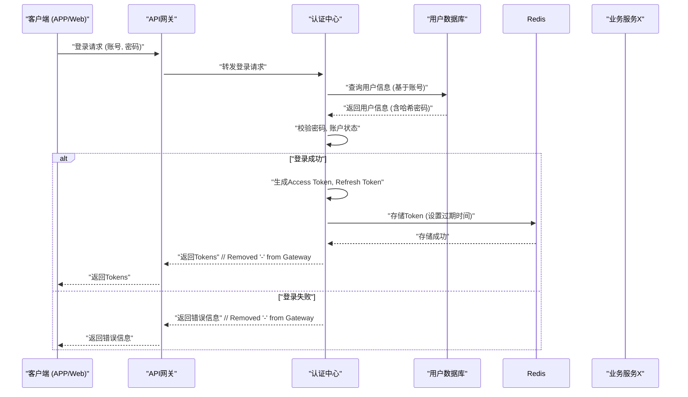

# 基于Spring Cloud的微服务架构的美食社交APP

**微服务架构**是一种软件架构风格，它将一个大型的复杂应用拆分成一组小型的、独立的服务。每个服务都围绕特定的业务功能构建，可以独立开发、部署和扩展。服务之间通常通过轻量级的通信机制（如HTTP RESTful API或消息队列）进行交互。这种架构的核心思想是“职责单一”，每个服务做好一件事。

**Spring Cloud**则是基于Spring Boot的一套用于快速构建分布式系统中常见模式的工具集。它为开发者提供了诸如服务发现（Eureka, Consul）、配置管理（Config Server）、智能路由（Gateway, Zuul）、负载均衡（Ribbon）、熔断器（Hystrix, Resilience4j）等解决方案，极大地简化了微服务的开发和治理。

该项目采用了Spring Cloud全家桶来构建整个后端系统，有效地支撑用户、好友、Feed流、秒杀订单等业务。

## 技术优势

*   **职责单一与独立性 (Isolation & Single Responsibility):** 每个服务只关注自身业务，团队可以独立开发、测试、部署和运维，互不影响。隔离性强，相互之间各自干各自的。
*   **技术异构性 (Technology Diversity):** 虽然项目主要使用Java和Spring Cloud，但理论上微服务允许不同服务采用最适合自身业务的技术栈。可以用自己擅长的语言去写这个服务，比如我也会一些python脚本语言
*   **弹性伸缩 (Scalability):** 可以根据各个服务的负载情况，独立地对它们进行扩缩容。例如，秒杀活动时，可以只针对订单服务和Redis进行扩容。
*   **易于维护与理解 (Maintainability):** 单个服务的代码量较小，业务逻辑清晰，容易维护。
*   **容错性 (Resilience):** 单个服务的故障不会导致整个系统瘫痪。通过熔断、降级等机制（Spring Cloud Hystrix/Resilience4j提供支持），可以提高系统的整体可用性。
*   **快速迭代与部署 (Faster Development Cycles):** 由于服务拆分，小团队可以快速迭代功能并独立部署，缩短了上线周期。

## 示例图解


```mermaid
graph TD
    %% 用户请求流
    Client["客户端 (APP/Web)"] --> Nginx["NGINX (反向代理)"]
    Nginx --> Gateway["API网关 (Gateway)"]

    %% 核心基础设施组件
    Eureka["服务注册与发现 (Eureka)"]
    Config["配置中心 (Config)"]
    Monitoring["监控服务 (Monitoring)"]

    %% 业务微服务
    UserService["食客服务 (User Service)<br/>- MySQL<br/>- Redis (缓存)"]
    FeedService["Feed流服务 (Feed Service)<br/>- MySQL<br/>- Redis (Feed缓存)"]
    OrderService["订单/秒杀服务 (Order Service)<br/>- MySQL<br/>- Redis (锁/库存)"]
    RankingService["排行榜服务 (Ranking Service)<br/>- Redis (SortedSet)"]

    %% API网关与核心基础设施的交互
    Gateway -.->|使用Eureka实现:<br/>路由, 负载均衡, 鉴权| Eureka

    %% API网关路由到业务服务
    Gateway --> UserService
    Gateway --> FeedService
    Gateway --> OrderService
    Gateway --> RankingService %% 假设排行榜服务也通过网关暴露

    %% 服务与Eureka的交互 (注册与发现)
    UserService -- "注册/发现" --> Eureka
    FeedService -- "注册/发现" --> Eureka
    OrderService -- "注册/发现" --> Eureka
    RankingService -- "注册/发现" --> Eureka

    %% 服务与配置中心的交互
    UserService -- "获取配置" --> Config
    FeedService -- "获取配置" --> Config
    OrderService -- "获取配置" --> Config
    RankingService -- "获取配置" --> Config

    %% 服务间调用
    UserService <-->|调用| FeedService

    %% 各组件与监控服务的连接 (发送指标/被监控)
    UserService -.-> Monitoring
    FeedService -.-> Monitoring
    OrderService -.-> Monitoring
    RankingService -.-> Monitoring
    Gateway -.-> Monitoring
    Eureka -.-> Monitoring
    Config -.-> Monitoring
```

**图解说明:**

*   客户端请求经过NGINX到达API网关。
*   网关通过Eureka发现下游服务，并将请求路由到相应的业务微服务（如食客服务、Feed服务、订单服务等）。
*   各微服务独立部署，拥有自己的数据库（MySQL）和/或Redis实例。
*   Redis在各服务中扮演不同角色：缓存、分布式锁、排行榜数据存储等。
*   配置中心统一管理所有服务的配置。
*   监控服务对整个集群进行监控。


## 工作流程

用户A发布了一条关于某家餐厅的美食点评（我们称之为“Feed”）：

1.  用户A在APP上编辑好点评内容，点击发布。请求首先会到达我们的**API网关（Spring Cloud Gateway）**。
2.  网关进行统一的身份验证、安全校验后，会将请求路由到**Feed服务**。
3.  Feed服务接收到请求，处理点评内容，比如保存到数据库（MySQL），同时可能会将这条新的Feed信息推送到**Redis缓存**中，以便用户A的好友能快速刷到。
4.  如果这条Feed提到了特定的餐厅，Feed服务可能还会通知**餐厅服务**更新相关信息，或者触发**消息队列**事件，由**排行榜服务**（比如基于Redis Sorted Set实现的热门点评排行）进行后续处理。
5.  同时，**用户服务**可能记录了用户A的活跃行为。

在这个过程中，用户的一个简单操作，背后可能涉及到API网关、Feed服务、用户服务、餐厅服务以及Redis缓存、数据库等多个独立微服务的协同工作。它们各司其职，共同完成了这次业务操作。

## 核心组件

*   **API网关 (Spring Cloud Gateway):** 作为系统的统一入口，负责请求路由、聚合、过滤、身份认证、限流熔断等。所有外部请求都先经过网关，再分发到具体的业务服务。
*   **服务注册与发现中心 (Netflix Eureka):** 所有微服务实例在启动时会向Eureka注册自己的网络位置等信息，其他服务可以通过Eureka发现并调用它们。使服务间的调用变得动态和灵活。
*   **配置中心 (Spring Cloud Config):** 用于集中管理所有微服务的配置文件。当配置变更时，服务可以动态刷新，无需重启，提高运维效率。
*   **各个业务微服务:**
    *   **食客服务 (User Service):** 负责用户注册、登录、单点登录（SSO）、个人信息管理等。
    *   **Feed流服务 (Feed Service):** 处理用户动态（点评、打卡）的发布、点赞、评论、拉取关注好友的Feed列表等。
    *   **好友服务 (Friend Service):** 管理用户间的关注、取关、共同好友等社交关系。
    *   **订单与秒杀服务 (Order & Seckill Service):** 处理代金券的抢购、秒杀逻辑（利用Redis实现分布式锁防止超卖）、订单创建与管理。
    *   **缓存服务 (Cache Service):** 广泛使用Redis缓存热点数据，如餐厅信息、用户信息、排行榜数据，提升系统性能。
    *   **排行榜服务 (Ranking Service):** 基于Redis的Sorted Set实现用户积分榜、热门餐厅榜等。
    *   **附近的人服务 (Nearby Service):** 利用Redis的Geo模块实现查找附近的美食分享或食客。
*   **持久化存储 (MySQL):** 作为主要的结构化数据存储。
*   **缓存与多功能中间件 (Redis):**
    *   **数据缓存:** 缓存常用数据，减轻数据库压力。
    *   **分布式锁:** 在秒杀等场景保证数据一致性。
    *   **排行榜:** 利用Sorted Set实现。
    *   **地理位置服务:** 利用Geo模块实现“附近的人”等功能。
    *   **会话管理:** 分布式会话共享。
*   **监控服务 (如Spring Boot Admin, Prometheus, Grafana):** 监控各个微服务的健康状态、性能指标、日志等，实现告警。

## 用户下单秒杀代金券

1.  **用户请求秒杀:** 用户在APP上点击秒杀按钮，请求通过客户端发送到API网关。
2.  **网关处理:** API网关验证用户身份和请求合法性，然后将请求路由到订单/秒杀服务。
3.  **秒杀服务处理:**
    *   **获取分布式锁:** 为了防止超卖，秒杀服务首先会尝试获取基于Redis的分布式锁（例如使用`SETNX`或Redisson）。只有获取到锁的请求才能继续处理。
    *   **库存校验:** 检查Redis中该代金券的库存是否充足。如果库存不足，则直接返回秒杀失败。
    *   **扣减库存:** 如果库存充足，则在Redis中预扣减库存（可以使用`DECR`原子操作）。
    *   **创建订单:** 生成订单信息，并将订单状态设置为“待支付”，异步写入MySQL数据库。为了快速响应，可以先写缓存或消息队列，再由后台任务同步到数据库。
    *   **释放分布式锁:** 处理完毕后，释放Redis分布式锁。
    *   **返回结果:** 向用户返回秒杀成功（或失败）的结果，并引导用户支付。
4.  **后续处理:**
    *   用户支付成功后，会更新订单状态。
    *   如果用户超时未支付，系统会自动取消订单并恢复Redis中的库存（需要考虑补偿机制）。

在这个流程中，Redis不仅缓存库存信息，还通过分布式锁保证高并发下秒杀的正确性。


## 个人经验

*   跨多个服务的数据一致性是一个难题。比如用户下单成功后，需要扣减库存、增加积分等，这些操作可能分布在不同服务。我自己采用的是最终一致性的方案，比如通过消息队列异步通知相关服务进行处理，并做好补偿机制。
*   Feed流采用推拉结合的模式，热门用户的Feed直接推送给粉丝的Redis时间线，冷门用户则采用拉模式。排行榜利用Sorted Set的特性，可以非常高效地进行排名和查询。秒杀场景下，Redis的原子操作和分布式锁保证系统稳定和数据准确的关键。

## 常用命令

```java
// 解析依赖
mvn dependency:resolve
// 编译项目
mvn compile
// -U 选项会告诉 Maven 忽略本地缓存的快照依赖的元数据，并强制从远程仓库检查是否有更新的快照版本。
mvn clean install -U
```

## 用户注册并登录

```sql
-- ----------------------------
-- Table structure for t_users
-- ----------------------------
DROP TABLE IF EXISTS `t_users`;
CREATE TABLE `t_users`  (
  `id` int(11) NOT NULL AUTO_INCREMENT,
  `username` varchar(255) CHARACTER SET utf8mb4 COLLATE utf8mb4_unicode_ci NULL DEFAULT NULL,
  `nickname` varchar(255) CHARACTER SET utf8mb4 COLLATE utf8mb4_unicode_ci NULL DEFAULT NULL COMMENT '昵称',
  `phone` varchar(255) CHARACTER SET utf8mb4 COLLATE utf8mb4_unicode_ci NULL DEFAULT NULL,
  `email` varchar(255) CHARACTER SET utf8mb4 COLLATE utf8mb4_unicode_ci NULL DEFAULT NULL,
  `password` varchar(255) CHARACTER SET utf8mb4 COLLATE utf8mb4_unicode_ci NULL DEFAULT NULL,
  `avatar_url` varchar(255) CHARACTER SET utf8mb4 COLLATE utf8mb4_unicode_ci NULL DEFAULT NULL COMMENT '头像',
  `roles` varchar(255) CHARACTER SET utf8mb4 COLLATE utf8mb4_unicode_ci NULL DEFAULT '' COMMENT '角色',
  `is_valid` tinyint(1) NULL DEFAULT NULL,
  `create_date` datetime(0) NULL DEFAULT NULL,
  `update_date` datetime(0) NULL DEFAULT NULL,
  PRIMARY KEY (`id`) USING BTREE
) ENGINE = InnoDB AUTO_INCREMENT = 6 CHARACTER SET = utf8mb4 COLLATE = utf8mb4_unicode_ci ROW_FORMAT = DYNAMIC;

-- ----------------------------
-- Records of t_users
-- ----------------------------
INSERT INTO `t_users` VALUES (1, 'abc', '昵称st', '13888888888', 'abc@imooc.com', 'e10adc3949ba59abbe56e057f20f883e', '/abc', 'ROLE_USER', 1, '2020-11-06 16:17:52', '2020-11-06 16:17:55');
INSERT INTO `t_users` VALUES (2, 'test', 'test', '13666666666', NULL, 'e10adc3949ba59abbe56e057f20f883e', '/test', 'ROLE_USER', 1, '2020-11-12 12:01:13', '2020-11-12 12:01:13');
INSERT INTO `t_users` VALUES (3, 'test2', 'test2', '13666666667', NULL, 'e10adc3949ba59abbe56e057f20f883e', '/test2', 'ROLE_USER', 1, '2020-11-12 17:47:12', '2020-11-12 17:47:12');
INSERT INTO `t_users` VALUES (5, 'aaa', 'aaa', '12311112222', NULL, 'e10adc3949ba59abbe56e057f20f883e', '/aaa', 'ROLE_USER', 1, '2020-11-13 12:29:49', '2020-11-13 12:29:49');
```


1.  **用户访问注册页面**：用户打开APP，点击“注册”按钮。
2.  **输入手机号并获取验证码**：
    *   用户输入手机号码。系统后台首先校验该手机号是否已被注册。
    *   如未注册，用户点击“获取验证码”。此时，前端按钮会进入60秒倒计时禁用状态，防止用户频繁请求。
    *   认证中心生成一个6位随机验证码，通过短信网关发送给用户。同时，该验证码会存储到Redis中，并设置1分钟的过期时间。
3.  **填写注册信息并提交**：
    *   用户收到验证码后，在页面输入验证码、期望的用户名和密码。
    *   点击“注册”提交。
4.  **后台处理注册请求**：
    *   认证中心接收到请求后，首先进行参数的非空和合法性校验。
    *   然后，从Redis中获取对应手机号的验证码，与用户输入的验证码进行比对。
    *   接着，校验用户名是否已被占用。
    *   所有校验通过后，将用户信息（用户名、加密后的密码、手机号等）存入数据库。
5.  **自动登录并跳转**：
    *   注册成功后，为了提升体验，系统通常会为用户执行一次自动登录。
    *   认证中心会生成一个身份凭证（例如JWT Token），并将其存储在Redis中（用于后续的单点登录和会话管理）。
    *   该Token返回给客户端，客户端存储并在后续请求中携带。
    *   用户被重定向到APP的首页或个人中心。
6.  **后续访问其他服务 (SSO)**：
    *   当用户尝试访问另一个微服务（比如订单服务）时，请求会先经过API网关。
    *   API网关会携带Token请求认证中心进行身份校验。
    *   认证中心验证Token的有效性（从Redis中查找）。如果有效，则认为用户已登录，允许访问订单服务，无需再次输入用户名密码。


### 3. 项目中认证中心的核心组件及其作用是什么？

根据需求分析，认证中心的核心组件规划如下：

*   **用户账户数据库 (User Account Database)**:
    *   **作用**: 持久化存储用户信息，如用户ID、用户名、哈希密码、手机号、邮箱、头像URL、账户状态、注册时间、最后登录时间等。
    *   **技术选型**: 关系型数据库如MySQL。
*   **验证码服务 (Verification Code Service)**:
    *   **作用**: 生成、发送（通过短信网关）和校验短信验证码。管理验证码的有效性和防止滥用（如60秒内防重发）。
    *   **技术选型**:
        *   **存储**: Redis，用于临时存储验证码并设置过期时间。
        *   **短信发送**: 集成第三方短信服务提供商。
*   **密码服务 (Password Service)**:
    *   **作用**: 安全地处理用户密码，包括密码加密存储（如使用BCrypt、SCrypt或PBKDF2等哈希算法加盐处理）和密码验证。
*   **单点登录 (SSO) 模块**:
    *   **作用**: 实现用户一次登录，多服务共享登录状态。
    *   **技术选型**:
        *   **Spring Security**: 负责核心的认证（Authentication）逻辑，如验证用户凭证。
        *   **OAuth 2.0 (或OIDC)**: 负责授权（Authorization）逻辑，定义令牌（Token）的颁发、校验和管理流程。文件中提到使用 "auto"，推测可能是OAuth 2.0的简写或特定实现。
        *   **Token存储**: Redis，用于存储和管理访问令牌（Access Token）和刷新令牌（Refresh Token），实现跨服务的会话共享和快速校验。
*   **API网关 (Spring Cloud Gateway)**:
    *   **作用**: 作为所有微服务的统一入口，集成认证逻辑。所有需要身份验证的请求在到达具体业务服务前，由网关拦截并调用认证中心进行Token校验。
    *   **技术选型**: Spring Cloud Gateway。
*   **用户接口层 (User Interface Layer - for authentication)**:
    *   **作用**: 提供用户进行登录、注册、找回密码等操作的API接口。

这些组件协同工作，构成了整个认证体系。

### 4. 能否详细说明一个典型的工作流程，比如用户通过账号密码登录？

好的，以用户使用**用户名和密码进行正常登录**为例，流程如下：

1.  **用户提交登录凭证**:
    *   用户在客户端（APP/Web）输入用户名（或手机号/邮箱）和密码，点击登录。
    *   客户端将这些凭证通过HTTPS发送到API网关。

2.  **API网关路由与初步校验**:
    *   API网关接收到登录请求，将其路由到认证中心的登录接口。
    *   （可选）网关层面可以做一些基础的请求频率限制等。

3.  **认证中心处理登录请求**:
    *   **参数校验**: 认证中心首先对接收到的账号和密码进行非空校验和基本的格式校验。
    *   **查找用户**:
        *   根据用户输入的账号类型（用户名、手机号或邮箱），在用户账户数据库中查找对应的用户记录。
        *   如果未找到用户，返回“账号不存在”或“账号或密码错误”的提示。
    *   **密码校验**:
        *   如果找到用户，获取数据库中存储的该用户的哈希密码。
        *   使用相同的哈希算法和盐值，对用户本次输入的密码进行哈希计算。
        *   比较计算得到的哈希值与数据库中存储的哈希值。
        *   如果密码不匹配，记录尝试失败次数（可选，用于防止暴力破解），并返回“账号或密码错误”。
    *   **账户状态检查**:
        *   如果密码匹配，检查用户账户状态是否有效（例如，是否被禁用、锁定）。
        *   如果账户无效，返回相应提示。
    *   **生成Token (登录成功)**:
        *   所有校验通过，表示用户身份验证成功。
        *   认证中心（SSO模块）生成一个访问令牌（Access Token）和一个刷新令牌（Refresh Token）。这些Token通常包含用户ID、权限等信息，并有设定的有效期。
        *   将生成的Token（特别是Access Token的关键信息或整个Token，取决于策略）存储到Redis中，并设置相应的过期时间。这用于后续的Token校验和会话管理。
        *   （可选）更新用户的最后登录时间等信息到数据库。
    *   **返回Token给客户端**:
        *   将生成的Access Token和Refresh Token返回给客户端。

4.  **客户端处理**:
    *   客户端安全地存储这些Token（例如，Access Token存入内存或安全存储，Refresh Token存入更持久的安全存储）。
    *   在后续向其他受保护资源发起请求时，客户端会在请求头中携带Access Token。

5.  **后续请求的Token校验 (通过API网关)**:
    *   当客户端携带Access Token访问其他服务时，API网关会拦截请求。
    *   网关将Token发送给认证中心（或自身集成校验逻辑，如果Token是自包含的如JWT且网关有公钥）进行校验。
    *   认证中心从Redis中查找该Token或验证其签名和有效期。
    *   如果Token有效，则允许请求访问目标服务；否则，返回未授权错误，客户端可能需要使用Refresh Token获取新的Access Token或引导用户重新登录。

这个流程确保了用户身份的正确验证，并通过Token机制为单点登录打下了基础。

### 5. 您能画一个认证流程的简化图解吗？

（面试时会在白板上画，这里用文字描述一个简化的登录和SSO流程图）



**图解说明:**

*   **登录流程**: 客户端发起登录，经过网关到达认证中心，认证中心与数据库交互验证凭证，成功后生成Token存入Redis并返回给客户端。
*   **SSO流程**: 客户端携带Token访问其他服务，网关拦截后请求认证中心校验Token（通过Redis），有效则放行。

### 