## 死锁

> 多线程环境下多个锁导致的交叉产生，这种因争夺资源而陷入相互等待的僵局。

```mysql
-- 查看 InnoDB 存储引擎状态信息的 SQL 命令。该命令输出的内容通常被用来分析数据库性能、事务等待、死锁等问题。DEADLOCKS	最近一次的死锁信息。
show engine innodb status;
```


## 概念

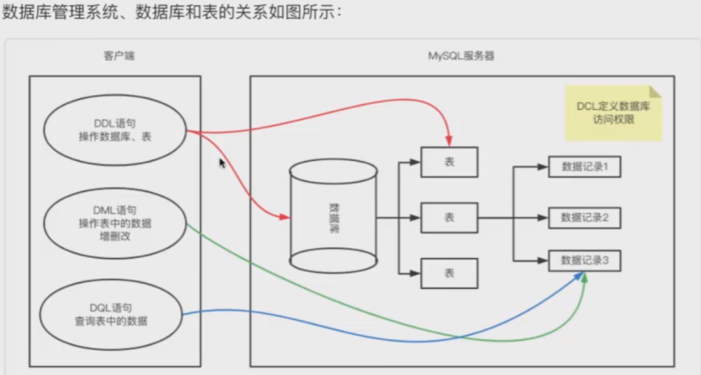

* 数据库管理系统 DataBaseSystem 是一套运行在操作系统的软件
* 通过文件形式管理数据的文件系统
* 关系型数据库
* 非关系型数据库
* mysql1996年开始运作被oracle收购
* mysql不区分大小写
* mysql创建数据库默认字符集：latin1

## 数据类型

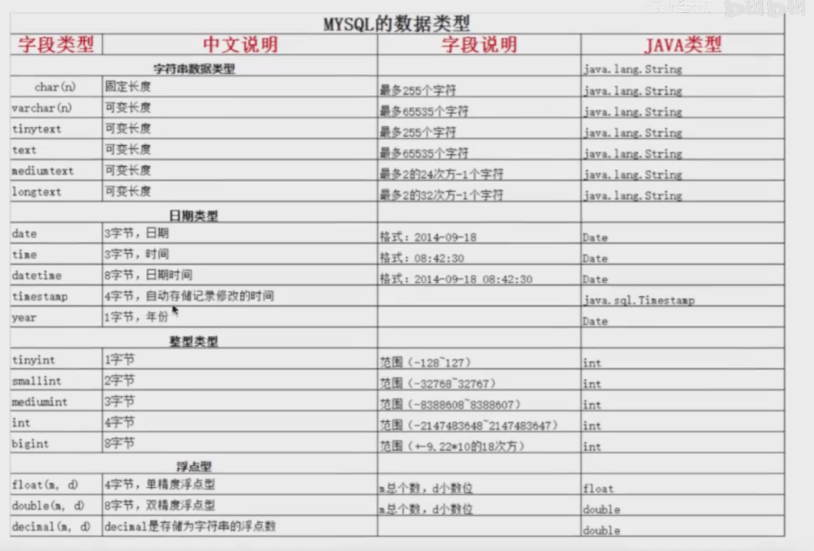

#### 字符串类型

* char 固定长度 适合存储固定大小的字符串如性别、身份证号
* varchar 可变长度 ，适合存储一定范围内变化的字符串，如微博留言；频繁扩容或缩容效率低但节省存储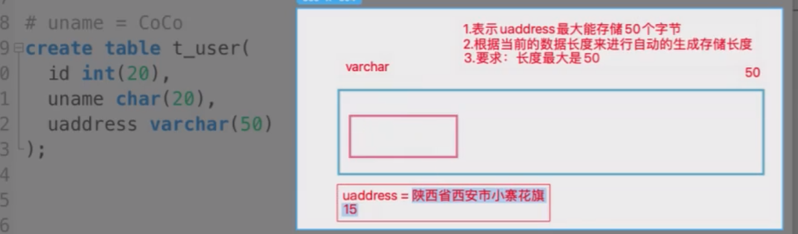

## DDL

数据库定义语言。Data Definition Language 定义数据库、表、字段

### 创建数据库

```sql
-- 数据库不存在则创建utf8编码的数据库
create database if not exists db1 character set utf8;
```

```sql
/*SqlServer语法*/
-- 创建该数据库
CREATE DATABASE 库名
```


### 复制表结构

```sql
-- 复制表结构
create table tb2 like tb1;
```

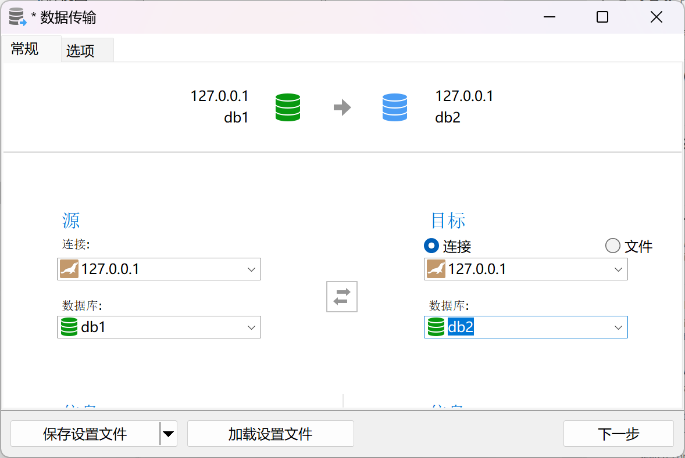

### 创建表

```sql
-- 创建表
create table if not exists tb1(
	id int(20) primary key,
    uname char(20),
    uaddress varchar(50)
);
```

### 展示某数据库详细

```sql
-- 选中库
use db1;
-- 展示某数据库详细
show create database db1;
```

### 查看正在运行的库

```sql
-- 查看正在运行的库
select database();
```

## 查看所有库

```sql
-- 查看所有库
SHOW DATABASES;
```


### 查看所有表

```SQL
-- 查看所有表
show tables;

-- SqlServer查询所有表
select name from sys.tables
```

### 查看某表的字段定义信息

```sql
-- 查看某表的字段定义信息
desc tb1;
```

### 查看某表的创建语句

```sql
-- 查看某表的创建语句
show create table tb1;
```

### 删除表

```sql
-- 删除tb1
drop table if exists tb1;
```

```sql
/*sqlserver语法*/

use master;
-- 删除tb1
IF EXISTS (SELECT * FROM INFORMATION_SCHEMA.TABLES WHERE TABLE_NAME = 'tb1')
    DROP TABLE SALEHTSP_EQBCS;
-- 查询所有表
select name from sys.tables;
```


### 修改表名

```sql
-- 修改表名为tb2
rename table tb1 to tb2
```

### 修改表默认字符编码

```sql
-- 修改 默认字符编码
alter table tb1 character set utf8
show create table tb1; --修改是否生效
```

### 添加字段

```sql
-- 添加字段email
alter table tb1 add email VARCHAR(20)
desc tb1 -- 查看是否生效
```

### 修改字段长度及数据类型

```sql
-- 修改字段长度及数据类型
alter table tb1 modify email char(20)
desc tb1 -- 查看是否生效

-- 修改字段名、长度及数据类型
alter table tb1 change email phone char(11)
desc tb1 -- 查看是否生效
```

### 删除字段

```mysql
-- 删除字段phone
alter table tb1 drop phone
desc tb1 -- 查看是否生效
```

## DML

数据库操作语言。Data Manipulation Language 对数据表增删改

```mysql
-- 学生表
use db1;
create table student(
	sid int,
	sname varchar(20),
	age int,
	sex char(1),
	saddress varchar(50)
);

```

### 插入

```sql
-- 增
insert into student values
(1,"罗涛",'23','男','宝安'),
(2,"周超",'24','男','福永'),
```

### 更新

```sql
-- 改
update student set age=18 where sid=1
```


### delete和truncate影响自增

```sql
-- 逐行删除，效率低
delete from where sid =1

-- truncate先全表删除，然后重新创建一样的表
truncate table student
-- 1.直接删除student
drop table if exists student;
-- 2.获取定义语句并重新创建表
show create table student;
```


## DCL

数据控制语言。Data Controller Language 定义数据库的访问权限、安全级别、存储过程等

### 创建用户

```sql
-- luotao01只能在本机访问目标数据库,密码123456 
create user 'luotao01'@'localhost' identified by '123456';

-- luotao02可在任意主机访问目标数据库
create user 'luotao02'@'%' identified by '123456';
```

### 查询有多少数据库用户

```sql
-- 查询有多少数据库用户
select * from mysql.user;
```

### 用户授权

```sql
-- 用户授权all/create/alter/select/insert/update/delete
grant 权限1,权限2...on 数据库名.表名 to '用户名'@'主机名称';
```

### 查询授权

```sql
-- 查询授权
show grants for '用户名'@'主机名'
```

### 删除用户

```sql
-- 删除用户
drop user '用户名'@'主机名称';
```

## DQL

数据查询语言，Data Query Language

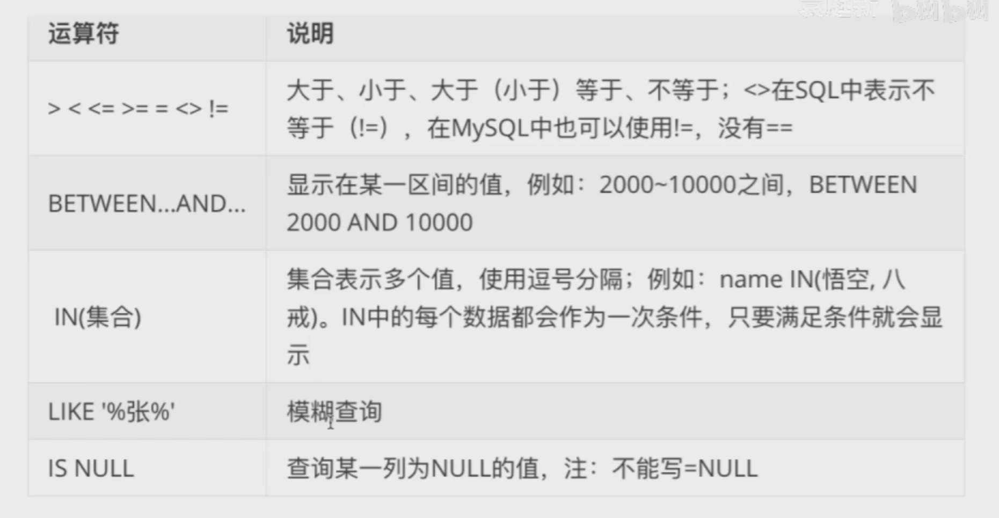

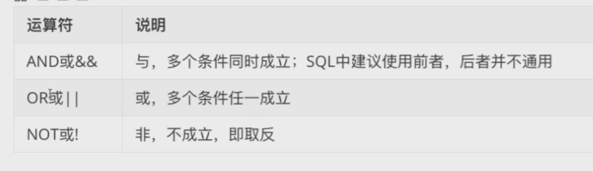

### 字段参与运算

```sql
-- 员工表
use db1;
create table emp(
	eid int,
	ename varchar(20),
	sex char(1),
	salary double,
	hire_date date,
	depte_name varchar(20)
);

-- 查询结果参与运算：字段值运算
select ename,salary+100  from emp where ename='罗涛'
select ename,salary+eid  from emp where ename='罗涛'

```

### in

```sql
-- in(集合)，每个元素都会与表中指定字段一一比较
select * from emp where ename not in ('罗涛','周超') and ename is null
select * from emp where ename !='罗涛' and ename is null
```

### 区间

```sql
-- 区间
select * from emp where salary between 5000 and 10000
```

### 模糊查询

```sql
-- 模糊查询，-表示任意
select * from emp where  ename like '-涛%'
```

### 排序

```sql
-- 单列排序 降序desc
select * from emp  order by salary desc

-- 组合排序,若前字段相同则 排序后一字段
select * from emp order by salary desc,eid desc;
```


## 聚合函数

纵向查询，根据列筛选保留满足条件的数据。

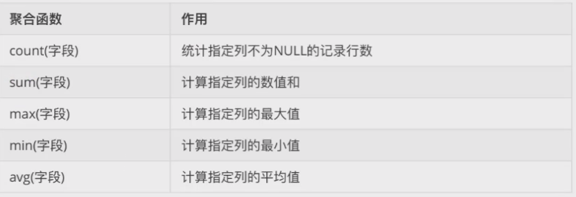

### group by

```sql
/*
	1.先根据分组条件划分组
	select * from emp where sex='男';
	select * from emp where sex='女';
	2.若没有明确展示字段，则取出分组中的第一条记录展示
	3.分组要结合聚合函数使用
	select sex,count(*) from emp group by sex;
	
**/
select * from emp group by sex;
```

## having

对分组后进一步添加过滤条件，结合group by

```sql
/*
	查询部门的平均薪资>6000的部门
	1.分组部门统计平均薪资
	2.分组后过滤
**/
select depte_name,avg(salary)
from emp 
where depte_name is not null --分组前用where过滤无效数据
group by depte_name
having avg(salary)>6000

-- having 条件表达式 and\or\not 
select depte_name,avg(salary)
from emp 
group by depte_name
having avg(salary)>6000 and depte_name is not null; -- 分组后过滤无效数据
```

## limit分页查询

```sql
limit 起始行(从0开始),记录数
-- 每页3条
-- 第1页
select * from emp limit 0,3;
-- 第2页
select * from emp limit 3,3;
-- 第3页
select * from emp limit 6,3;
-- 第4页
select * from emp limit 9,3;
...
-- 第N页,每页记录数R
select * from emp limit (N-1)*R,R;
```

## SQL约束

对表数据限制以保证数据的正确性。

### primary key

```sql
-- primary key 主键约束 标识唯一记录 主键自增 uname非空约束 IDnumber唯一约束
create table tb1(
	id int(20) primary key auto_increment,
    uname char(20) not null,
    IDnumber char(18) unique,
    uaddress varchar(50),
    dept_id int(20) constraint 外键约束名 foreign key(外键名) references 主表名（关联主表的主键）
);
create table tb1(
	id int(20) primary key auto_increment,
    uname char(20),
    uaddress varchar(50),
    constraint 外键约束名 foreign key(外键名) references 主表名（关联主表的主键）
);
-- 添加主键（含非空约束）
alter table tb1 primary key(id);
desc tb1;-- 查看修改
-- 删除主键不会删除非空约束
alter table tb1 drop primary key;
desc tb1;-- 查看修改
-- 联合主键
primary key(字段1，字段2);
```

### unique

```sql
-- unique 唯一约束（null不参与该约束）
```

### not null

```sql
-- not null 非空约束
```

### 默认值

```sql
-- 默认值可以防止null值产生
create table tb1(
	id int(20) ,
    uname char(20),
    uaddress varchar(50),
    sex char(1) default '男',
    salary double default 0.0
);
desc tb1;
```

### foreign key

```sql
/* foreign key 外键约束
	主表：约束从表 部门表
	从表：主表ID作外键	员工表中部门ID为外键（员工表的非主键字段deptID是部门表的主键，deptID为员工表的外键）。
	添加数据时，先添加主表后添加从表。
	删除数据时，先删除从表后删除主表。
**/
-- 修改为外键，并分配约束名
alter table 从表 constraint 约束名 
add foreign key(外键) 
references 主表(主表的主键)
-- 删除外键约束
alter table 从表 drop foreign key 约束名
```

## 级联操作

删除和更新时，同步主从表的数据。

```sql
-- 修改时标记级联
alter table 从表 constraint 约束名 
add foreign key(外键) 
references 主表(主表的主键)
on delete cascade
on update cascade 

-- 创建表时标记级联
create table tb1(
	id int(20) primary key auto_increment,
    uname char(20),
    uaddress varchar(50),
    constraint 外键约束名 foreign key(外键名) references 主表名（关联主表的主键）
    on delete cascade 
    on update cascade 
);

-- 级联删除
delete from tb1 where 指定关联键

-- 级联更新
update tb1 set 指定关联键 where 指定关联键
```


## 事务

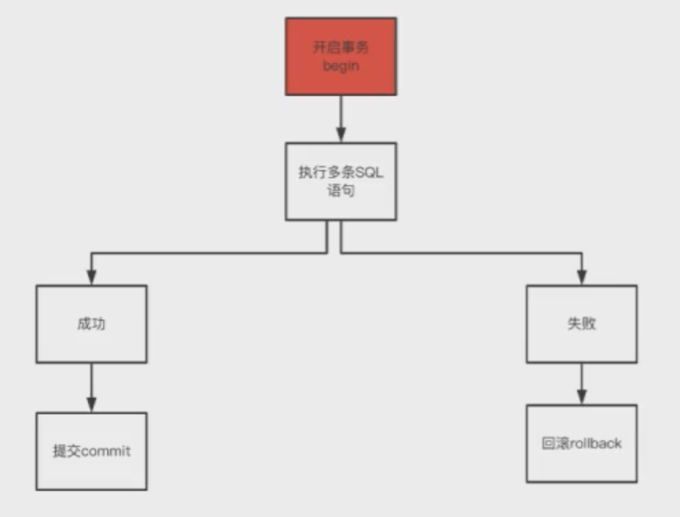

事务由多条sql语句组成整体，若任意一条sql异常都不能提交数据库，全部正常执行则提交，否则回滚到执行事务之前的状态。

> ATM取钱 取1k——》校验合法——》update (ATM宕机回滚)
>
> ```sql
> create table account(
> 	id int primary key auto_increment,
>     username varchar(20),
>     money double -- 账户余额
> );
> insert into account values(null,'luotao',1000),(null,'zhoucao',1000);
> select * from account;
> 
> -- 1.开启事务 
> -- start transaction;
> begin;
> -- 2.提交事务 luotao-》zhoucao 转账500
> update account set money=money-500 where username='luotao';
> update account set money=money+500 where username='zhoucao';
> commit; -- 提交
> 
> -- 异常回滚事务 rollback;
> ```

### 自动提交事务

mysql默认每一条DQL都是一个单独的事务。

### 查看当前数据库事务默认的提交方式

```sql
-- 查看当前数据库事务默认的提交方式
show variables like 'autocommit';
```

### 数据库事务自动提交开关

```sql
-- 关闭数据库事务自动提交
set @@autocommit=OFF;
-- 打开数据库事务自动提交
set @@autocommit=ON;
```

### 事务四大特性ACID

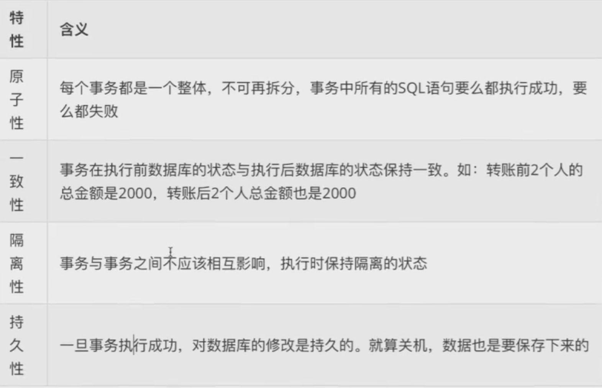

### 事务四个隔离级别

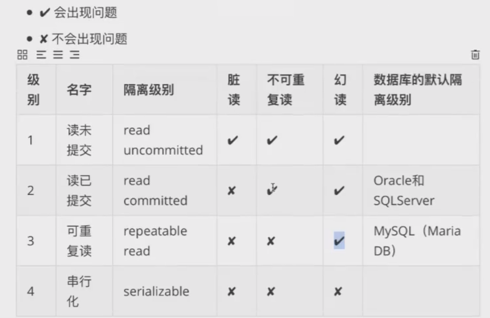

#### 数据库并发问题

一个数据库服务器可被多个客户端并发访问（多个用户同时涌入服务器）。

##### 脏读

一个事务读到了另一个事务中尚未提交的数据。

> 脏读案例
>
> -- 修改默认隔离级别为“读未提交”
> set global transaction isolation level read uncommitted;
>
> 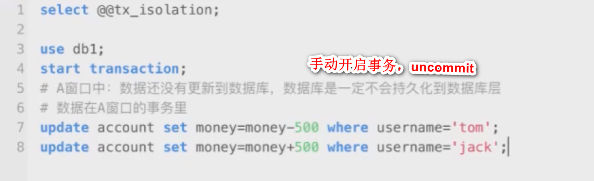
>
> 
>
> -- 规避脏读：提升隔离级别

##### 不可重复读

一个事务中两次读的内容不一致。update时引发的问题。（一个事务里在其他事务提交修改之前和之后读到的数据不一致）

> 不可重复读案例
>
> -- 修改默认隔离级别为“读已提交”
> set global transaction isolation level read committed;
>
> 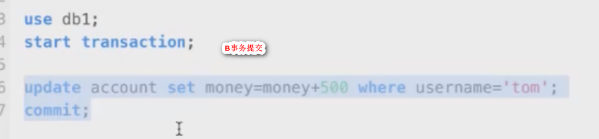
>
> 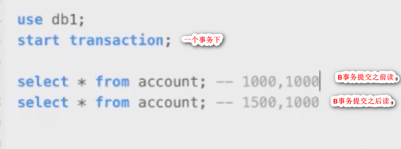

##### 幻读

读到的数据状态不准确。一个事务中某次select读到的结果无法支撑后续的业务操作。

（A用户用A事务做查询的时候读到B用户在B事务中提交的修改或新增数据，导致读不准确）

> 幻读案例
>
> 先select查询，若无记录则注册。

#### 隔离级别相关命令

```sql
-- 当前数据库的默认隔离级别
select @@tx_isolation;
-- mysql的默认级别为可重复读（幻读问题）
-- 修改默认隔离级别
set global transaction isolation level 隔离级别名称;
```

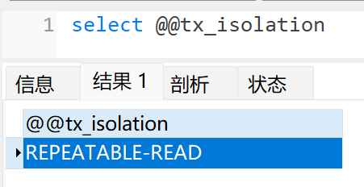

## 数据库设计

### 一对一

A表与B表中只有一条关联数据。

设计时通常合并成一张表。

```sql
-- 顾客——学生
create table if not exists  customer(
	id int ,
    name char(20) not null,
    qq char(12) not null,
    phone char(11) not null,
    primary key(id) auto_increment
);

create table if not exists student(
	id int,
    name char(20) not null,
    sno char(10) not null unique,
    primary key(id) auto_increment,
    customer_id int unique,
    foreign key(customer_id) references customer(id)
);
```

```sql
/* 夫妇关系表
	husband=0表示同性，不可取丈夫;
	wife=0表示同性，不可取妻子；
	男：1001 husband0 	wife1002
	女：1002 husband1001 	wife0
**/
create table if not exists person(
	id int primary key auto_increment,
    sname varchar(20),
    sex char(1),
    husband int,
    wife int
);

```


### 一对多

> 班级——学生：一个班可多个学生，每个学生只能对应一个班级。
>
> 客户——订单：一个客户可下多个订单，每个订单只能是一个客户。
>
> 部门——员工： 一个部门有多个员工，每个员工只能属于一个部门。
>
> 分类——商品：电脑分类下可有小米、联想等多个商品，小米、联想等电脑是一个电脑分类

A表在B表中有多条关联，B表中每一条只能对应A表的一条。

```sql
-- 省份——市
create table if not exists province(
	id int primary key auto_increment,
    name varchar(20),
    description varchar(20)
);
create table if not exists city(
	id int primary key auto_increment,
    name varchar(20),
    description varchar(20),
    pid int,
    constraint pro_city_fk foreign key(pid) references province(id)
);
```

```sql
-- 分类——商品
create table if not exists category(
    cid varchar(32) primary key,
    cname varchar(50)
);
create table if not exists product(
	pid varchar(32) primary key,
    pname varchar(50),
    price int,
    flag varchar(2),-- 商品状态：1上架，2下架
    category_id varchar(32),
    foreign key(category_id) references category(cid)
);
```


### 多对多

A表和B表都有多条关联对应。

需引入第三张表保存映射关系（A表的外键和B表的外键）。

> 老师——学生：一个老师有多个学生，每个学生也有有多个老师。
>
> 学生——课程：一个学生可选多个课程，每个课程也有多个学生。中间表：保存两表外键（sid,cid）
>
> 用户——角色：一个用户可分配管理员、普通等角色，每个角色也可被多个用户使用。

```sql
-- 演员——角色
create table if not exists actor(
	id int primary key auto_increment,
    name varchar(20)
);
create table if not exists role(
	id int primary key auto_increment,
    name varchar(20)
);
-- 中间表
create table if not exists actor_role(
	id int primary key auto_increment,
    aid int,
    rid int,
    foreign key(aid) references actor(id),
    foreign key(rid) references role(id)
);
```

```sql
-- 图书——作者：一个图书可以多个作者，一个作者也可编写多本书
create table if not exists book(
	id int primary key auto_increment,
    title varchar(10),
    price int
);
create table if not exists author(
	id int primary key auto_increment,
	name char(10),
    gender char(1)
);
-- 中间表,并添加级联删除和级联更新
create table if not exists book_author(
	id int primary key auto_increment,
    book_id int,
    author_id int,
    foreign key(book_id) references book(id)
    on update cascade
    on delete cascade,
    foreign key(author_id) references author(id)
    on update cascade
    on delete cascade
);
```

### 数据库三范式

* 原子性:列最小单元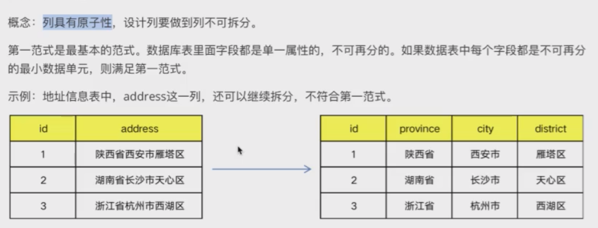
* 一张表只描述一件事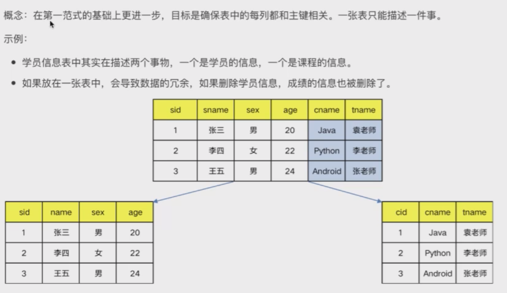
* 消除传递依赖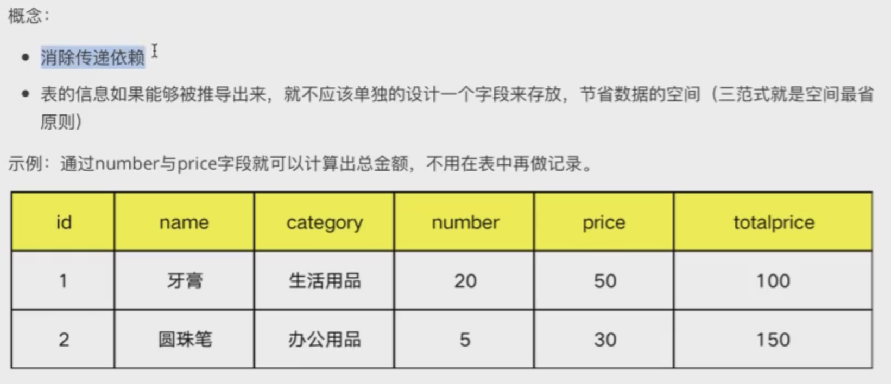

反三范式：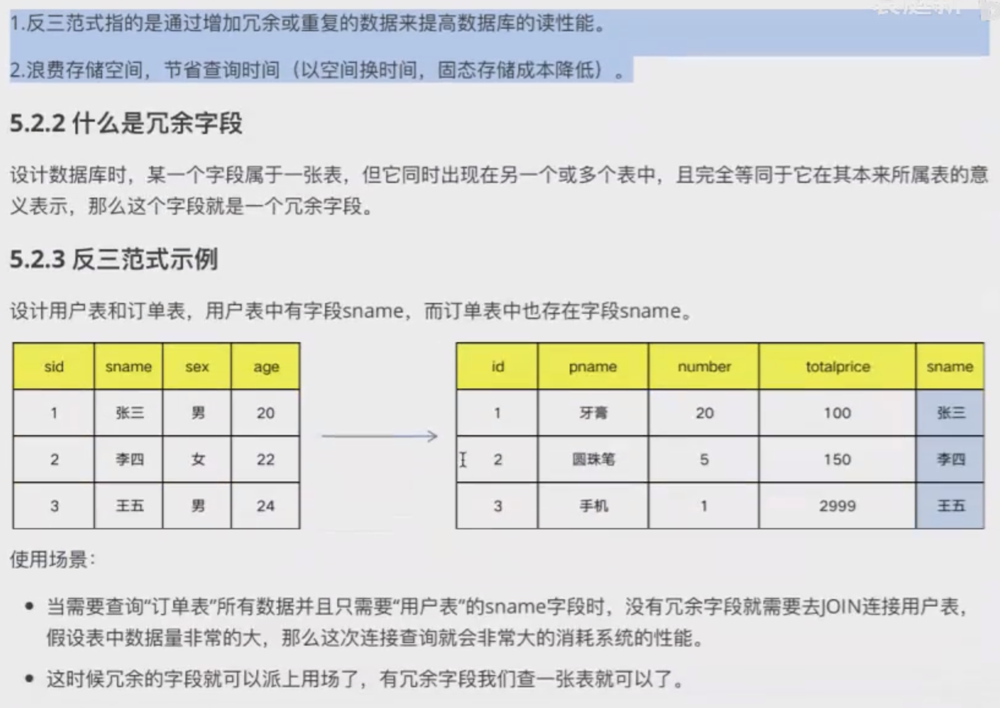

## cross join

交叉连接-笛卡尔积

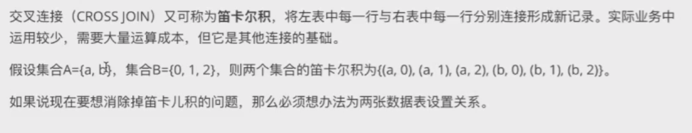

## inner join

内连接：将符合比较运算符比较的结果数据重新组合。两表交集。

* 隐式内连接

  ```sql
  -- category_id作为商品表的外键
  select p.pname,p.price,c.cname 
  from product p，category c 
  where c.category_id=p.cid
  ```

* 显示内连接

  ```sql
  -- category_id作为商品表的外键
  select p.pname,p.price,c.cname from product p
  inner join category c on c.category_id=p.cid
  where c.cname='鞋服' and p.price>500
  
  ```

## left join

左外连接，左表记录全显示以及右表交集。将左表作为基表与右表匹配，若右表匹配为空则NULL显示。

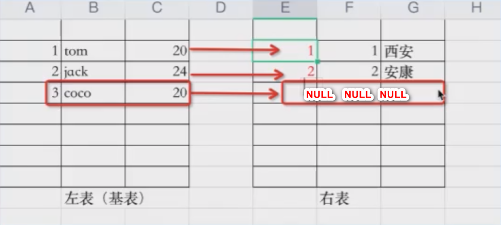

```sql
-- 每个分类下商品数量,注意count不会过滤NULL
select c.cname '分类名',count('pid') '商品数量' from category c 
left join  product p on c.category_id=p.cid
group by c.cname
```

## right join

右外连接，右表记录全显示以及左表交集。将右表作为基表与左表匹配，若左表匹配为空则NULL显示。

## 子查询

查询块：select-from-where

将一个查询块作为另一个查询块where或having或from部分出现，该查询块作子查询（内层查询），外层查询为父查询。

* where型子查询：将子查询结果作父查询的where条件。
* form型子查询：将子查询结果作临时表供外层sql父查询。
* exists型子查询：父查询结果拿到子查询比较。

```sql
-- 价格最高的商品信息
select * from products where price=(select max(price) from product);

-- 化妆品分类下的商品名称和价格
select p.pname,p.price from product p where p.category_id=(select cid from category where cname='化妆品')

-- 价格<2000的商品来自那个分类
select * from category where cid in(select distinct category_id from product where price<2000)
```

## 索引

数据库设计时对字段建立引用，使提升查询该字段的效率。

考虑字where及order by涉及的列上建索引。

对表数增删改时索引也要维护。

* 主键索引——primary key（unique+not null）

* 唯一索引——unique index(可以为NULL)

* 普通索引——index

  ```sql
  -- 添加索引
  create talbe tb1(
      id int,
      name varchar(20),
      hobby varchar(30),
      address varchar(30)
  	unique index 索引名 (字段)
  );
  
  -- 添加索引
  create unique index 索引名 on tb1(字段)
  
  -- 添加索引
  alter table tb1 add unique index 索引名(字段)
  
  -- 删除普通索引
  alter talbe tb1 drop index 索引名;
  
  -- 修改主键自增
  alter table tb1 modify 主键名 字段类型;
  -- 先删除主键自增：删除主键索引/删除主键
  alter talbe tb1 drop primary key;
  ```

## 视图

* 虚表
* 将指定列映射成一个视图
* select结果集作为视图的数据映射
* 只有查询操作，做数据的展示 
* 权限控制：某几个列运行运行用户查询，其他列不允许，可以开通视图查询特定列起到权限控制作用
* 视图本质是将复杂查询构建成一张视图，通过查询视图即可，简化了多表查询

```sql
create database if not exists my_db character set utf8;

use my_db;
-- 分类主表
create table if not exists category(
	cid varchar(32) PRIMARY key,
	cname VARCHAR(50)
);
-- 商品从表
create table if not exists  product(
	pid VARCHAR(32) PRIMARY key,
	pname VARCHAR(50),
	price INT,
	flag VARCHAR(2),-- 1上架、0下架
	category_id VARCHAR(32),
	FOREIGN KEY(category_id) REFERENCES category(cid)-- 外键约束
);


```


```sql
create view 视图名 字段别名 as select(字段);

-- 基于select将结果集作为视图映射
create view  products_category_view as 
select * from products p left join category c on p.category_id=c.cid;
-- 使用视图
select cname '分类名',avg(price) '分类平均价格' 
from products_category_view 
group by cname

```

```sql
-- 鞋服分类下最贵的商品信息
select * 
	from products p
	left join category c on p.category_id=c.cid
	where c.cname='鞋服'
and 
p.price=(
	select max(p.price) '最贵商品'
	from products p
	left join category c on p.category_id=c.cid
	where c.cname='鞋服';
);
-- 使用视图
select *
from products_category_view pcv
where pcv.cname='鞋服' 
and pcv.price=(
	select max(price)
    from pcv
    where cname='鞋服'
);

```

## 存储过程

* SQL中加入一些逻辑控制
* 为了完成特定功能的sql语句集，经编译创建并保存在数据库中，可供外部调用
* 存储过程调试完成后稳定运行，减少了业务系统与数据库的交互
* 业务需求在不断变化，存储过程难以维护

### 无参存储过程

```sql
delimiter $$ -- 标记开始
create procedure 存储过程名称()
begin -- 标记SQL开始
	
end $$ -- 标记结束
```

```sql
-- 调用存储过程
call 存储过程名称
```

> ```sql
> create table goods(
> 	gid int,
>     name varchar(20),
>     num int -- 库存
> );
> create table orders(
> 	oid int,
> 	gid int,
> 	price int -- 订单金额
> );
> insert into goods values 
> (1,'奶茶',20),
> (2,'绿茶',100),
> (3,'花茶',25);
> 
> -- 查询所有商品
> delimiter $$
> create procedure goods_proc()
> begin 
> 	select * from goods;
> end $$
> -- 调用存储过程
> call goods_proc();
> ```

### 有参存储过程

```sql
delimiter $$
create procedure orers_proc(
	in o_oid int,
    in o_gid int,
    in o_price int,
    out out_num int
)
begin
-- sql
	insert into orders values(	o_oid int,o_gid int,o_price int);
    -- 给输出变量out_num赋值
	set @out_num=10;
	-- 返回参数
	select @out_num;
end $$
-- 调用存储过程
call orers_proc(1,2,100,@out_num)
```

```sql
-- 存储过程接受商品ID并根据ID删除商品数据
delimiter $$
create procedure goods_delById_proc(in goods_id int)
begin
	delete from goods where gid=goods_id;
end $$
---- 删除goods_id=3的商品
call goods_delById_proc(3);

```

## 触发器

* 某些sql在特定条件下作为触发条件自动执行

* 针对表增删改（before/after）触发增删改的操作
* 一个表最多三种触发器（增删改），每个触发器只能作用一张表
* 视图和临时表不能添加触发器
* truncate表时触发器不会被删除，delete会删除。

> 客户下单：订单表插入一条数据，更新商品表的库存-1

```sql
-- 触发器和存储过程
delimiter $
	create trigger
		触发器名称 触发器时间 触发事件 on tb1
		for each row -- 按行触发
		begin
		-- sql
		end
$
```

```sql
-- 用户下一个订单之后，然后将库存减1
delimiter $
	create trigger 
	tri_xd after insert on orders
	for each row
	begin
	update goods set num=num-1 where gid=1;
	end $
	
-- 编写触发事件:客户下单奶茶
insert into orders values(1,1,20)
```

### 查询触发器

```sql
-- 查询触发器
show triggers;
```

### 删除触发器

truncate表时触发器不会被删除，delete会删除。

```sql
-- 逐行删除，效率低
delete from where sid =1

-- truncate先全表删除，然后重新创建一样的表
truncate table student
-- 1.直接删除student
drop table if exists student;
-- 2.获取定义语句并重新创建表
show create table student;
```

```sql
-- 删除触发器
if(object_id('触发器名称') is not null)
drop trigger 触发器名称
go
```

### trigger_name

触发器名称在当前数据库唯一

### trigger_time

触发时间(before/after)

* before——希望验证新数据是否满足条件
* after——希望在激活触发器的sql之后完成多个更改

### trigger——event

触发事件（增删改可激活触发器）

### for each row

行级触发,触发影响的每一行都会激活触发器的动作。增删改都有before/after，故每个表最多支持6个触发器,每个表的每个增删改都只对应一个触发器。

### trigger_stmt

触发激活的sql

## 数据库备份

```sql
-- 备份数据库
mysqldump -u用户名称 -p密码 数据库名称 > 脚本保存路径.sql
```

```sql
-- mysql备份数据库
mysqldump -uroot -proot db1 >./db1.sql
-- mysql还原数据库
mysql -u -p;
source 目标路径;
```

### SqlServer备份还原

```sql
/*SqlServer备份还原*/
-- 1.sqlserver备份
BACKUP DATABASE QPSDZLC
TO DISK='D:\QPSDZLC.bak'
-- 2.检查备份文件的逻辑信息，主要为LogicName，一个是数据文件mdf，一个是日志文件ldf
RESTORE FILELISTONLY
FROM DISK = 'D:\QPSDZLC.bak';
-- 3.还原
use master
RESTORE DATABASE QPSDZLC
FROM DISK='D:\QPSDZLC.bak'
```

#### 因为数据库正在使用，所以无法获得对数据库的独占访问权

报以上错误时执行以下语句：

```sql
use master
ALTER  DATABASE QPSDZLC SET OFFLINE WITH ROLLBACK IMMEDIATE
```

数据恢复之后，使用以下语句

```sql
ALTER  database   QPSDZLC   set   online 
```

### 导入脚本还原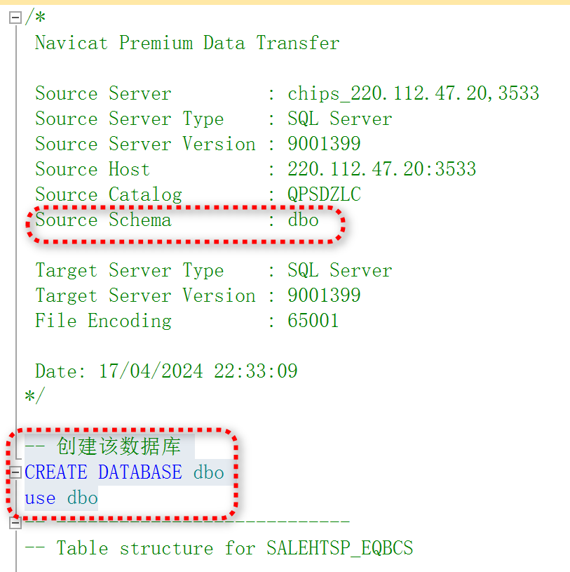


## 参考

* [数据库排名](https://db-engines.com/en/ranking)

* sqlLite嵌入式小型数据库应用手机端

* frm——表结构文件；
  ibd——表数据和索引；

  
