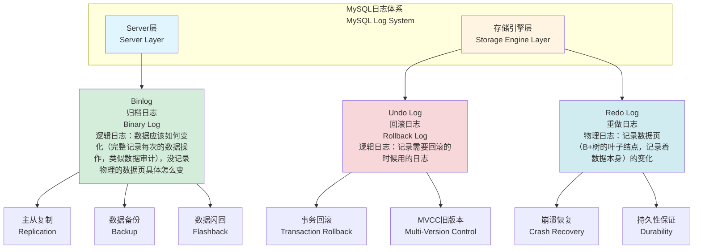
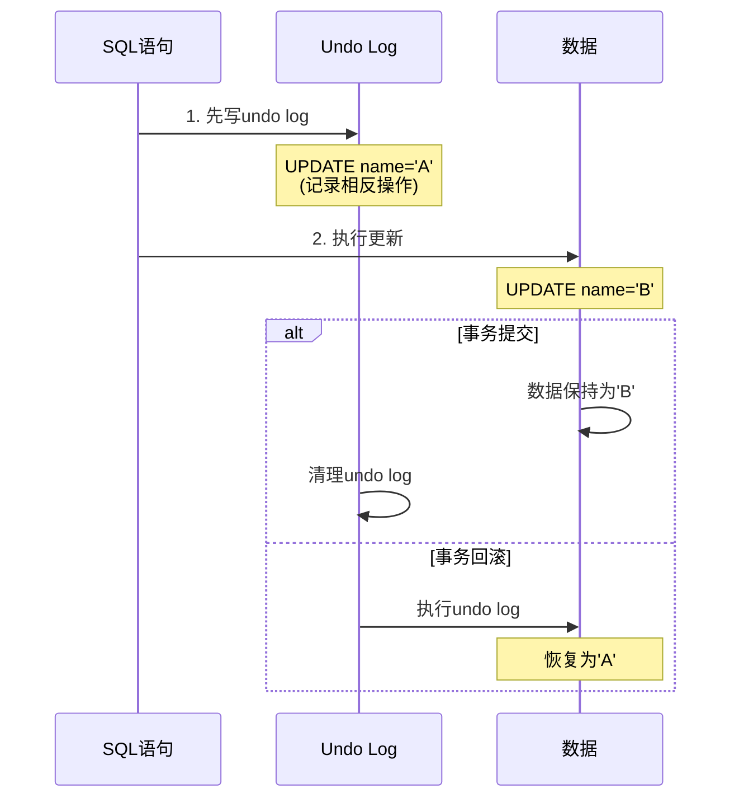
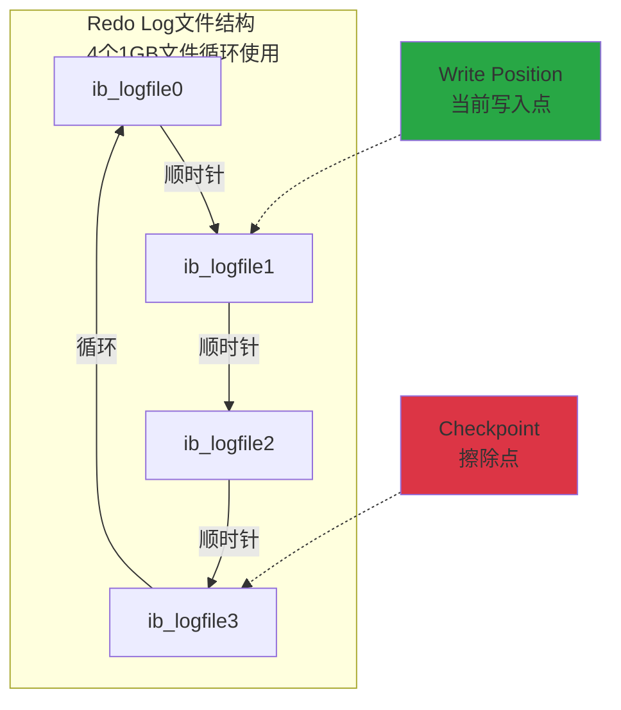
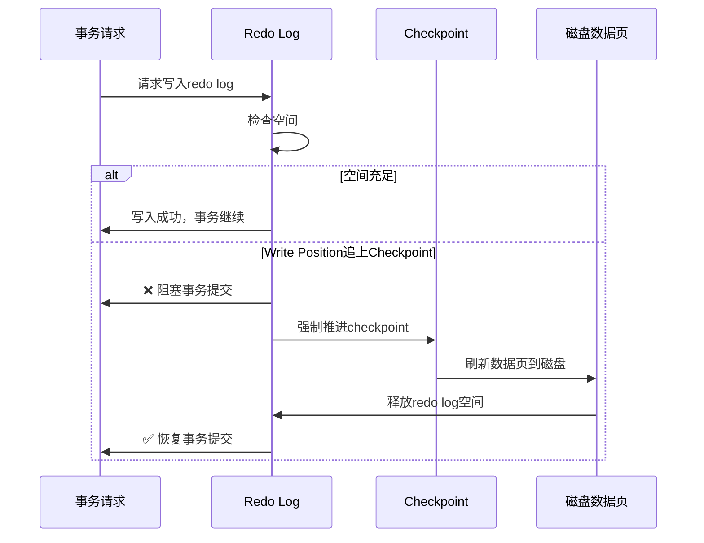
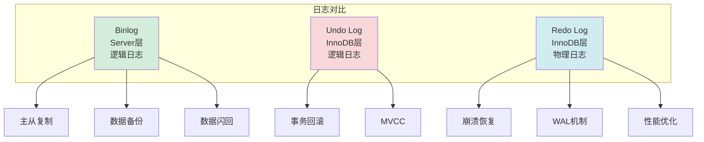
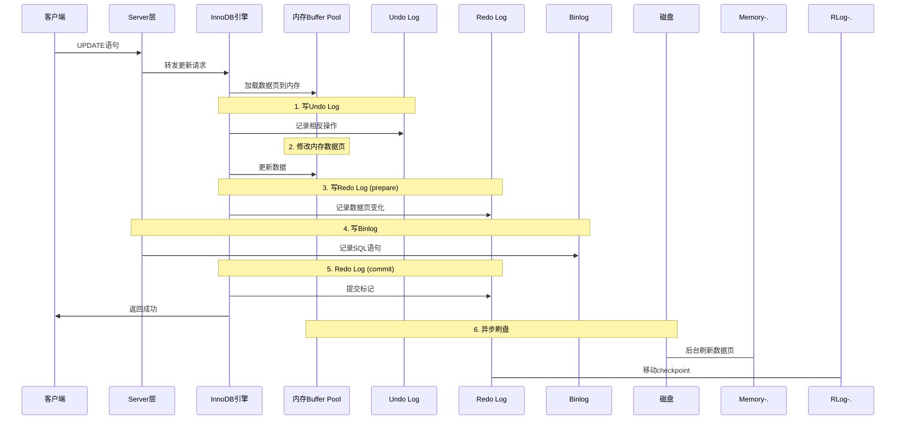
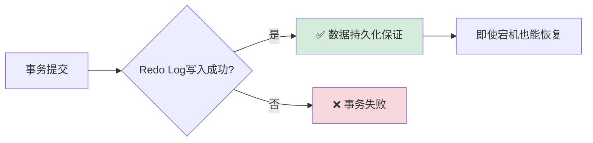
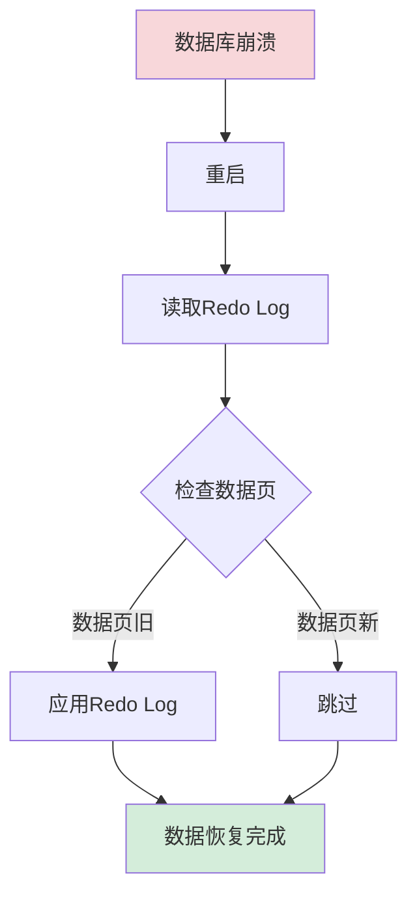
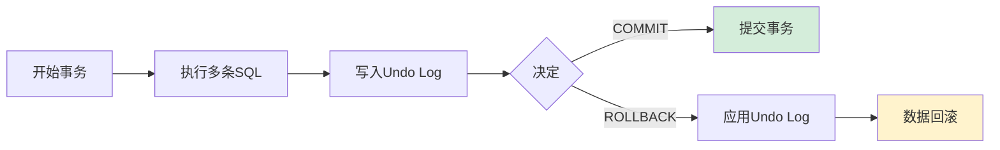

# MySQL日志体系详解 - InnoDB更新机制

## 一、概述

MySQL为了满足主从复制、事务等功能，设计了复杂的日志体系。这些日志不是给人看的运行日志，而是系统运行所必需的功能性日志。

## 二、三种核心日志详解

### 2.1 Binlog（归档日志 / Binary Log）

#### **基本特性**

| 属性 | 说明 |
|------|------|
| **所属层级** | Server层产生（与存储引擎无关） |
| **日志类型** | 逻辑日志（Logical Log） |
| **记录内容** | 数据应该如何变化（SQL语句或行变更） |
| **存储位置** | 专门的binlog文件 |

#### **主要用途**

1. **数据复制（Replication）**
   - 主库将binlog传送给从库
   - 从库通过binlog重现主库的数据更新
   - 实现主从同步

2. **数据备份（Backup）**
   - 完整记录数据库的所有操作
   - 可作为数据审计手段

3. **数据闪回（Flashback）**
   - 记录每一刻的数据操作
   - 可以像录像带倒带一样回退数据状态
   - 实现时光机般的数据恢复

#### **形象化场景**

> 想象binlog是一个完整的操作录像带，记录了数据库的每一次变化。就像监控录像一样，你可以：
> - 把录像传给另一个地方播放（主从复制）
> - 保存录像作为备份（数据备份）
> - 倒带回放到某个时间点（数据闪回）

---

### 2.2 Undo Log（回滚日志 / Rollback Log）

#### **基本特性**

| 属性 | 说明 |
|------|------|
| **所属层级** | InnoDB存储引擎特有 |
| **日志类型** | 逻辑日志（Logical Log） |
| **记录内容** | 数据变更的相反操作 |
| **存储位置** | 表空间的Undo Segment |

#### **主要用途**

1. **事务回滚（Transaction Rollback）**
   - 事务执行过程中需要rollback时
   - 使用undo log将所有操作还原

2. **展示旧版本（MVCC）**
   - 多版本并发控制（Multi-Version Concurrency Control）
   - 为不同事务提供数据的历史版本

#### **工作原理示例**

**逻辑日志示例：**

| 原始SQL | Undo Log记录 |
|---------|-------------|
| `UPDATE name = 'B'` (原值为A) | `UPDATE name = 'A'` |
| `DELETE FROM table WHERE id=1` | `INSERT INTO table VALUES(...)` |
| `INSERT INTO table VALUES(...)` | `DELETE FROM table WHERE id=x` |

#### **形象化场景**

> Undo Log就像Word文档的"撤销"功能（Ctrl+Z）。你修改了文档内容，但还没保存，如果想撤销，就用undo log记录的相反操作来还原。同时，它也像文档的"修订历史"，可以查看之前的版本。

---

### 2.3 Redo Log（重做日志 / Redo Log）

#### **基本特性**

| 属性 | 说明 |
|------|------|
| **所属层级** | InnoDB存储引擎特有 |
| **日志类型** | **物理日志（Physical Log）** |
| **记录内容** | 数据页的物理变化 |
| **存储位置** | 4个1GB的循环文件（可配置） |
| **核心原则** | **日志优先于数据（Write-Ahead Logging）** |

#### **核心机制：WAL（Write-Ahead Logging）**

**关键理解：**
- ✅ 只要写入了redo log，就视为数据已更新（持久化保证）
- ⏰ 实际数据页可以延迟写入磁盘
- 🔒 内存中保持最新数据，查询不受影响

#### **Redo Log循环写入机制**

**两个关键指针：**

| 指针 | 说明 | 移动方向 |
|------|------|---------|
| **Write Position** | 当前日志写入点 记录新的redo log | 顺时针前进 ⬆️ |
| **Checkpoint** | 数据已刷盘的擦除点 可以清理的redo log | 顺时针前进 ⬇️ |

**空间状态：**
- 🟢 **绿色区域**：空闲空间，可写入新日志
- 🟡 **黄色区域**：已写入但未刷盘的日志

#### **极端情况：Write Position追上Checkpoint**

**性能影响：**
- ⚠️ 当Write Position追上Checkpoint时，所有增删改操作被阻塞
- 📊 查询操作不受影响
- 🐌 这是数据库更新性能差的主要原因之一

#### **形象化场景：开会记笔记**

> **场景：** 你在向老板汇报80页的PPT，老板不断提出修改意见。
> 
> **你的选择：**
> 1. ❌ 每次都退出PPT，立即修改，再继续（效率低）
> 2. ✅ 用小本本记录修改意见，会后统一修改（效率高）
> 
> **对应关系：**
> - 📝 **小本本** = Redo Log
> - 📄 **PPT文件** = 磁盘数据页
> - 💻 **播放中的PPT** = 内存数据页
> - ✏️ **记录意见** = 写入redo log
> - 💾 **会后修改** = 异步刷盘
> 
> **关键点：**
> - 只要记在小本本上，老板就认为你已经更新了（日志优先于数据）
> - 你早晚会修改PPT（数据最终会持久化）
> - 如果小本本写满了（Write Position追上Checkpoint），必须停下来先处理一些（强制刷盘）

---

## 三、三种日志对比总结

| 特性 | Binlog | Undo Log | Redo Log |
|------|--------|----------|----------|
| **层级** | Server层 | InnoDB引擎 | InnoDB引擎 |
| **类型** | 逻辑日志 | 逻辑日志 | **物理日志** |
| **内容** | SQL语句/行变更 | 相反操作 | 数据页变化 |
| **用途** | 复制/备份/闪回 | 回滚/MVCC | 崩溃恢复/持久化 |
| **存储** | binlog文件 | 表空间Undo Segment | 4个循环文件 |
| **必需性** | 所有引擎 | InnoDB事务 | InnoDB事务 |
| **写入时机** | 事务提交时 | 更新前 | 更新后 |

---

## 四、更新流程中的日志协作

---

## 五、关键概念与原则

### 5.1 WAL原则（Write-Ahead Logging）

> **日志优先于数据**
> - 先写日志，再写数据
> - 只要日志写入成功，就保证数据不丢失
> - 数据可以延迟写入磁盘

### 5.2 数据持久性保证

**核心理解：**
- 只要redo log不丢，数据就不会丢失
- 内存中的数据是最新的（查询不受影响）
- 磁盘上的数据可能是旧的（但有redo log保证）

### 5.3 性能优化关键

**影响性能的因素：**
1. ⚠️ Checkpoint推进速度慢
2. ⚠️ Write Position频繁追上Checkpoint
3. ⚠️ 强制刷盘导致事务阻塞

**优化方向：**
- 增大redo log文件大小
- 调整刷盘策略
- 优化checkpoint推进速度

---

## 六、实际应用场景

### 场景1：数据库崩溃恢复

### 场景2：主从复制

### 场景3：事务回滚

---

## 七、面试要点总结

### 7.1 必须掌握的知识点

1. **三种日志的区别**
   - Binlog：Server层，逻辑日志，用于复制和备份
   - Undo Log：InnoDB，逻辑日志，用于回滚和MVCC
   - Redo Log：InnoDB，物理日志，用于崩溃恢复

2. **WAL机制**
   - 日志优先于数据
   - 先写redo log，再异步刷盘
   - 保证数据持久性

3. **Redo Log循环写入**
   - 4个文件循环使用
   - Write Position和Checkpoint
   - 空间满时阻塞事务

### 7.2 常见面试问题

**Q1: 为什么需要redo log，直接写磁盘不行吗？**

A: 
- 随机写磁盘性能差（需要寻道）
- Redo log是顺序写，性能高
- 可以批量刷盘，减少IO次数

**Q2: Redo log写入后，磁盘数据是旧的，查询会查到旧数据吗？**

A:
- 不会，因为内存中的数据页是最新的
- 查询优先从Buffer Pool读取
- 只有内存中没有才读磁盘

**Q3: Undo log和Redo log的区别？**

A:
- Undo log记录相反操作（逻辑），用于回滚
- Redo log记录数据页变化（物理），用于恢复
- Undo log在更新前写，Redo log在更新后写

**Q4: Binlog和Redo log有什么区别？**

A:
- Binlog是Server层，所有引擎都有
- Redo log是InnoDB特有
- Binlog用于复制，Redo log用于崩溃恢复
- Binlog是追加写，Redo log是循环写

---

## 八、参考资料与扩展阅读

### 相关主题
- InnoDB存储引擎架构
- MVCC多版本并发控制
- 事务ACID特性实现
- MySQL主从复制原理
- 数据库备份与恢复策略

### 下节预告
- **更新SQL语句的完整执行流程**
- 从接收请求到数据持久化的全过程
- 各个日志的写入时机和顺序

---

**笔记创建时间：** 2025-01-22  
**课程来源：** MySQL InnoDB更新机制 - 日志体系  
**关键词：** `#MySQL` `#InnoDB` `#日志` `#Binlog` `#UndoLog` `#RedoLog` `#WAL` `#事务`
