## Shortcut keys

* 列出代码模板`ctrl + j`
* 删除当前行`ctrl + y`
* Ctrl + Alt + 左箭头：返回到上一个光标位置
*  `alt + 1 `
* 标记书签`ctrl + F11`
* 按 Shift + F11 查看所有书签并快速跳转
* 复制全类名`ctrl + shift + alt + c`
* 分屏`shift + enter`
* 语句块`ctrl + alt + t`
* 按快捷键 Ctrl + E 打开“最近文件”列表
* 移到方法结尾`Ctrl + ]`
* 批量重命名指定变量名、方法名、类名`shift + f6`
* 列出当前类结构filestructure,搜索指定方法`ctrl + f12`
* 查看继承结构type Hierarchy`ctrl + h`
* 回溯变量、方法的来源go to implementation `ctal + alt + b`
* 查看在上下文中的引用`ctal + f7`,用`f3`选择

## 断点调试

自定义视图

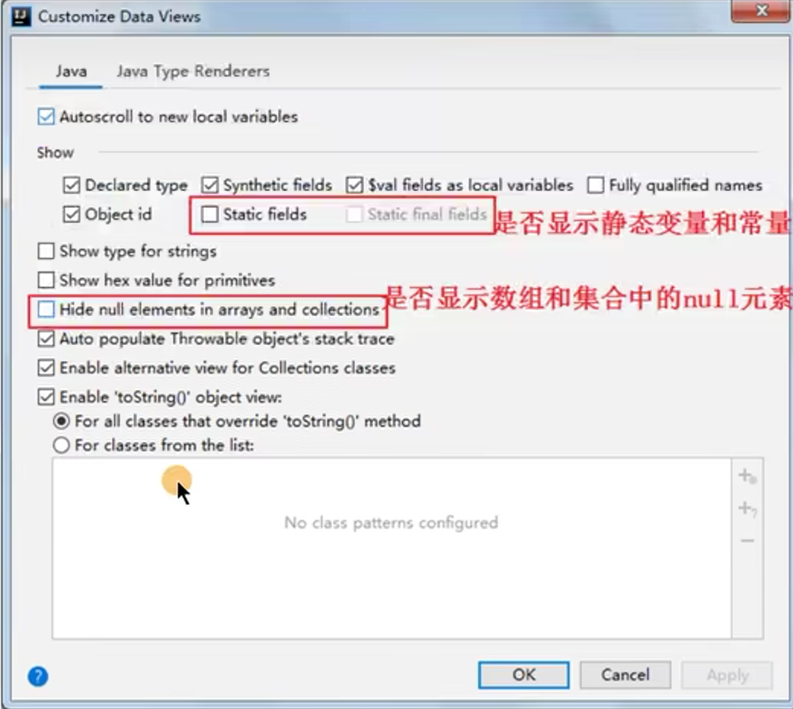

## 快捷操作

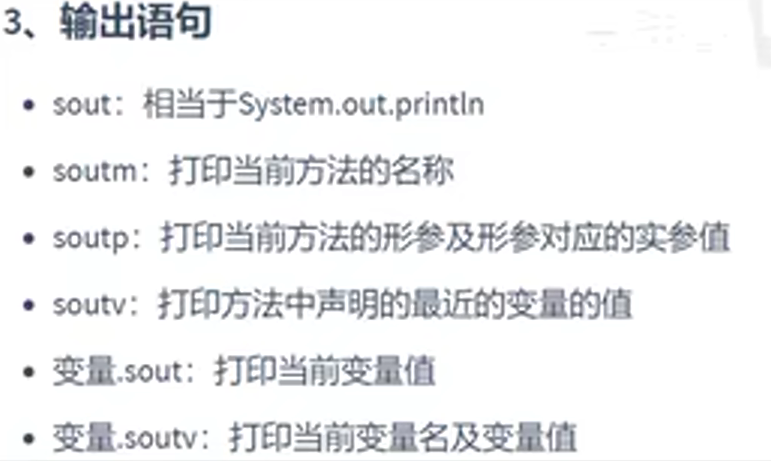

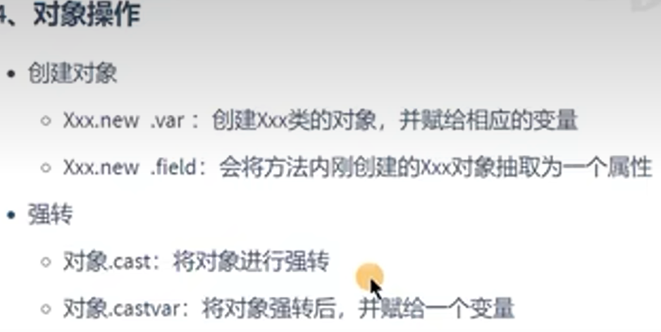

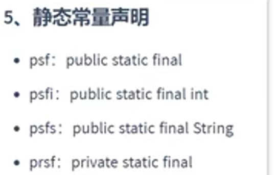


## 方法之间分隔符


## 代码补全

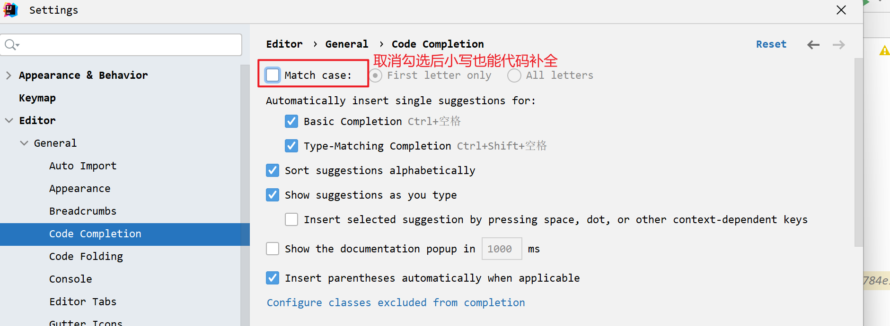

## 自动导包

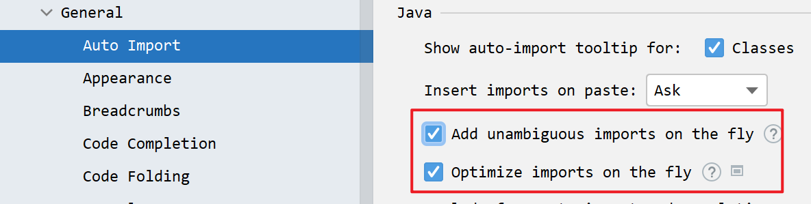

## 多行显示选项卡

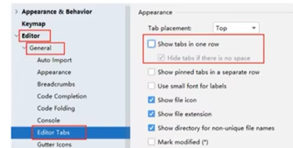

## 多模块指定不同编码


## IDEA热部署

* 运行时自动编译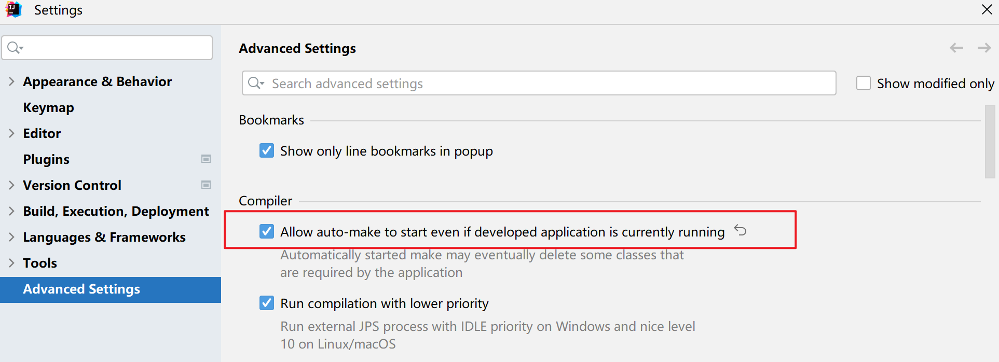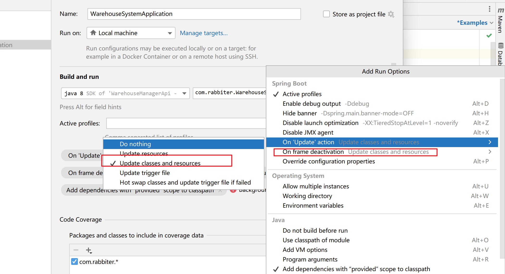

* 引入`devtools`热部署

  ```xml
  <!--devtools热部署-->
  <dependency>
      <groupId>org.springframework.boot</groupId>
      <artifactId>spring-boot-devtools</artifactId>
      <scope>runtime</scope>
      <optional>true</optional>
  </dependency>
  
  <plugin>
      <groupId>org.springframework.boot</groupId>
      <artifactId>spring-boot-maven-plugin</artifactId>
      <configuration>
  		<!--开启热部署devtools-->
          <fork>true</fork>
      </configuration>
  </plugin>
  ```
  
  

## 注释颜色

```html
6A9955
```


## IDEA注释模板

### 类模板

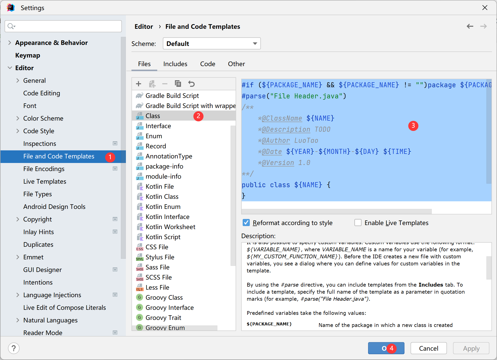

```java
#if (${PACKAGE_NAME} && ${PACKAGE_NAME} != "")package ${PACKAGE_NAME};#end
#parse("File Header.java")
/**
 * @Classname ${NAME}
 * @Description TODO
 * @Version 1.0.0
 * @Date ${DATE} ${TIME}
 * @Author LuoTao
 */
public class ${NAME} {
}

```

### 方法注释模板


```java
**
* @Description $desc$
* @Author LuoTao
* @Date $date$
* @return $return$
* @param $param$
**/
```

## templateVariables

### desc

```java
methodName()
```

### date

```java
date("yyyy-MM-dd HH:mm:ss")
```

### return

```java
groovyScript("def returnType = \"${_1}\"; def result = returnType; return result == '' ? null : result;", methodReturnType()); 
```

### param

```java
groovyScript("def result = '';def params = \"${_1}\".replaceAll('[\\\\[|\\\\]|\\\\s]', '').split(',').toList(); for(i = 0; i < params.size(); i++) {if(!params[i].isBlank())result+=(i==0?'':'* @param ' ) + params[i] + ((i < params.size() - 1) ? '\\r\\n ' : '')}; return result == '' ? null : result", methodParameters())
```


## 文档级注释

```java
**
* @Description: $desc$
* @Author: LuoTao
* @Date: $date$
**/
```

## 测试模板

```java
@Test
public void test$var1$(){
    $var2$
}
```

## 添加模板应用场景

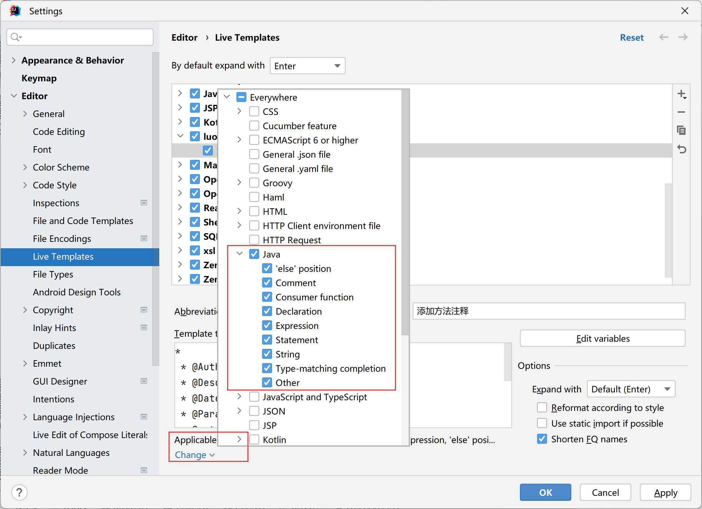


## EnvironmentConstruction

* [jdk下载](https://jdk.java.net/archive/)

 ```java
  // 环境变量
  JAVA_HOME
  %JAVA_HOME%\bin
  // 验证
  java -version
 ```

## CrossPlatform

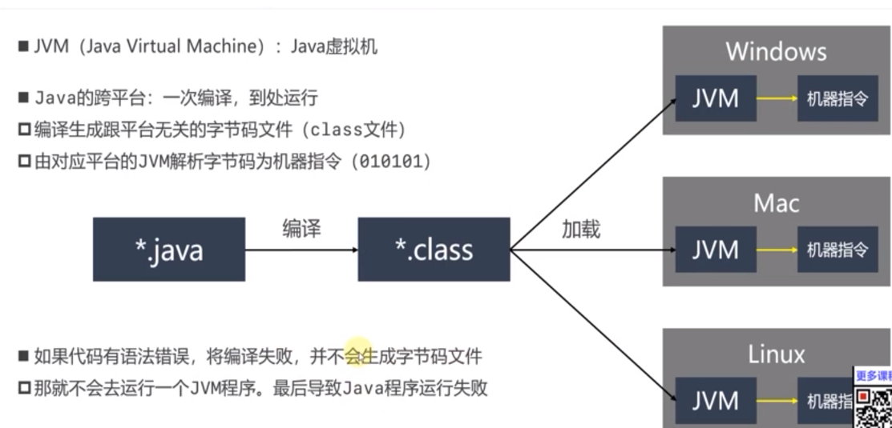

* c\c++使用平台相关的编译器生成对应平台的可执行文件

## DataType

浮点数属于近视值，运算可能出现精度丢失。

| 类型         | 取值范围                                     | 用途                                                         |
| ------------ | -------------------------------------------- | ------------------------------------------------------------ |
| `byte`(1)    | -128 到 127                                  | 存储较小的整数值，节省内存                                   |
| `short`(2)   | -32,768 到 32,767       即 -2^15 到 2^15 - 1 | 存储中等大小的整数值，节省内存                               |
| `int`(4)     | -2^31 到 2^31 - 1                            | 通用整数类型                                                 |
| `long`(8)    | -2^63 到 2^63 - 1                            | 存储大整数值                                                 |
| `float`(4)   | 大约 `±3.4e±38`（7 位精度）                  |                                                              |
| `double`(8)  | 大约`±1.7e±308`（15 位精度）                 |                                                              |
| `char`(2)    | `\u0000'`到 `\uffff`                         | 存储单个字符                                                 |
| `boolean`(1) | true 或 false                                | `JVM` 会在编译时期将 boolean 类型的数据转换为 int，使用 1 来表示 true，0 表示 false。`JVM `支持 boolean 数组，但是是通过读写 byte 数组来实现的。 |

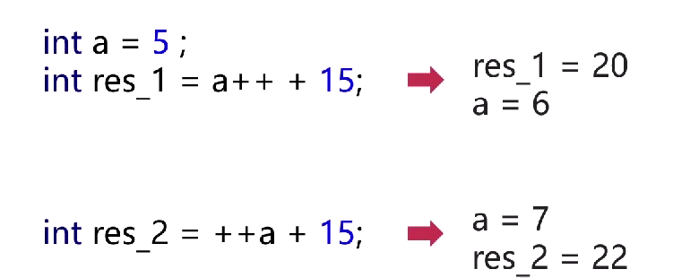

```java
    // @Description: a++ 先算表达式再自加；--a 先自减再表达式
	public static void main(String[] args) {
        int a = 100;
        int b = 200;
        b += a++;//b=300 a=101
        b += --a;//a=100 b=300 +100=400
        System.out.println(a);// 100
        System.out.println(b);// 400
    }
```


```java
   // @Description: 单目运算符自动发生强制类型转换
   public static void main(String[] args) {
        byte a=10;
        a += 10; //a = (byte)(a + 10);
    }
```

## case1-whileDemo-反转四位正整数

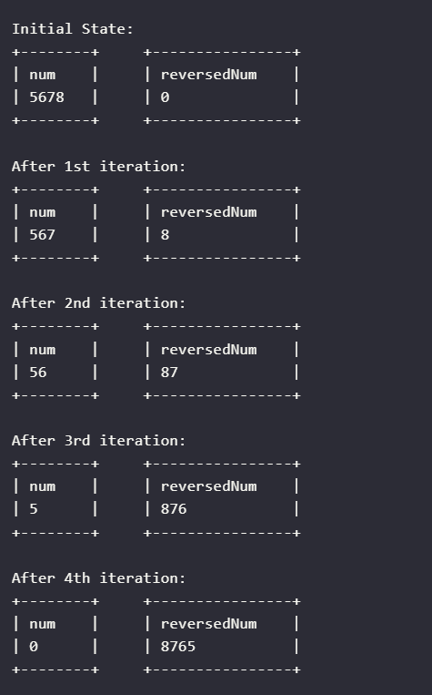

```java
package com.rabbiter.nekofun;

 class App {
    /**
     * 反转一个四位正整数并打印结果。
     *
     * @param num 四位正整数
     */
    public static void reverse(int num) {
        // 检查输入是否为四位正整数
        if (num < 1000 || num > 9999) {
            System.out.println("请输入一个四位正整数！");
            return;
        }

        int reversedNum = 0;
        while (num != 0) {
            //将 reversedNum 左移一位（乘以10），然后加上 num 的最后一位（通过取模运算 % 10 获得）
            reversedNum = reversedNum * 10 + num % 10;
            num /= 10;//去掉 num 的最后一位，为下一次迭代做准备
        }

        System.out.println("反转后的数字是: " + reversedNum);
    }

    public static void main(String[] args) {
        reverse(5678);
    }
}
```

## case2-whileDemo-四叶玫瑰数

```java
package com.rabbiter.nekofun;

 class App {
    /**
     * 找出所有的四叶玫瑰数（四位数，个位、十位、百位、千位上数字的4次方之和等于数字本身）
     */
    public static void whileDemo() {
        // 遍历所有四位数
        for (int num = 1000; num <= 9999; num++) {
            if (isFourLeafRose(num)) {
                System.out.println("找到四叶玫瑰数: " + num);
            }
        }
    }

    /**
     * 判断给定的四位数是否为四叶玫瑰数
     */
    private static boolean isFourLeafRose(int num) {
        int originalNum = num;
        int sumOfPowers = 0;

        while (num != 0) {
            int digit = num % 10;//每次取出末位
            sumOfPowers += Math.pow(digit, 4);
            num /= 10;//每次去掉末位
        }

        return sumOfPowers == originalNum;
    }

    public static void main(String[] args) {
        whileDemo();

    }
}
```

## case3-whileDemo-模拟电量消耗

```java
package com.rabbiter.nekofun;

class LoopDemo {

    /**
     * @Description: 模拟电量消耗的 while 循环示例。
     * 初始电量为 65%，每次循环（即一圈）减少 10% 的电量，
     * 直到剩余电量不足以完成一圈为止。
     * @CoreKnowledge: - 条件语句：在循环中使用条件判断来决定是否继续执行循环体。
     * - 变量作用域：定义了两个变量用于跟踪电量和圈数。
     */
    public static void whileDemo() {
        int remainCharge = 65; // 剩余电量
        int count = 0; // 记录圈数

        // 当剩余电量大于等于 10 时，可以跑一圈
        while (remainCharge >= 10) {
            count++; // 累加圈数
            remainCharge -= 10; // 每跑完一圈减少 10
            System.out.printf("第 %d 圈：剩余电量为 %d\n", count, remainCharge); // 格式化输出
        }

        // 当剩余电量不足 10
        if (remainCharge < 10) {
            System.out.println("快没电啦：剩余电量为 " + remainCharge);
        }
    }

    public static void main(String[] args) {
        whileDemo();
    }
}
```

## case4-whileDemo-定速巡航

> 循环次数未知时用while,且循环体要包含趋于结束的语句

```java
package com.rabbiter.nekofun;
/**
 * 定速巡航，初始速度50，每隔 1h 提升10,1h、2h后共行驶多少KM
 **/
class LoopDemo{
    public static void forDemoCalculateDistance(int speed,int hour){
        int i = 1;
        double distance=0;
        for(;i<=hour;i++){
              distance += speed * 1;// 每个小时的路程
            speed +=10;
        }
        System.out.println(hour + "小时后行驶了" + distance + "KM");
    }

    public static void WhileDemoCalculateDistance(int speed,int hour){
        int i = 1;
        double distance=0;
        while (i<=hour){
            distance += speed * 1;
            speed+=10;
            i++;
        }
        System.out.println(hour + "小时后行驶了" + distance + "KM");
    }

    public static void DoWhileDemoCalculateDistance(int speed,int hour){
        int i = 1;
        double distance=0;
        do{
            distance += speed * 1;
            speed+=10;
            i++;
        }while (i<=hour);
        System.out.println(hour + "小时后行驶了" + distance + "KM");
    }

    public static void main(String[] args) {
        forDemoCalculateDistance(50, 5);
        System.out.println("\n");
        WhileDemoCalculateDistance(50, 5);
        System.out.println("\n");
        DoWhileDemoCalculateDistance(50, 5);
    }
}
```


## case5-whileDemo-考试系统

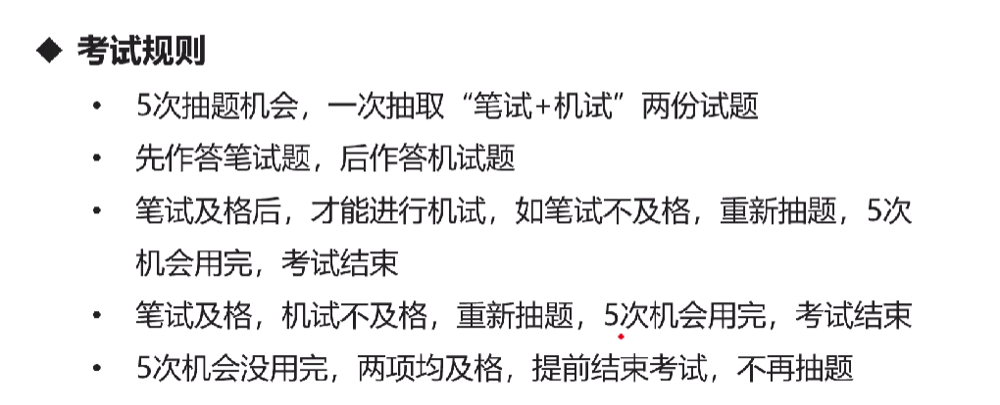

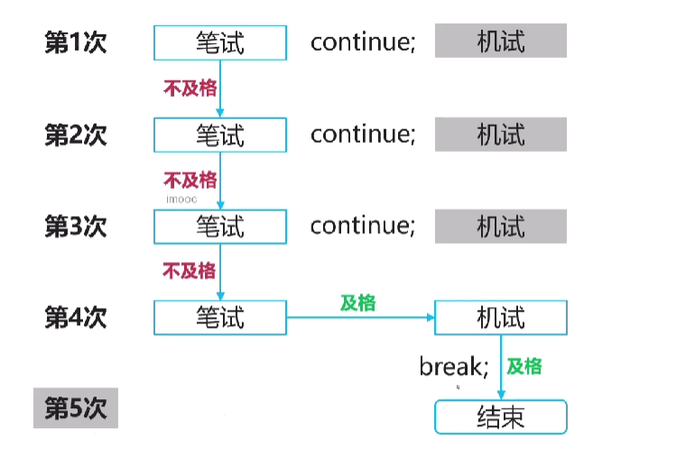

```java
package com.rabbiter.nekofun;

import java.util.Scanner;

/**
 * Exam 类模拟了一个考试系统，考生有5次抽题机会。
 * 每次抽取包含 "笔试" 和 "机试" 的两份试题，先进行笔试后进行机试。
 * 笔试不及格需要重新抽题；笔试及格但机试不及格也需要重新抽题。
 * 如果在5次机会内两项考试均及格，则考试结束，不再抽题。
 */
 class Exam {

    /**
     * 执行考试过程的方法。
     */
    public static void exam() {
        int count = 0; // 抽题次数
        Scanner sc = new Scanner(System.in); // 创建 Scanner 对象用于输入

        try {
            while (count < 5) {
                count++;
                System.out.println("====第 " + count + " 次考试=====");

                // 笔试部分
                System.out.print("请输入笔试成绩：");
                if (!sc.hasNextInt()) {
                    System.out.println("输入错误，请输入整数！");
                    sc.next(); // 清除无效输入
                    continue;
                }
                int score_1 = sc.nextInt();

                if (score_1 < 60) {
                    System.out.println("笔试不及格需重新抽题，总成绩：" + score_1);
                    continue;
                } else {
                    System.out.println("笔试通过, 成绩：" + score_1);
                }

                // 机试部分
                System.out.print("请输入机试成绩：");
                if (!sc.hasNextInt()) {
                    System.out.println("输入错误，请输入整数！");
                    sc.next(); // 清除无效输入
                    continue;
                }
                int score_2 = sc.nextInt();

                if (score_2 < 60) {
                    System.out.println("机试不及格需重新抽题，总成绩：" + (score_1 + score_2));
                    continue;
                } else {
                    System.out.println("恭喜，两项考试均合格，总成绩：" + (score_1 + score_2));
                    break;
                }
            }

            if (count == 5) {
                System.out.println("5次机会用完，考试结束！");
            }
        } finally {
            sc.close(); // 确保关闭 Scanner 资源
        }
    }


    public static void main(String[] args) {
        exam();
    }
}
```


## case6-whileDemo-猜年龄

```java
package com.rabbiter.nekofun;

import java.util.Scanner;

 class App {

    /**
     * @Description 猜年龄游戏
     * @Author LuoTao
     * @Date 2024/12/17 14:28
     * @param attempts 抽奖次数
     * @param actualAge 真实年龄
     */
    public static void guessAge(int attempts, int actualAge) {
        Scanner sc = new Scanner(System.in);
        int age;
        boolean guessedCorrectly = false; 

        System.out.println("欢迎来到猜年龄游戏！你有 " + attempts + " 次机会。");

        while (attempts > 0 && !guessedCorrectly) {
            System.out.print("请输入年龄：");
            if (sc.hasNextInt()) {
                age = sc.nextInt();
                if (age == actualAge) {
                    System.out.println("恭喜你，猜对了！");
                    guessedCorrectly = true;
                } else {
                    attempts--;
                    if (attempts > 0) {
                        System.out.println("没猜对，再来一次吧，你还剩 " + attempts + " 次机会。");
                    }
                }
            } else {
                System.out.println("输入无效，请输入一个整数。");
                sc.next(); // 清除无效输入
            }
        }

        if (!guessedCorrectly) {
            System.out.println("很遗憾，你没有猜对。正确答案是：" + actualAge);
        }

        sc.close();
    }

    public static void main(String[] args) {
        guessAge(3, 18);
    }
}
```


## case1-DoWhileDemo-购物支付

```java
package com.rabbiter.nekofun;

import java.util.InputMismatchException;
import java.util.Scanner;
/**
 （1）计算机输出：请输入钢笔的价格（元）：
 （2）用户输入：15
 （3）计算机输出：请输入水杯的价格（元）：
 （4）用户输入：22
 （5）计算机输出：一共需要支付 37.0 元
**/
 class DoWhileDemo {
    public static void main(String[] args) {
        Scanner scanner = new Scanner(System.in);

        double penPrice = 0.0;
        double cupPrice = 0.0;
        boolean validInput = false;

        // 提示用户输入钢笔的价格，并确保输入有效
        do {
            try {
                System.out.print("请输入钢笔的价格（元）：");
                penPrice = scanner.nextDouble();
                validInput = true; // 如果没有抛出异常，则输入有效
            } catch (InputMismatchException e) {
                System.out.println("输入错误，请确保输入的是有效的数字！");
                scanner.nextLine(); // 清除错误输入
                validInput = false;
            }
        } while (!validInput);

        validInput = false; // 重置标志位以用于下一个输入

        // 提示用户输入水杯的价格，并确保输入有效
        do {
            try {
                System.out.print("请输入水杯的价格（元）：");
                cupPrice = scanner.nextDouble();
                validInput = true; // 如果没有抛出异常，则输入有效
            } catch (InputMismatchException e) {
                System.out.println("输入错误，请确保输入的是有效的数字！");
                scanner.nextLine(); // 清除错误输入
                validInput = false;
            }
        } while (!validInput);

        // 计算总价
        double totalPrice = penPrice + cupPrice;

        // 输出总价
        System.out.printf("一共需要支付 %.1f 元\n", totalPrice);

        // 关闭 Scanner 对象以释放资源
        scanner.close();
    }
}
```

## case1-forDemo-逢7拍手

```java
package com.rabbiter.nekofun;

class LoopDemo {
    /**
     * @Description 逢7拍手
     **/
    public static void forDemo(){
        /**
        * 个位是7：num %10==7
         * 十位是7：num /10 %10==7
         * 7的倍数：num %7==0
        **/
        int num =1;
//        for(int num =1;;num<=100;i++){
        for(;;){
            System.out.println("==第" + num + "次循环==");
            if (num %10==7 || num /10 %10==7 || num %7==0){
                System.out.println("逢"+ num +"拍手");
            }
            num++; //第一百次循环时，num=101跳出循环
            if(num >100){
                System.out.println("num=" + num + "跳出循环");
                break;
            }
        }
        System.out.println(num);//101
    }


    public static void main(String[] args) {
        forDemo();
    }
}
```

## case2-forDemo-前 10 排的座位号

```java
package com.rabbiter.nekofun;

 class SeatNumberGenerator {

    public static void main(String[] args) {
        // 输出前10排的座位号
        for (int row = 1; row <= 10; row++) {
            for (char col = 'A'; col <= 'F'; col++) {
                System.out.print(row + "" + col + " ");
            }
            System.out.println(); // 换行
        }
    }
}
```


## BoxingUnboxing

```java
package com.rabbiter.hello;
/**
 * @Description 自动装箱和拆箱
 * 频繁的拆装箱可能会导致影响性能，因为每次转换都会涉及对象的创建和销毁
 *
 * 使用基本类型可以避免装箱和拆箱，提高性能
 **/
public class BoxingUnboxingExample {
    public static void main(String[] args) {
        // 装箱
        Integer x = 2;     // 装箱，调用了 Integer.valueOf(2)

        // 拆箱
        int y = x;         // 拆箱，调用了 x.intValue()

        // 空指针异常
        Integer z = null;
        int w = z;  // 抛出 NullPointerException


        // 性能考虑
        long startTime = System.currentTimeMillis();
        Integer sum = 0;
        for (int i = 0; i < 1000000; i++) {
            /**
            * @Description: 每次循环都会进行装箱和拆箱操作
             * 拆箱：sum 是一个 Integer 对象，i 是一个 int 类型的变量。在执行 sum += i; 时，sum 首先会被拆箱为 int 类型，即调用 sum.intValue()。
             * 装箱：计算结果 sum + i 是一个 int 类型的值，然后这个结果会被装箱为 Integer 类型，即调用 Integer.valueOf(sum + i)。
             * 为什么拆箱先行？
             *      +运输符要求两操作数都是int类(或同一种基本类型）,首先需要将 sum 拆箱为 int 类型，才能进行加法运算
            **/
            sum += i;
        }
        long endTime = System.currentTimeMillis();
        System.out.println("装箱和拆箱耗时: " + (endTime - startTime) + " ms");

        // 使用基本类型替代
        startTime = System.currentTimeMillis();
        int sum2 = 0;
        for (int i = 0; i < 1000000; i++) {
            sum2 += i;  // 使用基本类型，避免装箱和拆箱
        }
        endTime = System.currentTimeMillis();
        System.out.println("基本类型耗时: " + (endTime - startTime) + " ms");
    }
}
```


## IntegerCache

```java
package com.rabbiter.hello;
/**
 * @Classname 缓存池
 * Integer 缓存池是Java为了提高性能和减少内存开销而引入的一个机制
 * 减少内存开销，提高性能，因为它会重用已有的对象
 * 尽量避免使用 new 关键字创建 Integer 对象
 * 
 * Integer 的缓冲池 IntegerCache 很特殊，这个缓冲池的下界是 - 128，上界默认是 127，但是这个上界是可调的
 * 在启动 jvm 的时候，通过 -XX:AutoBoxCacheMax=<size> 来指定这个缓冲池的大小
 */
public class IntegerCacheExample {
    public static void main(String[] args) {
        // 使用 new 关键字创建 Integer 对象，每次都会创建新对象实例
        Integer x = new Integer(123);
        Integer y = new Integer(123);
        System.out.println(x == y);    // false

        /*
            Integer.valueOf 方法会使用缓存池来管理 Integer 对象。
            对于 -128 到 127 之间的整数，valueOf 方法会返回缓存池中的对象，而不是每次都创建新的对象。
         */
        Integer z = Integer.valueOf(123);
        Integer k = Integer.valueOf(123);
        System.out.println(z == k);   // true,对象引用相同

        // 超出缓存范围的整数对象也不会共享相同的引用,而会创建新对象
        Integer a = Integer.valueOf(128);
        Integer b = Integer.valueOf(128);
        System.out.println(a == b);   // false

        // 使用基本类型比较，==比较的是值而非引用
        int m = 123;
        int n = 123;
        System.out.println(m == n);   // true
    }
}
```

## String_StringBuffer_StringBuilder

```java
package com.luotao.job.utils.demo;


/*性能比较:
 *       单线程场景：StringBuilder > StringBuffer > String
 *       多线程场景：StringBuffer > String
 * */


/**
 * @Description String
 * 被声明为 final 而不可被继承
 * 不可变：创建后内容不可变（原字符串不变，会在常量池中创建新的字符串），线程安全
 * 性能较低：频繁的字符串操作会创建大量临时对象导致性能下降
 *
 * 适用于当字符串内容无需修改时
 * java8版本中使用char数组存储数据
 * java9版本中改用byte数组存储字符串
 *
 * 不可变的优点：
 *      String的hash经常被使用，如作为HashMap的key；
 *      如果一个String对象已被创建过则会从StringPool取得引用；
 *      String作为网络连接参数时若可变则可能出现安全性问题；
 *		可以安全地在多个线程间共享；
 *
 **/
class StringExample {
    public static void main(String[] args) {
        String str = "neko";
        str += "fun";// 创建了一个新String对象
        System.out.println(str);
    }
}

/**
 * @Description StringBuffer
 * 内部使用 synchronized 进行同步以保证线程安全，使用与字符串内容需要频繁修改且在多线程环境的场景
 **/
class StringBufferExample{
    public static void main(String[] args) {
        StringBuffer sb = new StringBuffer("neko");
        sb.append("fun");// 修改现有的StringBuffer对象
        System.out.println(sb.toString());
    }
}

/**
 * @Description StringBuilder
 * 非线程安全，没有同步开销，适用于字符串内容频繁修改且单线程的场景
 *
 **/
class StringBuilderExample{
    public static void main(String[] args) {
        StringBuilder sb1 = new StringBuilder(); // 创建空字符串对象，默认容量16个字符
        StringBuilder sb = new StringBuilder("没头脑和不高兴");
        sb.append("。");//没头脑和不高兴。
        // 都是左闭右开原则
        sb.replace(3,4,"LOVE"); // 没头脑LOVE不高兴。
        sb.insert(0, "888"); //888没头脑LOVE不高兴。
        sb.delete(0, 3);//没头脑LOVE不高兴。
        sb.reverse();
        System.out.println(sb.toString());
    }

}


```

## String Pool

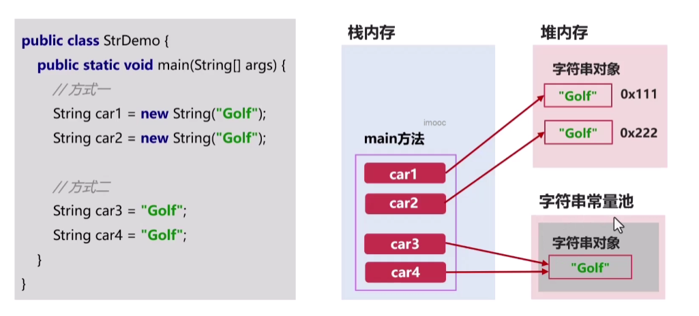

```java
package com.rabbiter.hello;

/**
 * @Classname 字符串常量池
 * JVM 中用于存储字符串字面量和字符串对象的引用的一块内存区域来管理和重用字符串对象以节省内存
 * 池中的对象的唯一的
 */
 class StringPoolExample {
    public static void main(String[] args) {
        String user1 = "neko";
        String user2 = "neko";// 若字符串常量池中存在相同字符串则返回已有字符串引用
        System.out.println(user1 == user2);// ture,都引用字符串常量池中的同一个 neko 对象

        String userA = new String("admin");// 两次创建对象：池中不存在 admin 则在池中将其创建，同时在堆内存中也创建一个新 String 对象，其内容是池中的 admin
        String userB = new String("admin");
        System.out.println(userA==userB);// false,引用不同，都会在堆内存中创建新的对象
    }
}

/**
* @Description: intern 若池中已存在相同字符串则返回其引用，否则将字符串对象添加到池中并返回其引用
**/
class StringInternExample{
    public static void main(String[] args) {
        String stu1 = new String("kuroneko");
        String stu2 = "kuroneko";
        System.out.println(stu1==stu2);//false
        System.out.println(stu1.equals(stu2);// true 比较内容
        System.out.println("abc".equalsIgnoreCase("ABC")); // true 忽略大小写比较内容
        stu1 = new String("kuroneko").intern();// 引用了已存在的 kuroneko
        System.out.println(stu1==stu2);// true
    }
}

    static void equalsDemo(String userName, String password, String verifyCode) {
        if (verifyCode.equals("abc".toLowerCase())){
            if (userName.length()!=0 && password.length()!=0){
                if (userName.equals("admin") && password.equals("123")){
                    System.out.println("登录成功");
                }else {
                    System.out.println("用户名或密码错误");
                }
            }else{
                System.out.println("用户名或密码不能为空");
            }
        }else{
            System.out.println("验证码错误");
        }
    }
                           
    static void strDemo() {
        String img_path = "C:\\Users\\T\\Pictures\\img.png";
        int index1 = img_path.indexOf("\\");
        if (index1 != -1) {
            System.out.println("盘符" + img_path.substring(0,index1 )); 
        }
        int index2 = img_path.lastIndexOf("\\");
        if (index2 != -1) {
            System.out.println("文件名" + img_path.substring(index2+1));
        }
        System.out.println(img_path.replace("png","jpg"));
    }
```

## 数组

> * 数组的元素相同数据类型、是有序的、可重复的
> * 创建后长度和类型不可变

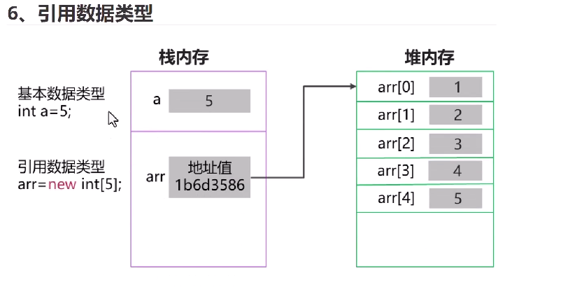

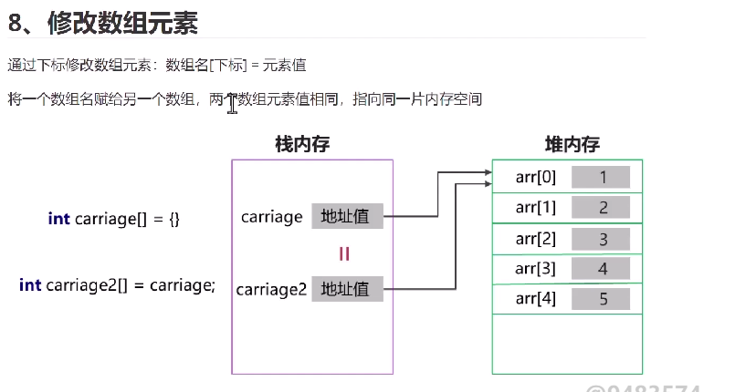

```java
package com.luotao.container;
import java.util.Arrays;

/**
 * @Classname ArrayDemo
 * @Description 数组
 * - 数组的元素相同数据类型、是有序的、可重复的
 * - 创建后长度和类型不可变
 * 缺点：(后来设计出集合来规避这些缺点)
 * - 底层基于紧密结构(即顺序结构)导致增删效率低
 * - 数组中实际存储的元素数量没有提供对应方法来获取
 * @Version 1.0.0
 * @Date 2025/2/25 20:24
 * @Author LuoTao
 */
public class ArrayDemo {
    public static void main(String[] args) {
        arrayInit();
        arrayBubbleSort();
        arrayReverse();
        arrayTwo();
    }

    /**
     * @Description 创建数组的三种写法
     * 有序。
     * 创建后长度不可变。
     * 元素的数据类型相同。
     * @Author LuoTao
     * @Date 2025/2/25 20:44
     **/
    static void arrayInit(){

        int[] arrA;
        arrA= new int[5];

        int[] arrB={1,2,3,4,5};// 静态初始化
        int[] arrC = new int[]{6,7};// 静态初始化
        System.out.println(arrA.length); //数组长度
        arrB=arrC; //true 引用类型: arrB和arrC指向同一块堆内存地址
        System.out.println(arrB==arrC);
        System.out.println(Arrays.toString(arrB));

    }
    /**
     * @Description: 冒泡排序
     * @Author: LuoTao
     * @Date: 2025-02-25 20:47:54
     **/
    static void arrayBubbleSort(){
        //重复地遍历待排序的序列，依次比较相邻的两个元素并交换顺序不对的元素，直到整个序列有序为止。
        int[] ages = {5,4,3,2,1};
        System.out.println(Arrays.toString(ages));
        //外层循环的次数决定了需要进行多少轮比较和交换。(第0轮比较，未排序的有length个，需要两两比较length-1次；第1轮比较，为排序的有length-1个，需要两两比较length-1-1次
        for (int i=0;i<ages.length-1;i++){
            System.out.println("第"+i+"轮比较,未排序的有" +(ages.length-i) + "个,需要两两交换" + (ages.length-i-1) + "次(每轮循环结束后都排好了一位):"   );
            for (int j=0;j<ages.length-1-i;j++){//在每一轮外层循环结束时，最大的元素会被移动到数组的末尾位置，因此不需要再对其进行比较。
                if( ages[j] >ages[j+1] ){
                    // 交换顺序
                    int tmp = ages[j];
                    ages[j] = ages[j+1];
                    ages[j+1] = tmp;
                }
                System.out.println(Arrays.toString(ages));
            }
        }


//        Arrays.sort(ages); //默认升序 [1, 2, 3, 4, 5]
    }

    /**
     * @Description: 数组元素颠倒顺序
     * 可以想象成一个队伍中的人在换位子，站在队头第一个人和队尾最后一个人交换位置，第二个人和倒数第二个人交换位置，以此类推，直到中间位置为止
     * @Author: LuoTao
     * @Date: 2025-03-03 11:02:24
     **/
    static void arrayReverse(){
        int[] ages = {5,4,3,2,1};
        for (int i=0;i<ages.length/2;i++){
            // 保存当前元素到临时变量
            int tmp = ages[i];
            // 将当前元素替换为对称位置的元素
            ages[i] = ages[ages.length-1-i];
            // 将对称位置的元素替换为临时变量中的元素，完成两个元素的交换
            ages[ages.length-1-i] = tmp;
            System.out.println("第" +i+"轮比较" + Arrays.toString(ages) );
        }
    }

    /**
     * @Description: 二维数组计算个人平均分和各科平均分
     * @Author: LuoTao
     * @Date: 2025-03-13 11:24:13
     **/
    static void arrayTwo(){
        float[][] score = {{100f, 99f, 98.5f}, {80f, 95f, 92f}, {100f, 95.5f, 95f}};
        float sumScore;// 个人总分
        float avgScore;// 个人平均分

        float sum_chinese=0.0f;//语文总分
        float sum_math=0.0f;//数学总分
        float sum_english=0.0f;//英语总分

        for (int row = 0; row < score.length; row++) {
            sumScore=0.0f;
            avgScore=0.0f;

            for (int col = 0; col < score[row].length; col++){
                sumScore += score[row][col];
                avgScore=sumScore/score[row].length;
            }
            System.out.println("第" + (row+1) + "个学生平均分：" + avgScore);

            sum_chinese +=score[row][0];
            sum_math +=score[row][1];
            sum_english +=score[row][2];
        }
        System.out.println("语文平均分：" + sum_chinese/score.length);
        System.out.println("数学平均分：" + sum_math/score.length);
        System.out.println("英语平均分：" + sum_english/score.length);
    }

}


```

## Java面向对象编程(OOP)学习笔记

### 1. 面向对象基本概念

面向对象编程(Object-Oriented Programming)是一种编程范式，它将现实世界中的事物抽象为程序中的对象。

面向对象编程就像是在搭建乐高积木。每个积木块都是一个对象，它们有自己的特征（属性）和功能（方法）。通过组合不同的积木块，我们可以创建出复杂的结构。

主要特点：
1. 对象是程序的基本单元
2. 每个对象都包含数据和代码
3. 程序是多个对象相互协作的结果

### 面向对象的基本原则
1. **封装**：把相关的数据和方法组织在一起
2. **继承**：在已有类的基础上创建新类
3. **多态**：同一个操作作用于不同的对象，产生不同的执行结果

#### 1.1 类与对象的关系
- 类(Class)：对象的模板，定义对象的属性和行为
- 对象(Object)：类的具体实例
- 关系：类好比是设计图，对象则是根据设计图制造的具体产品

#### 1.2 三大特性

##### (1) 封装性(Encapsulation)

> 封装就像是把糖果放在盒子里，外界只能通过盒子提供的方式（开盖子）来访问里面的糖果，而不能直接触碰糖果。

- 定义：将对象的属性和方法包装在一起，隐藏实现细节
- 目的：
  - 保护数据安全
  - 提高代码可维护性
  - 降低代码耦合度
- 实现方式：
  - 使用访问修饰符(private, protected, public)
  - 提供getter/setter方法访问私有属性

##### (2) 继承性(Inheritance)

> 继承就像父母和孩子的关系，孩子会继承父母的特征，同时也可以拥有自己的特征。

- 定义：子类继承父类的属性和方法，实现代码复用
- 特点：
  - Java只支持单继承（一个类只能有一个直接父类）
  - 可以实现多个接口
  - 所有类都默认继承Object类
- 关键字：
  - extends：类继承
  - implements：实现接口

##### (3) 多态性(Polymorphism)

> 多态就像遥控器，同一个按钮可以控制不同的电器，产生不同的效果。

- 定义：同一个行为具有多个不同表现形式
- 实现方式：
  1. 方法重载(Overload)：同一个类中，方法名相同，参数列表不同,如有参构造和无参构造方法也是重载。
  2. 方法重写(Override)：子类重写父类的方法

### 2. 面向对象vs面向过程

| 面向对象                | 面向过程                |
|---------------------|---------------------|
| 以对象为中心             | 以过程为中心             |
| 更接近人类思维方式          | 按步骤顺序执行            |
| 更容易维护、复用、扩展        | 代码复用性差             |
| 适合大型项目             | 适合简单的功能实现          |

### 3. 对象内存

#### 3.1 Java内存区域
Java虚拟机(JVM)在运行时将数据分为以下几个区域：

1. **栈内存(Stack)**
   - 存储局部变量
   - 基本数据类型直接存储在栈中
   - 引用类型变量存储对象的引用（地址）
   - 特点：
     - 线程私有
     - 随方法调用而创建，方法结束而销毁
     - 存取速度快

2. **堆内存(Heap)**
   - 存储对象的实际内容
   - 所有通过new关键字创建的对象
   - 特点：
     - 线程共享
     - 由垃圾回收器管理
     - 存取速度相对较慢

#### 3.2 对象的创建和使用过程

```java
class Person {
    private String name;  // 实例变量，存储在堆内存
    private int age;      // 实例变量，存储在堆内存
}

public void test() {
    // 1. 在栈内存中创建p1引用变量
    // 2. 在堆内存中创建Person对象
    // 3. p1引用变量存储Person对象的地址
    Person p1 = new Person();  
    
    // p2和p1指向同一个对象
    Person p2 = p1;  
}
```

#### 3.3 内存分配示意图

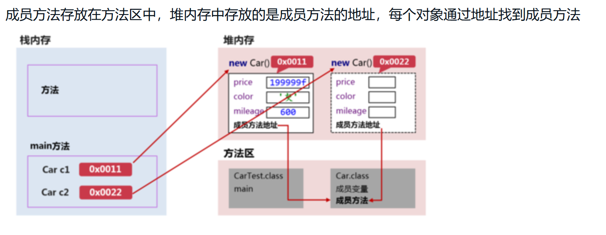


### 5. Java参数传递机制

Java中的参数传递机制是初学者容易混淆的概念之一。正确理解这一机制对于编写可靠的代码至关重要。

#### 5.1 基本概念：Java只有"值传递"

Java的参数传递机制可以概括为一句话：**Java只有值传递，没有引用传递**。

- **值传递(Pass by Value)**：方法调用时，实际参数的值被复制一份传递给形式参数。方法内对参数的修改不会影响到实际参数。
- **引用传递(Pass by Reference)**：方法调用时，传递的是实际参数的引用（即内存地址）。方法内对参数的修改会影响到实际参数。Java中不存在这种机制。

#### 5.2 基本类型参数传递

对于基本数据类型（如int, float, boolean等），传递的是值的副本。

```java
public static void main(String[] args) {
    int x = 10;
    System.out.println("调用前 x = " + x);  // 输出：调用前 x = 10
    changeValue(x);
    System.out.println("调用后 x = " + x);  // 输出：调用后 x = 10（不变！）
}

public static void changeValue(int num) {
    num = 20;  // 只改变了副本，不影响原始值
    System.out.println("方法内 num = " + num);  // 输出：方法内 num = 20
}
```

#### 5.3 引用类型参数传递

对于引用类型（如类、数组等），传递的是引用（地址）的副本，而不是对象本身的副本。

```java
public static void main(String[] args) {
    Person p = new Person("张三");
    System.out.println("调用前 name = " + p.name);  // 输出：调用前 name = 张三
    changeName(p);
    System.out.println("调用后 name = " + p.name);  // 输出：调用后 name = 李四（改变了！）
}

public static void changeName(Person person) {
    person.name = "李四";  // 修改的是同一个对象
}

class Person {
    String name;
    public Person(String name) {
        this.name = name;
    }
}
```

#### 5.4 容易混淆的案例

虽然对象传递看起来像"引用传递"，但下面的例子可以证明Java确实是值传递：

```java
public static void main(String[] args) {
    Person p = new Person("张三");
    System.out.println("调用前 p.name = " + p.name);  // 输出：调用前 p.name = 张三
    System.out.println("调用前 p = " + p);            // 输出对象的内存地址
    
    changeReference(p);
    
    System.out.println("调用后 p.name = " + p.name);  // 输出：调用后 p.name = 张三（不变！）
    System.out.println("调用后 p = " + p);            // 内存地址不变
}

public static void changeReference(Person person) {
    person = new Person("李四");  // 创建新对象，改变了副本引用的指向
    System.out.println("方法内 person.name = " + person.name);  // 输出：方法内 person.name = 李四
}
```

在这个例子中，虽然在`changeReference`方法内部创建了新的Person对象并将参数引用指向它，但这只改变了参数引用的副本，原始引用p仍然指向原来的对象。

#### 5.5 参数传递机制的内存分析

##### 基本类型传递：
```
调用changeValue(x)前：
    栈内存：
    +--------+
    | x = 10 |
    +--------+

调用changeValue(x)时：
    栈内存：
    +--------+    +----------+
    | x = 10 |    | num = 10 |  (x的值复制给num)
    +--------+    +----------+

changeValue执行后：
    栈内存：
    +--------+    +----------+
    | x = 10 |    | num = 20 |  (num改变，x不受影响)
    +--------+    +----------+
```

##### 引用类型传递：
```
调用changeName(p)前：
    栈内存：              堆内存：
    +-------+             +----------------+
    | p ->  |----------->| Person对象      |
    +-------+             | name = "张三"   |
                         +----------------+

调用changeName(p)时：
    栈内存：              堆内存：
    +-------+             +----------------+
    | p ->  |--+          | Person对象      |
    +-------+  |          | name = "张三"   |
               |          +----------------+
    +-----------+                 ^
    | person -> |-----------------|
    +-----------+  (p的引用复制给person)

changeName执行后：
    栈内存：              堆内存：
    +-------+             +----------------+
    | p ->  |--+          | Person对象      |
    +-------+  |          | name = "李四"   | (对象内容改变)
               |          +----------------+
    +-----------+                 ^
    | person -> |-----------------|
    +-----------+
调用changeReference(p)前：
    栈内存：              堆内存：
    +-------+             +----------------+
    | p ->  |----------->| Person对象1     |
    +-------+             | name = "张三"   |
                         +----------------+

调用changeReference(p)时：
    栈内存：              堆内存：
    +-------+             +----------------+
    | p ->  |--+          | Person对象1     |
    +-------+  |          | name = "张三"   |
               |          +----------------+
    +-----------+                 ^
    | person -> |-----------------|
    +-----------+  (p的引用复制给person)

changeReference执行中创建新对象后：
    栈内存：              堆内存：
    +-------+             +----------------+
    | p ->  |----------->| Person对象1     |
    +-------+             | name = "张三"   |
                         +----------------+
    +-----------+         
    | person -> |-------->+----------------+
    +-----------+         | Person对象2     |
                          | name = "李四"   |
                         +----------------+
```

#### 5.6 最佳实践

1. **清晰理解**：记住Java总是值传递，但对于对象，传递的是引用的值（地址）。

2. **方法返回**：如果需要在方法中修改对象并保留更改，可以：
   - 修改传入对象的属性（如上例中的changeName）
   - 返回新的对象

3. **不可变对象**：使用不可变对象（如String）可以减少副作用。

4. **注意事项**：
   - 方法内创建的新对象不会影响原始引用
   - 对数组和集合的操作会影响原始数据
   - String是特例，由于其不可变性，所有看似"修改"的操作实际上都是创建新的String对象

#### 5.7 实际应用示例

##### 例1：交换两个数（不成功）
```java
public static void main(String[] args) {
    int a = 10, b = 20;
    System.out.println("交换前：a = " + a + ", b = " + b);
    swap(a, b);
    System.out.println("交换后：a = " + a + ", b = " + b);  // 值不变
}

public static void swap(int x, int y) {// xy其实是a,b的副本
    int temp = x;
    x = y;
    y = temp;
}
```

##### 例2：交换数组元素（成功）
```java
public static void main(String[] args) {
    int[] arr = {10, 20};
    System.out.println("交换前：arr[0] = " + arr[0] + ", arr[1] = " + arr[1]);
    swapElements(arr);
    System.out.println("交换后：arr[0] = " + arr[0] + ", arr[1] = " + arr[1]);  // 值改变
}

public static void swapElements(int[] arr) {// arr的值是引用（地址）的副本，值与实参arr的值相同，都是数组在堆内存中的地址,会直接影响原始对象。
    int temp = arr[0];
    arr[0] = arr[1];
    arr[1] = temp;
}
```

## 抽象类与接口

> 实现多态和代码复用的重要工具

### 抽象类的本质

#### 定义与特点

> 抽象类是一种不能被实例化的类，它的目的是为子类提供一个通用的模板，强制子类实现某些方法，同时允许复用公共代码。
>
> 抽象类就像是一个半成品的模具，需要子类来完善。

```javascript
package com.luotao.job.utils.demo;

public abstract class Animal{
    // 实例变量
    protected String name;
    protected int age;

    //构造方法
    public Animal(String name,int age){
        this.name=name;
        this.age=age;
    }

    // 具体方法（可以被继承）
    public void sleep(){
        System.out.println(name + " is sleeping");

    }
    
    //抽象方法（必须被子类实现）
    public abstract void makeSound();
}
```

抽象类的关键特点：

- 使用`abstract`关键字声明
- 不能被实例化
- 可以包含抽象方法（无方法体的方法）
- 子类必须实现所有抽象方法，除非子类也是抽象类
- 可以包含具体方法（有方法体的方法）
- 可以包含构造方法、实例变量、静态方法、静态变量等

#### 抽象类的设计理念

抽象类体现了**"是什么"**的关系，定义了一系列子类的共同特性。它表达了继承层次中的抽象概念，如"动物"、"形状"、"车辆"等。

抽象类的核心设计理念：

1. ***\*强制规范\****：通过抽象方法强制子类提供特定行为的实现
2. ***\*代码复用\****：通过具体方法提供可被所有子类继承的公共代码
3. ***\*类型统一\****：提供一个统一类型，使得不同子类对象可以被一致处理

### 接口的本质

> 接口就像是一份合同，实现接口的类必须履行合同规定的义务。
>
> 在 Java 中，接口可以被看作是一种“契约”，只要某个类实现了某个接口，它就可以被视为该接口类型的对象。

接口是一种完全抽象的类型，它只定义行为的规范（方法签名），不提供具体实现（java8之前）。接口代表了**能做什么**的契约。

```javascript
public interface Flyable{
    // 抽象方法（隐式public abstract）
    void fly();
    
    // 常量（隐式public static final）
    int MAX_ALTITUDE=10000;
    
    // java8引入：默认方法
    default void glide(){
        System.out.println("Gliding in the air")
    }
    
    // java8引入：静态方法
    static boolean canFly(Object obj){
        return ojb instanceof Flyable;
    }
    
    // java9引入：私有方法
    private void calculateTrajectory(){
        // 内部计算逻辑
    }
}
```

接口的关键特点：

- 使用`interface`关键字声明
- 所有方法隐式为`public abstract`(除非是默认、静态或私有方法)
- 所有字段隐式为`public static final`(常量)
- 一个类可以实现多个接口（弥补了java单继承的局限性）
- 接口可以继承一个或多个其他接口

#### 接口的设计理念

接口体现了**"能做什么"**的关系，定义了对象的能力或行为契约。它表达了不同对象间的共同行为，如"可飞行的"、"可比较的"、"可运行的"等。

接口的核心设计理念：
1. **行为契约**：定义对象应该具备的能力，而不关心对象"是什么"
2. **松耦合**：允许不同类型的对象只要实现相同接口就能被一致处理
3. **多重实现**：一个类可以实现多个接口，获得多种能力
4. **插件式设计**：为系统提供可插拔的功能模块

#### 7.3 抽象类与接口的深度对比

##### 7.3.1 本质区别

| 特性 | 抽象类 | 接口 |
|-----|-------|-----|
| 核心理念 | **是什么** - 强调本质 | **能做什么** - 强调能力 |
| 继承关系 | 单继承（一个子类只能继承一个抽象类） | 多实现（一个类可以实现多个接口） |
| 方法特性 | 可以有具体方法和抽象方法 | 主要是抽象方法（Java 8后可有默认方法） |
| 字段特性 | 可以有实例变量、常量 | 只能有常量（隐式public static final） |
| 构造方法 | 可以有构造方法 | 不能有构造方法 |
| 访问修饰符 | 方法可以是private、protected等 | 方法隐式为public（Java 9开始可有private方法） |
| 实例化 | 不能直接实例化 | 不能实例化 |
| 使用场景 | 定义具有相似特性的类的共同基类 | 定义不相关类之间的共同行为规范 |

##### 7.3.2 深层理解

- **抽象类是对类的抽象**，表达的是"is-a"关系（继承体系）
- **接口是对行为的抽象**，表达的是"has-a"关系（能力）
- 抽象类可以对方法提供默认实现，更注重复用性
- 接口更纯粹地关注行为规范，更注重解耦

#### 7.4 Java 8+对接口的增强

Java 8及以后版本对接口做了重要增强，使接口的功能更加强大。

##### 7.4.1 默认方法（Default Methods）

允许接口提供方法的默认实现，实现类可以直接使用或覆盖。

```java
public interface Vehicle {
    void accelerate();
    
    // 默认方法
    default void brake() {
        System.out.println("Standard braking mechanism");
    }
}
```

默认方法的意义：
- 允许在不破坏现有实现的情况下扩展接口
- 提供可选功能的实现
- 减少接口实现类中的重复代码

##### 7.4.2 静态方法（Static Methods）

允许接口包含静态方法，这些方法属于接口本身，不能被实现类继承。

```java
public interface MathOperations {
    // 静态方法
    static int add(int a, int b) {
        return a + b;
    }
}

// 调用方式
int result = MathOperations.add(5, 3);
```

静态方法的意义：
- 为接口提供工具方法
- 增强接口的自包含性
- 减少对工具类的依赖

##### 7.4.3 私有方法（Java 9引入）

允许接口包含私有方法，用于在默认方法之间共享代码。

```java
public interface Logger {
    default void logInfo(String message) {
        log(message, "INFO");
    }
    
    default void logError(String message) {
        log(message, "ERROR");
    }
    
    // 私有方法（Java 9+）
    private void log(String message, String level) {
        System.out.println(level + ": " + message);
    }
}
```

私有方法的意义：
- 提高接口内部代码的复用性
- 使默认方法更简洁
- 增强封装性

#### 7.5 实际应用案例

##### 7.5.1 抽象类的典型应用

**模板方法模式**：定义算法骨架，让子类实现特定步骤。

```java
public abstract class DataProcessor {
    // 模板方法
    public final void processData() {
        readData();
        processData();
        saveData();
        notifyCompletion();
    }
    
    // 抽象方法 - 子类必须实现
    protected abstract void readData();
    protected abstract void processData();
    protected abstract void saveData();
    
    // 具体方法 - 提供默认实现
    protected void notifyCompletion() {
        System.out.println("Data processing completed");
    }
}
```

##### 7.5.2 接口的典型应用

**策略模式**：定义一系列算法，使它们可以互相替换。

```java
// 定义策略接口
public interface SortingStrategy {
    void sort(int[] array);
}

// 实现具体策略
public class QuickSort implements SortingStrategy {
    @Override
    public void sort(int[] array) {
        // 快速排序实现
    }
}

public class MergeSort implements SortingStrategy {
    @Override
    public void sort(int[] array) {
        // 归并排序实现
    }
}

// 使用策略
public class Sorter {
    private SortingStrategy strategy;
    
    public Sorter(SortingStrategy strategy) {
        this.strategy = strategy;
    }
    
    public void doSort(int[] array) {
        strategy.sort(array);
    }
}
```

#### 7.6 何时使用抽象类，何时使用接口？

##### 7.6.1 选择抽象类的情况
- 需要在多个相关类之间共享代码
- 需要定义非静态或非常量字段（实例变量）
- 相关类之间存在"is-a"关系
- 需要为子类提供多个方法的默认实现
- 需要非公开的方法
- 需要构造方法

##### 7.6.2 选择接口的情况
- 需要定义一种能力，多个不相关的类可能具备此能力
- 需要支持多继承的类型
- 只关心对象能做什么，而不关心对象是什么
- 需要指定的行为契约，但不关心该行为如何实现
- 需要将行为从具体实现中解耦

#### 7.7 最佳实践与设计原则

1. **优先使用接口**：
   - 接口提供了更好的解耦性和灵活性
   - 接口更容易适应未来的变化
   - "面向接口编程，而不是面向实现编程"

2. **合理组合使用**：
   - 抽象类与接口可以配合使用
   - 接口定义能力，抽象类提供部分默认实现

3. **接口隔离原则**：
   - 一个类不应该被迫依赖它不使用的方法
   - 接口应该小而精，而不是大而全

4. **设计层次分明的继承体系**：
   - 抽象应该从具体中提取
   - 避免过深的继承层次

5. **避免接口污染**：
   - 不要在接口中添加过多方法
   - Java 8后，可以使用默认方法扩展接口

## 访问权限修饰符


* private——仅在 当前类中访问（private 方法隐式地被指定为 final）
* default——同包访问
* protected——同包访问、子类访问
* public——所有类访问

## 封装

设计良好的模块会隐藏所有的实现细节，把它的 `API `与它的实现清晰地隔离开来。模块之间只通过它们的 `API `进行通信，一个模块不需要知道其他模块的内部工作情况，这个概念被称为信息隐藏或封装。

通过将属性设为私有并提供公共的getter和setter方法，将数据和操作数据的方法绑定在一起，隐藏对象的内部实现细节，只暴露必要的接口给外部使用。我们实现了对类的封装。这样可以保护类的内部状态，防止外部直接修改，同时提供必要的接口供外部使用。

## 构造方法

特殊成员方法，在实例化对象时JVM自动调用构造方法。构造方法被调用时JVM自动根据参数类型匹配对象的构造方法的参数列表，若和某个构造方法的参数列表匹配上了则将其调用。

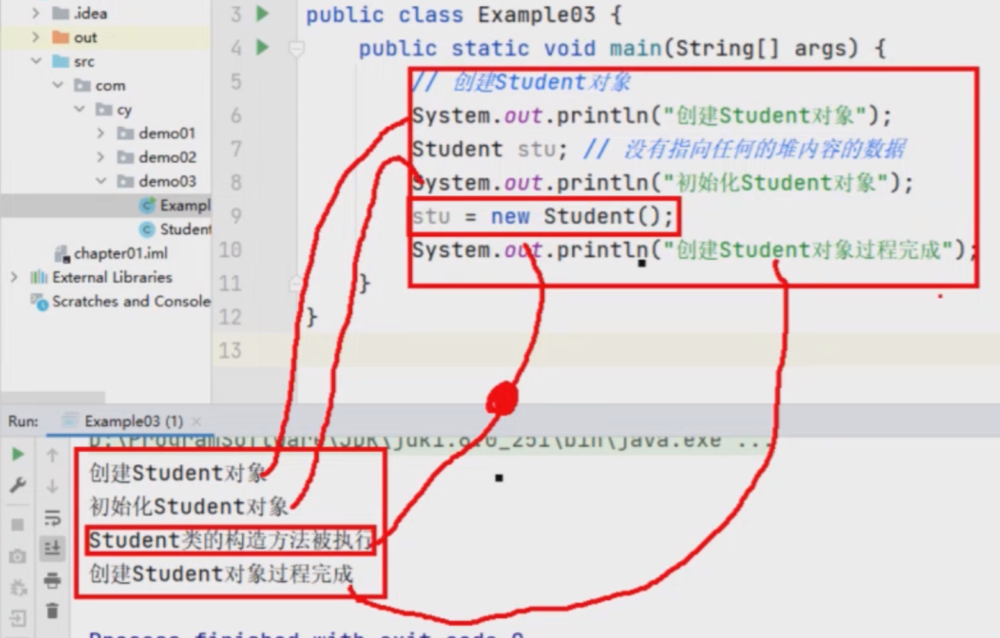

* 默认构造方法——若类没有显示声明构造则在编译时自动添加无参构造

## case-银行存取款

```java
package com.rabbiter.hello;

/**
 * @ClassName BankAccount
 * @Description 银行存取款
 * @Author LuoTao
 * @Date 2024-05-02 14:42
 * @Version 1.0
 **/
public class BankAccount {

    /**
     * 账户
     */
    private int accountNumber;

    /**
     * 余额
     */
    private double leftmoney;

    /**
     * @param number 账号
     * @param money 初始余额
     * @return null
     * @Author LuoTao
     * @Description 构造方法
     * @Date 2024-05-02 15:27:21
     **/
    public BankAccount(int number, double money) {
        this.accountNumber = number;
        this.leftmoney = money;
    }

    /**
     * @return 存的钱
     * @Author LuoTao
     * @Description 存款方法
     * @Date 2024-05-02 15:09:59
     * @Param 存的钱
     **/
    public double saveMoney(double money) {
        this.leftmoney += money;
        return money;
    }

    /**
     * @return 现有余额
     * @Author LuoTao
     * @Description 获取现有余额
     * @Date 2024-05-02 15:12:25
     * @Param
     **/
    public double getLeftmoney() {
        return this.leftmoney;
    }

    /**
     * @return 取走金额
     * @Author LuoTao
     * @Description 取款
     * @Date 2024-05-02 15:14:42
     * @Param
     **/
    public double getMoney(double money) {
        this.leftmoney -= money;
        return money;
    }
}


/**
 * @Description 客户端存取钱
 **/
class BankAccountClient {
    public static void main(String[] args) {
        BankAccount ba = new BankAccount(10086, 0);
        System.out.println("存款" + ba.saveMoney(1000) + ", 余额=" + ba.getLeftmoney() );//存款1000.0, 余额=1000.0
        System.out.println("取款" + ba.getMoney(1000) + ", 余额=" + ba.getLeftmoney() );//取款1000.0, 余额=0.0
    }
}
```

## case-查看手机配置与功能

```java
package com.rabbiter.hello;

/**
 * @Description case-查看手机配置与功能
 **/

public class Phone {

    /**
     * 手机品牌
     */
    private String brand;
    /**
     * 手机价格
     */
    private double price;
    /**
     * 手机型号
     */
    private String type;
    /**
     * 手机内存
     */
    private int memorySize;

    public Phone() {
    }

    public Phone(String brand, double price, String type, int memorySize) {
        this.brand = brand;
        this.price = price;
        this.type = type;
        this.memorySize = memorySize;
    }

    public String showInfo() {
        return "Phone{" +
                "brand='" + brand + '\'' +
                ", price=" + price +
                ", type='" + type + '\'' +
                ", memorySize=" + memorySize +
                '}';
    }

    /**
     * @Author LuoTao
     * @Description 打游戏
     * @Date 2024-05-02 16:04:12
     * @Param 游戏名
     * @return 游戏名
     **/
    public String playGame(String gameName){
        return gameName + "启动！";
    }

    /***
     * @Author LuoTao
     * @Description 下载音乐
     * @Date 2024-05-02 16:02:50
     * @Param 下载音乐名
     * @return 下载音乐名
     **/
    public String downMusic(String musicName){
        return "<"+ musicName + ">" + "下载成功！";
    }

}

class PhoneTest {
    public static void main(String[] args) {
        Phone p1 = new Phone("xiaomi", 1000, "安卓", 123);
        System.out.println(p1.downMusic("如果没有你"));
        System.out.println(p1.playGame("原神"));
        System.out.println(p1.showInfo());
    }
}

```


## this调用属性

<span style="color:red"> this就是类实例化的对象，和构造方法无关。类中没创建对象，不知道是哪个对象，那就用this来代替，this就表示一个对象。</span>

```java
package com.luotao.case3;

public class User {
    private String name;//全局变量null
    private int age;//0

    // 全局变量和局部变量冲突(参数名和全局变量名重复)则变量取值采取作用域就近原则
    public User(String name, int age) {
        name = name; // 左边的name和右边的name是同一个变量,相当于屏蔽了全局变量,此处应改为this.name=name
        age = age;
    }

    public void showInfo() {
        System.out.println("姓名：" + name + ",年龄：" + age);
    }

    public static void main(String[] args) {
        User admin = new User("旺财",18);
        admin.showInfo();//姓名：null,年龄：0
    }
}

```

##  this调用构造方法

```java
package com.luotao.case3;

public class User {
    private String name;
    private int age;

    public User(){
        /**
        * @Description: this调用构造方法：this(方法参数列表)
        * @Author: LuoTao
        * @Date: 2024-05-05 14:18:08
        **/
        /*
           - 必须位于构造方法的第一行
           - 原因：对象创建时会调用构造方法，在调用其他构造方法前不能操作对象的成员
           - 一个构造方法中只能调用一个其他构造方法
        */
        this("旺财", 18);
        System.out.println(name+age);
    }

    public User(String name, int age) {
        //当局部变量与实例变量同名时，使用this区分
        this.name = name;
        this.age = age;
    }

    public static void main(String[] args) {
        /*
        当执行`User user1 = new User();`时：
            1. 创建User对象，分配内存空间
            2. 调用无参构造方法`public User()`
            3. 在无参构造方法中，`this("旺财", 18)`调用带参构造方法
            4. 执行带参构造方法`public User(String name, int age)`
               - `this.name = name`将参数"旺财"赋值给实例变量name
               - `this.age = age`将参数18赋值给实例变量age
            5. 带参构造方法执行完毕，返回到无参构造方法
            6. 执行`System.out.println(name+age)`，输出"旺财18"
            7. 无参构造方法执行完毕，对象创建完成
        */
        User user1 = new User();//旺财18
        /*
```
        栈内存                    堆内存
        +----------+          +-------------------+
        | user1    |--------->|  User对象          |
        +----------+          |  name: "旺财"      |
                              |  age: 18          |
                              +-------------------+
        ```
        */
    }
}

```


## this和super

> * this表示当前类对象，可访问当前类的成员，若本类中找不到则从父类中找。调用本类构造，需放在构造的首行
> * super表示父类的成员调用，调父类的构造需放在子类构造的首行


## case-基于控制台的购书系统

```java
package com.luotao.case4;

/**
 * @Classname Book
 * @Description 图书实体
 * @Version 1.0.0
 * @Date 2024/5/5 14:44
 * @Author LuoTao
 */
public class Book {
    /***
    * @Description: 图书编号
    * @Author: LuoTao
    * @Date: 2024-05-05 14:50:57
    **/
    private int id;
    /**
    * @Description: 图书名称
    * @Author: LuoTao
    * @Date: 2024-05-05 14:51:30
    **/
    private String name;
    /**
    * @Description: 图书单价
    * @Author: LuoTao
    * @Date: 2024-05-05 14:51:40
    **/
    private  double price;
    /**
    * @Description: 图书库存
    * @Author: LuoTao
    * @Date: 2024-05-05 14:52:28
    **/
    private int storage;

    public Book() {
    }
    public Book(int id, String name, double price, int storage) {
        this.id = id;
        this.name = name;
        this.price = price;
        this.storage = storage;
    }

    public int getId() {
        return id;
    }

    public void setId(int id) {
        this.id = id;
    }

    public String getName() {
        return name;
    }

    public void setName(String name) {
        this.name = name;
    }

    public double getPrice() {
        return price;
    }

    public void setPrice(double price) {
        this.price = price;
    }

    public int getStorage() {
        return storage;
    }

    public void setStorage(int storage) {
        this.storage = storage;
    }

    @Override
    public String toString() {
        return "Book{" +
                "id=" + id +
                ", name='" + name + '\'' +
                ", price=" + price +
                ", storage=" + storage +
                '}';
    }
}

```

```java
package com.luotao.case4;

/**
 * @Classname Order
 * @Description 订单实体
 * @Version 1.0.0
 * @Date 2024/5/5 14:48
 * @Author LuoTao
 */
public class Order {
    /**
    * @Description: 订单号
    * @Author: LuoTao
    * @Date: 2024-05-05 15:02:31
    **/
    private int orderId;
    /**
    * @Description: 订单总金额
    * @Author: LuoTao
    * @Date: 2024-05-05 15:02:57
    **/
    private double total;
    /**
    * @Description: 订单项数组
    * @Author: LuoTao
    * @Date: 2024-05-05 15:06:25
    **/
    private OrderItem[] items;

    public Order(int orderId){
        this.orderId = orderId;
        /**
        * @Description: 初始化数组长度3：强制购买3次图书
        * @Author: LuoTao
        * @Date: 2024-05-05 15:09:30
        **/
        this.items = new OrderItem[3];
    }

    public int getOrderId() {
        return orderId;
    }

    public void setOrderId(int orderId) {
        this.orderId = orderId;
    }

    public double getTotal() {
        return total;
    }

    public void setTotal(double total) {
        this.total = total;
    }

    public OrderItem[] getItems() {
        return items;
    }

    public void setItems(OrderItem[] items) {
        this.items = items;
    }
    /**
     * @Description setItem
     * @Author LuoTao
     * @Date 2024/5/5 16:16
     * @return void
     * @param index items下标
     * @param orderItem
     **/
    public void setItem(int index,OrderItem orderItem){
        this.items[index] = orderItem;
    }
}

```

```java
package com.luotao.case4;

import jdk.nashorn.internal.ir.IfNode;

import java.util.Scanner;

/**
 * @Classname PayBooks
 * @Description 程序入口：支付图书
 * @Version 1.0.0
 * @Date 2024/5/5 15:12
 * @Author LuoTao
 */
public class PayBooks {
    public static void main(String[] args) {
        /**
        * @Description: 展示库房3种类型的图书
        * @Author: LuoTao
        * @Date: 2024-05-05 15:18:58
        **/
        Book[] books = new Book[3];
        outBooks(books);
        Order order = purchase(books);
        outOrder(order);

    }


    /**
     * @Description 展示图书实体信息
     * @Author LuoTao
     * @Date 2024/5/5 15:19
     * @return void
     * @param books
     **/
    public static void outBooks(Book[] books){
        System.out.println("-------基于控制台的购书系统-------");
        System.out.println("图书编号\t图书名称\t图书单价\t图书库存");
        for(int i=0;i<books.length;i++){
            /**
             * @Description 初始化库房图书信息
             **/
            books[i] = new Book(i + 1, "java" + i, 10 + i, 30);
            System.out.println(books[i].getId()+"\t\t"+
                    books[i].getName()+"\t\t"+
                    books[i].getPrice()+"\t\t"+
                    books[i].getStorage());
        }
        System.out.println("------------------------------");
    }

    /**
     * @Description 购买图书方法
     * @Author LuoTao
     * @Date 2024/5/5 15:46
     * @return com.luotao.case4.Order 返回购书订单实体
     * @param books 所购买的图书
     **/
    public static Order purchase(Book[] books){
        Order order = new Order(1001);
        OrderItem orderItem=null;
        double total=0;//订单总金额
        Scanner input = new Scanner(System.in);
        for (int i = 0; i < books.length; i++) {
            System.out.println("请输入购买图书编号:");
            int id = input.nextInt();
            System.out.println("请输入购买图书数量");
            int num = input.nextInt();
            Book book = books[i];
            total += book.getPrice() * num;
            orderItem = new OrderItem(book, num);
            order.setItem(i,orderItem);
            System.out.println("请继续购买图书...");
        }
        order.setTotal(total);
        return order;
    }

    /**
     * @param order
     * @return void
     * @Description 打印订单信息
     * @Author LuoTao
     * @Date 2024/5/5 16:33
     **/
    private static void outOrder(Order order) {
        System.out.println("---------------------------");
        System.out.println("订单编号："+order.getOrderId());
        System.out.println("订单总金额："+order.getTotal());
        System.out.println("---------订单项信息---------");
        System.out.println("图书编号\t图书名称\t购买数量\t图书单价\t合计");
        for (OrderItem item : order.getItems()) {
            System.out.println(item.getBook().getId()+"\t"+
                    item.getBook().getName()+"\t"+
                    item.getNum()+"\t"+
                    item.getBook().getPrice()+"\t"+
                    item.getBook().getPrice()*(item.getNum()));
        }
    }

}

```

##  构造代码块 

> 构造代码块的执行时间由于构造方法，一般用来做类的初始化（读取、加载配置文件）

```java
class Student {  
    private String name;  
  
    // 构造代码块  
    {  
        name = "luotao"; // 直接访问和修改类成员变量  
        System.out.println(name); // 打印成员变量的值  
    }  
  
    // 可以添加一个无参构造器来显示构造代码块被调用  
    public Student() {  
        // 构造代码块会在这里之前执行  
    }  
}  
  
public class Application {  
    public static void main(String[] args) {  
        Student stu = new Student(); // 创建Student对象时，构造代码块将被执行  
    }  
}
```

## static

> * 静态方法在类加载的时候就存在了，它不依赖于任何实例。所以静态方法必须有实现，也就是说它不能是抽象方法。
>
> * 静态字段属于所有实例“共享”的字段，实际上是属于`class`的字段；
>
>   调用静态方法不需要实例，无法访问`this`，但可以访问静态字段和其他静态方法；
>
>   静态方法常用于工具类和辅助方法。
>
> * 因为`interface`是一个纯抽象类，所以它不能定义实例字段。但是，`interface`是可以有静态字段的，并且静态字段必须为`final`类型
>
> * 因为静态方法属于`class`而不属于实例，因此，静态方法内部，无法访问`this`变量，也无法访问实例字段，它只能访问静态字段。
>
> * 静态先初始化，先有对象才有对象的成员，非静态成员要先创建对象才能访问，静态成员优于非静态创建，所以静态只能访问静态。即加载时间不一样导致的。
>
> * 被修饰的属性只会分配一块内存空间，该属性是被所有对象共享的全局或静态属性。
>
> * 在定义一个类时，只是在描述某事物的特征和行为，并没有产生具体的数据，只有new对象才会开辟栈内存及堆内存。
>
> * 堆内存中每个对象都有自己的属性，若希望某些属性被所有对象共享则用该关键字修饰。

```java
class Student{
    String name;
    int age;
    Static String school="A大学";//被修饰的属性只会分配一块内存空间，该属性是被所有对象共享的全局或静态属性
    
    public Student(String name,int age){
        this.name=name;
        this.age=age;
        
    }
    
    public void showInfo(){
        System.out.println(name + school);
    }
}

public class Application {
    public static void mian(String[] args){
        Student stu1 = new Student("张三",18);
        Student stu2 = new Student("张三",18);
        Student stu3 = new Student("张三",18);

        System.out.println(stu1.school);//对象.属性访问
        
        Student.school="B大学";//类名.属性访问并修改值
        new Student("luotao",24).showInfo();//张三 B大学
    }
}
```

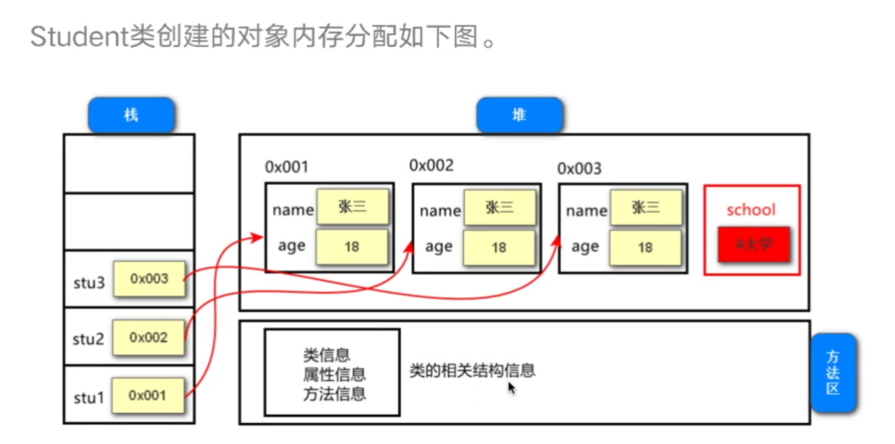

## 静态代码块

> * 对类的成员变量进行初始化
> * 类初次加载时被执行，只一次
> * 静态代码块>构造代码块>构造方法

```java
package com.luotao.demo1;
//构造代码块与静态代码块的执行时机
 class Student {


    //@Description: 1静态代码块
    static {
        System.out.println("1静态代码块");
    }
    // @Description: 2构造代码块
    {
        System.out.println("2构造代码块");
    }
    // @Description: 3构造方法
    public Student(){
        System.out.println("3构造方法");
    }
}
/**
 * @Description: 主线程
 * @Author: LuoTao
 * @Date: 2024-08-13 21:10:23
 **/
public class App{
    public static void main(String[] args){
        //类初次加载时静态代码块被执行，只一次
        Student stu1 = new Student();
        Student stu2 = new Student();
//        1静态代码块
//        2构造代码块
//        3构造方法
//        2构造代码块
//        3构造方法
    }
}

```


##  extend

```java
package com.rabbiter.hello.demo;

/**
* 用final修饰的类不能被继承
*
 * 继承用来描述类间关系。在现有类基础上构建出的新类作为子类继承父类的属性和方法，使得子类对象具有父类的特征和行为。
 * 通过继承复用代码以获得父类的所有功能。
 * 子类无法访问父类的`private`字段或方法。
 * <p>
 * 只要某个class没有final修饰符，那么任何类都可以从该class继承。
 **/
class Main {
    public static void main(String[] args) {
        Student s = new Student("Xiao Ming", 12, 89);

        /**
         *
         *
         * Student继承Person,因此拥有父类的全部功能
         * Person类型的变量指向Student类型的实例，对其操作没有问题
         * 当前继承树：Student > Person > Object
         * 向上转型：
         *      把子类类型安全的变为父类类型的赋值
         *      把子类类型安全的变为更加抽象的父类类型
         *
         **/
        Person p1 = new Student(); // upcasting, ok
        Person p2 = new Person();
        Student s1 = (Student) p1; // 在向下转型的时候，把p1转型为Student会成功，因为p1确实指向Student实例
        /**
         * Person类型p1实际指向Student实例，Person类型变量p2实际指向Person实例。
         *
         * runtime error! ClassCastException! 把p2转型为Student会失败，因为p2的实际类型是Person，不能把父类变为子类，因为子类功能比父类多，多的功能无法凭空变出来。
         * 因此，向下转型很可能会失败。失败的时候，Java虚拟机会报ClassCastException
         **/
        if (p2 instanceof Student) {
            // 所指向的实例是否是指定类型才会向下转型
            Student s2 = (Student) p2;
        }
    }
}

class Person {
    protected String name;
    protected int age;

    public Person() {
    }

    public Person(String name, int age) {
        this.name = name;
        this.age = age;
    }
}

class Student extends Person {
    protected int score;

    public Student() {
        super();
    }

    public Student(String name, int age) {
        super(name, age);
    }

    public Student(String name, int age, int score) {
        /**
         *
         * 任何class的构造方法，第一行语句必须是调用父类的构造方法。
         * 如果没有明确地调用父类的构造方法，编译器会帮我们自动加一句super();
         *
         * 子类不会继承任何父类的构造方法。子类默认的构造方法是编译器自动生成的，不是继承的。
         **/
        super(name, age);
        this.score = score;
    }
}
```


## Polymorphic

```java
package com.rabbiter.hello.polymorphic;

/**
* @Description: 多态
* @Author: LuoTao
* @Date: 2024-11-21 11:14:26
**/
public class PolymorphicDemo {
    public static void main(String[] args) {

        // 给一个有普通收入、工资收入和享受国务院特殊津贴的小伙伴算税:
        Income[] incomes = new Income[] {
                new Income(3000),//300
                new Salary(7500),//2500*0.2=500
                new StateCouncilSpecialAllowance(15000)//津贴免税
        };
        System.out.println(totalTax(incomes));
    }
    //接受可变数量的 Income 对象,参数会被自动封装成incomes数组
    public static double totalTax(Income... incomes) {
        double total = 0;
        for (Income income: incomes) {
            total = total + income.getTax();
        }
        return total;
    }
}

class Income {
    protected double income;

    public Income(double income) {
        this.income = income;
    }

    public double getTax() {
        return income * 0.1; // 税率10%
    }
}

class Salary extends Income {
    public Salary(double income) {
        super(income);
    }

    @Override
    public double getTax() {
        if (income <= 5000) {
            return 0;
        }
        return (income - 5000) * 0.2;
    }
}

class StateCouncilSpecialAllowance extends Income {
    public StateCouncilSpecialAllowance(double income) {
        super(income);
    }

    @Override
    public double getTax() {
        return 0;
    }
}

```


## 方法重写

> 具有直接或间接继承关系且非私有方法。
>
> 名称、参数列表及返回值类型需保持一致且权限>=被重写方法的权限。
>
> 注解@Override
>
> `final`修饰的方法不能被Override

```java
package com.luotao.demoExtends;

/**
 * @Classname Animal
 * @Description 父类
 * @Version 1.0.0
 * @Date 2024/10/3 14:51
 * @Author LuoTao
 */
class Animal {
    private String name;//在子类中无法直接访问私有属性或方法
    int age;

    public Animal() {
        System.out.println("我是父类无参构造");
    }

    public Animal(String name, int age) {
        this.name = name;
        this.age = age;
        System.out.println("我是父类有参构造");
    }

    public String getName() {
        return name;
    }

    public void setName(String name) {
        this.name = name;
    }

    public int getAge() {
        return age;
    }

    public void setAge(int age) {
        this.age = age;
    }

    @Override
    public String toString() {
        return "Animal{" +
                "name='" + name + '\'' +
                ", age=" + age +
                '}';
    }
    public void eat(){
        System.out.println("所有动物都会叫");
    }
}

/**
 * @Description: Cat继承Animal的属性和方法
 * @Author: LuoTao
 * @Date: 2024-10-03 14:55:23
 */
class Cat extends Animal {
    private String color; // 子类特有的属性：颜色

    // 子类构造
    public Cat() {
        super();
        System.out.println("我是子类无参构造");
    }
    public Cat(String name,int age) {

        super(name,age);
        this.eat();//当前类没有就找父类
        System.out.println("我是子类有参构造");
    }

    public String getColor() {
        return color;
    }
    public void setColor(String color) {
        this.color = color;
    }
    /**
     * @Description 重写,在父类的基础上添加颜色信息
     * @Author LuoTao
     * @Date 2024/10/3 16:13
     * @return java.lang.String
     * @param
     **/
    @Override
    public String toString() {
        return super.toString() + ", color='" + color + '\'';
    }
}

/**
 * @Description: 主类
 * @Author: LuoTao
 * @Date: 2024-10-03 15:17:16
 */
public class DemoExtends {
    public static void main(String[] args) {
        // 子类中调用父类的属性和方法
        Cat cat = new Cat();
        cat.setName("罗涛");
        cat.setAge(18);
        cat.setColor("白色");
        System.out.println(cat.toString());
        new Cat("1", 2);
    }
}
```


## final

> - 修饰的属性不能更改
> - 修饰的类不能被继承
> - 修饰的方法不能被重写，可以被子类继承
> - private 方法隐式地被指定为 final，如果在子类中定义的方法和基类中的一个 private 方法签名相同，此时子类的方法不是重写基类方法，而是在子类中定义了一个新的方法。
> - 修饰的引用数据类型在堆中的地址不可更改，可修改对象内部数据
> - jvm使用内嵌机制加载final方法，更高效
> - 声明作为全局变量时若不赋值则需在构造中初始化

```java
package com.luotao;

/**
 * @Classname Final修饰引用类型时在堆中的地址不可更改，可更改其内部数据
 * @Description TODO
 * @Version 1.0.0
 * @Date 2024/10/4 16:36
 * @Author LuoTao
 */
public class DemoFinal {
    String name;
    final int age;//final属性作为全局变量需在构造中初始化。即用final修饰的字段在初始化后不能被修改，可以在构造方法中初始化final字段。

    public DemoFinal() {
        this.age = 18;
    }

    public DemoFinal(String name, int age) {
        this.name = name;
        this.age = age;
    }
    public void setName(String name) {
        this.name = name;
    }

    @Override
    public String toString() {
        return "DemoFinal{" +
                "name='" + name + '\'' +
                ", age=" + age +
                '}';
    }

    public static void main(String[] args) {
       final DemoFinal demoFinal = new DemoFinal();
        demoFinal.setName("旺财");
        System.out.println(demoFinal.toString());;
    }

}

```

## case-学生投票系统

> 班级学生人数为100人，每个学生只能投一票，投票成功提示'感谢投票'，重复投票则提示‘请勿重复投票’，当投票总数达到100或者主观结束投票时，统计投票学生人数和投票结果。
>
> * Set集合存储不重复元素

```java
package com.luotao.caseVoter;

import java.util.HashSet;
import java.util.Set;

/**
 * @Classname Voter
 * @Description 投票者类
 * @Version 1.0.0
 * @Date 2024/10/4 17:03
 * @Author LuoTao
 */
public class Voter {
    private static final int MAX_COUNT = 10;// 学生数量
    private String name;//投票者
    private String answer;//投票意见
    private static int count;//计数器，记录投票者投票数
    private static Set<Voter> voters= new HashSet();//存储投票者,set存储不重复元素

    public Voter(String name) {
        this.name = name;
    }

    /**
     * @Description 投票方法
     * @Author LuoTao
     * @Date 2024/10/4 17:22
     * @return void
     * @param answer 投票意见
     **/
    public void voterFor(String answer){
        if(count == MAX_COUNT){
            System.out.println("票数已满，不能再继续投票！");
        }else {
            if( voters.contains(this)){
                System.out.println(this.name + "不能重复投票！");
            }else{
                this.answer = answer;
                count++;
                voters.add(this);
                System.out.println(this.name + "投票成功！");
            }
        }
    }

    /**
     * @Description 投票结果汇总
     * @Author LuoTao
     * @Date 2024/10/4 17:35
     * @return void
     * @param
     **/
    public static void voterResult(){
        System.out.println("投票总数：" + count +"\n"+
                "投票者名单："
        );
        for(Voter v:voters){
            System.out.println(v.name + ":" + v.answer);
        }
    }

    public static void main(String[] args) {
        for(int i=0;i<10;i++){
            Voter voter = new Voter("user" + i);
            if(i%2==0){
                voter.voterFor("OK");
            }else {
                voter.voterFor("NO");
            }
        }
        Voter.voterResult();
    }
}

```

##  抽象类

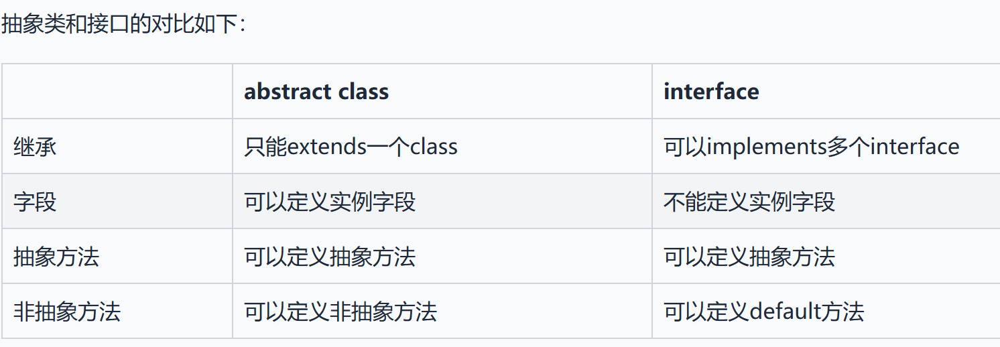

> * 在抽象类中，抽象方法本质上是定义接口规范：即规定高层类的接口，从而保证所有子类都有相同的接口实现，这样，多态就能发挥出威力。
>
>   如果一个抽象类没有字段，所有方法全部都是抽象方法，就可以把该抽象类改写为接口。
>
> * 由于多态的存在，每个子类都可以覆写父类的方法，如果父类的方法本身不需要实现任何功能，仅仅是为了定义方法签名，目的是让子类去覆写它，那么，可以把父类的方法声明为抽象方法，具体的业务逻辑由不同的子类实现，调用者并不关心
>
> * 无法实例化的抽象类有什么用？
>
>   因为抽象类本身被设计成只能用于被继承，因此，抽象类可以强迫子类实现其定义的抽象方法，否则编译会报错。因此，抽象方法实际上相当于定义了“规范”。
>
> * 在对类设计的时候,不能具象表示某一类实物,需要将该类定义成抽象类.
>
> * 抽象类用来提供一个基础类的骨架，并允许子类扩展和重用代码。而接口用来定义一组行为规范,允许多个类实现这些行为，并支持多重继承的概念。
>
> * **继承限制**：Java中一个类只能继承一个抽象类。
>
> * **构造器**：抽象类可以有构造器，虽然它本身不能被实例化，但子类在构造时可能会用到。
>
> * 抽象类可以提供部分方法的具体实现,接口只能定义静态常量\抽象方法\默认方法\静态方法
>
> * 抽象方法必须在子类中实现,继承该抽象类的子类必须重写父类的所有抽象方法。
>
> * 不能被实例化，可借助匿名内部类实现实例化。在子类中可用super调用父类（抽象类）的构造方法完成属性的初始化。
>
> * 抽象方法不能私有化，因为私有化的抽象方法不能被子类所访问，谈不上重写，无意义。
>
> * 当需要提供一个基本的类框架，允许子类在此基础上添加自己的行为时，使用抽象类。
>
> * 当需要提供一些默认实现，但又不想让别人直接实例化该类时，使用抽象类。

```java
package com.luotao.demoAbstract;

/**
 * @Classname Animal
 * @Description 抽象类
 * @Version 1.0.0
 * @Date 2024/10/4 18:56
 * @Author LuoTao
 */
abstract class Animal {
    private String name;
    private String sex;

    public Animal() {
    }

    public Animal(String name, String sex) {
        this.name = name;
        this.sex = sex;
        System.out.println("Animal中的有参构造" + name + sex);
    }
    /**
     * @param
     * @return void
     * @Description 抽象方法-所有动物都会吃
     * @Author LuoTao
     * @Date 2024/10/4 18:58
     **/
    public abstract void eat();
    {
        System.out.println("父类Animal构造代码块");
    }
    static {
        System.out.println("父类Animal静态代码块");
    }
}
/**
* @Description: 父类的抽象方法eat也被继承
* @Author: LuoTao
* @Date: 2024-10-04 19:13:39
**/
abstract class  Bird extends Animal {
    private String color;//特有颜色
    public Bird() {
    }
    public Bird(String name, String sex, String color) {
        super(name, sex);
        this.color = color;
    }

    public abstract void fly();
}
/**
 * @Description 麻雀类
 * @Author LuoTao
 * @Date 2024/10/4 19:11
 **/
class sparrow extends Bird{
    private int age;//特有属性

    public sparrow() {
    }

    public sparrow(String name, String sex, String color, int age) {
        super(name, sex, color);
        this.age = age;
    }

    /**
     * @Description 继承该抽象类的子类需重写父类的抽象方法，这里有两个抽象方法，eat是被Bird继承的
     * @Author LuoTao
     * @Date 2024/10/4 19:13
     * @return void
     * @param
     **/
    @Override
    public  void fly(){
        System.out.println("鸟飞");
    }
    @Override
    public void eat() {
        System.out.println("鸟吃");
    }
    {
        System.out.println("子类sparrow构造代码块");
    }
    static {
        System.out.println("子类sparrow静态代码块");
    }

}
public class DemoAbstract {
    public static void main(String[] args) {
        new sparrow("旺财","男","橘色",18).fly();
        /**
         父类Animal静态代码块
         子类sparrow静态代码块
         父类Animal构造代码块
         Animal中的有参构造旺财男
         子类sparrow构造代码块
         鸟飞
        **/
    }
}

```

## case-学生和老师

```java
package com.luotao.case5;

/**
 * @Classname Person
 * @Description TODO
 * @Version 1.0.0
 * @Date 2024/10/4 22:11
 * @Author LuoTao
 */
public abstract class Person {
    private  String name;
    private  int age;

    public Person(String name, int age) {
        this.name = name;
        this.age = age;
    }

    public String getName() {
        return name;
    }

    public void setName(String name) {
        this.name = name;
    }

    public int getAge() {
        return age;
    }

    public void setAge(int age) {
        this.age = age;
    }
    /**
     * @Description 输出基本信息
     * @Author LuoTao
     * @Date 2024/10/4 22:20
     * @return void
     * @param
     **/
    public void say(){
        System.out.println(getContent());
    }

    public abstract String getContent();
}

```

```java
package com.luotao.case5;

/**
 * @Classname Student
 * @Description TODO
 * @Version 1.0.0
 * @Date 2024/10/4 22:22
 * @Author LuoTao
 */
 class Student extends  Person{
    private  double score;//学生成绩
    /**
     * @Description 父类显示声明构造后子类要对其属性做初始化
     * @Author LuoTao
     * @Date 2024/10/4 22:28
     **/
    public Student(String name,int age,double score){
        super(name,age);
        this.score = score;
    }
    @Override
    public String getContent() {
        return "学生信息："+
                "姓名：" + super.getName() + "\n" +
                "年龄：" + super.getAge() + "\n" +
                "成绩" + this.score;
    }
}

class Teacher extends Person{
    private  double salary;//老师薪资
    /**
     * @Description 父类显示声明构造后子类要对其属性做初始化
     * @Author LuoTao
     * @Date 2024/10/4 22:28
     **/
    public Teacher(String name, int age,double salary) {
        super(name, age);
        this.salary = salary;
    }

    @Override
    public String getContent() {
        return "老师信息："+
                "姓名：" + super.getName() + "\n" +
                "年龄：" + super.getAge() + "\n" +
                "薪水" + this.salary;
    }
}
public class caseApp {
    public static void main(String[] args) {
        new Student("旺财", 18, 100).say();
        new Teacher("小黑", 18, 5000).say();
        System.out.println(new Student("旺财1", 20, 99).getContent());
        /**
         学生信息：姓名：旺财
         年龄：18
         成绩100.0
         老师信息：姓名：小黑
         年龄：18
         薪水5000.0
         学生信息：姓名：旺财1
         年龄：20
         成绩99.0
        **/
    }
}

```

## case-经理与员工工资

```java
package com.luotao.case6;

abstract class Person{
    private String name;
    private String address;

    public Person(String name, String address) {
        this.name = name;
        this.address = address;
    }

    public String getName() {
        return name;
    }

    public void setName(String name) {
        this.name = name;
    }

    public String getAddress() {
        return address;
    }

    public void setAddress(String address) {
        this.address = address;
    }
}

abstract class Employee extends Person{
    private int id;
    private double salary;
    private int age;
    public Employee(String name,String address,int id,double salary,int age){
        super(name, address);
        this.id=id;
        this.salary=salary;
        this.age=age;
    }
    /**
     * @Description 员工涨薪的抽象方法
     * @Author LuoTao
     * @Date 2024/10/5 13:53
     * @return void
     * @param
     **/
    public abstract void addSalary();
    public int getId() {
        return id;
    }

    public void setId(int id) {
        this.id = id;
    }

    public double getSalary() {
        return salary;
    }

    public void setSalary(double salary) {
        this.salary = salary;
    }

    public int getAge() {
        return age;
    }

    public void setAge(int age) {
        this.age = age;
    }
}

class Manager extends  Employee{
    /**
    * @Description: 员工级别:0普通级别,1经理级别
    * @Author: LuoTao
    * @Date: 2024-10-05 13:58:42
    **/
    private int level;

    public Manager(String name, String address, int id, double salary, int age, int level) {
        super(name, address, id, salary, age);
        this.level = level;
    }

    /**
     * @return void
     * @Description 员工涨薪的抽象实现,根据level判断是员工还是经理
     * @Author LuoTao
     * @Date 2024/10/5 13:53
     **/
    @Override
    public void addSalary() {
        double salary = getSalary();// 原来的薪资
        if(level==0){
            super.setSalary(salary + 100);//普通级别涨薪100
        }else if(level == 1){
            super.setSalary(salary + 500);//经理级别涨薪500
        }else{
            System.out.println("当前员工级别异常!");
        }
        System.out.println(getName() + "涨薪后的工资=" + getSalary());
    }
}

public class DemoApp {
    public static void main(String[] args) {
        new Manager("员工牛马","翻斗花园",1,1000,18,1).addSalary();
        new Manager("经理旺财","翻斗花园2号",1,1000,18,0).addSalary();
    }
}

```

## interface

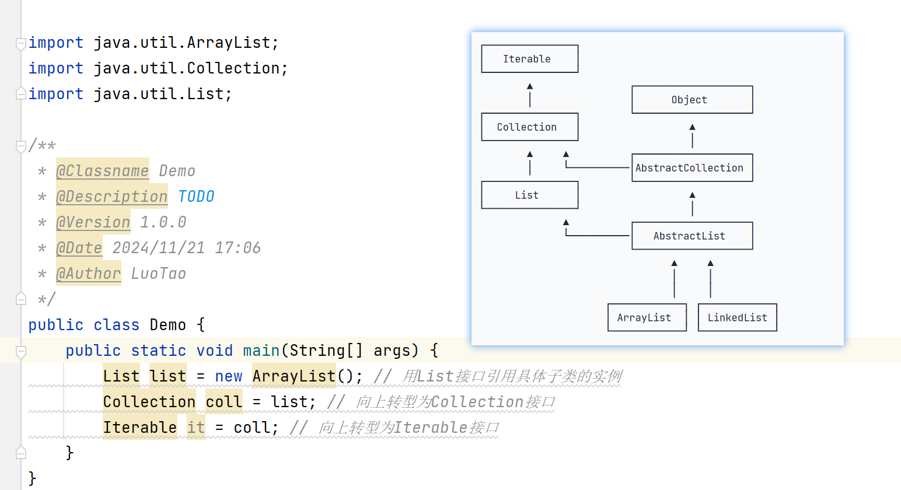

> * 因为`interface`是一个纯抽象类，所以它不能定义实例字段。但是，`interface`是可以有静态字段的，并且静态字段必须为`final`类型
>
> * 接口的所有方法都是抽象方法，接口不能定义实例字段
>
> * 约束和规范,遵循统一的设计
>
> * 抽象类用来提供一个基础类的骨架，并允许子类扩展和重用代码。而接口用来定义一组行为规范,允许多个类实现这些行为，并支持多重继承的概念。
>
> * 1.8之间只能定义静态常量\抽象方法,1.8之后增加了默认方法和静态方法
> * 接口中的方法默认是`public abstract`的，字段只能是`public static final`
> * 类实现接口后需重新接口中所有的抽象方法,否则本类需定义成抽象类.
> * 接口中的静态方法默认不能被子类重写
> * java是单继承的,为了扩充子类的功能,引入接口,因为接口是多基础的.
> * 当需要定义一组操作的规范，而不关心具体实现时，使用接口。
> * 当需要多个类共享某些行为，而又不想让它们之间有继承关系时，使用接口。
> * 当需要模拟“多重继承”的时候，使用接口
> * 通过实现接口，类必须提供接口中所有抽象方法的具体实现

```java
package com.luotao.interfaceDemo;

public interface interfaceDemo {
    /**
    * @Description: 静态常量,默认加上public static final
    * @Author: LuoTao
    * @Date: 2024-10-05 14:38:13
    **/
     double PI=3.1415926;

     /**
      * @Description 抽象方法(无方法体)简写, 默认加上public abstract,
      * @Author LuoTao
      * @Date 2024/10/5 14:41
      * @return void
      * @param a
      * @param b
      **/
     void add(int a, int b);

     /**
      * @Description 静态方法,默认加上public 需构建方法体
      * @Author LuoTao
      * @Date 2024/10/5 14:46
      * @return void
      * @param a
      * @param b
      **/
    static void sum(int a, int b){
        System.out.println("接口中的静态方法可通过接口名直接调用");
    }

    /**
     * @Description 默认方法, 默认加上public, 需构建方法体
     * @Author LuoTao
     * @Date 2024/10/5 14:52
     * @return int
     * @param a
     * @param b
     **/
    default void sub(int a,int b){
        System.out.println("a-b:" + (a-b));
    }
}

```

```java
package com.luotao.interfaceDemo;

/**
 * @Classname interfaceDemo的实现类.类实现接口后需重新接口中所有的抽象方法,否则本类需定义成抽象类.接口中的静态方法默认不能被子类重写
 * @Description TODO
 * @Version 1.0.0
 * @Date 2024/10/5 15:31
 * @Author LuoTao
 */
public class interfaceDemoImpl implements interfaceDemo {

    @Override
    public void add(int a, int b) {
        System.out.println("重写接口中的抽象方法" );
    }

    @Override
    public void sub(int a, int b) {
        System.out.println("重写接口中的默认方法" );
    }
}
class main{
    public static void main(String[] args) {
        new interfaceDemoImpl().add(1,2);
        new interfaceDemoImpl().sub(3,4);
        interfaceDemo.sum(5, 6);//接口中的静态方法可通过接口名直接调用
    }
}

```

## case-研究生薪资管理

> 学生要学费,老师有月薪资,在职研究生既是老师又是学生,所以既要缴学费又有薪资.实现一个程序统计在职研究生的收入与学费,若收入<学费则输出需要贷款,否则不需要贷款.

```java
package com.luotao.case7Demo;
/**
* @Description: 学生学费功能接口
* @Author: LuoTao
* @Date: 2024-10-05 22:50:45
**/
public interface StudentManager {
    /**
     * @Description 获取学生学费
     * @Author LuoTao
     * @Date 2024/10/5 22:49
     * @return double
     * @param
     **/
    double getFree();

    /**
     * @Description 设置学生学费
     * @Author LuoTao
     * @Date 2024/10/5 22:49
     * @return void
     * @param
     **/
    void setFree(double free);
}

```

```java
package com.luotao.case7Demo;
/**
* @Description: 老师薪资功能接口
* @Author: LuoTao
* @Date: 2024-10-05 22:52:30
**/
public interface TeacherManager {
    /**
     * @Description 获取老师薪资
     * @Author LuoTao
     * @Date 2024/10/5 22:53
     * @return double
     * @param
     **/
    double getSalary();
    /**
     * @Description 设置老师薪资
     * @Author LuoTao
     * @Date 2024/10/5 22:53
     * @return double
     * @param
     **/
    void setSalary(double salary);
}

```

```java
package com.luotao.case7Demo;

/**
 * @Classname 研究生类,有两个功能接口:老师和学生
 * @Description TODO
 * @Version 1.0.0
 * @Date 2024/10/5 22:54
 * @Author LuoTao
 */
public class Graduate implements StudentManager,TeacherManager{
    private String name;
    private String sex;
    private int age;
    private double free;//学费
    private double salary;//薪资

    public Graduate(String name, String sex, int age, double free, double salary) {
        this.name = name;
        this.sex = sex;
        this.age = age;
        this.free = free;
        this.salary = salary;
    }

    public String getName() {
        return name;
    }

    public void setName(String name) {
        this.name = name;
    }

    public String getSex() {
        return sex;
    }

    public void setSex(String sex) {
        this.sex = sex;
    }

    public int getAge() {
        return age;
    }

    public void setAge(int age) {
        this.age = age;
    }

    @Override
    public double getFree() {
        return free;
    }

    @Override
    public void setFree(double free) {
        this.free = free;
    }

    @Override
    public double getSalary() {
        return salary;
    }

    @Override
    public void setSalary(double salary) {
        this.salary = salary;
    }
}
class AppMain{
    public static void main(String[] args) {
        Graduate graduate = new Graduate("旺财", "男", 18, 8000, 3000);
        System.out.println(graduate.getSalary()*12 -graduate.getFree());
        if (graduate.getSalary()*12 -graduate.getFree() <0) {
            System.out.println( "需要贷款");
        }else {
            System.out.println("无需贷款");
        }
    }
}

```

## instance of

> 判断对象数据类型.

```java
package com.luotao.case8Demo;

/**
 * @Classname Animal抽象类
 * @Description TODO
 * @Version 1.0.0
 * @Date 2024/10/5 23:25
 * @Author LuoTao
 */
 abstract class Animal {
    private  String name;
    private  int age;

    public abstract void run();
}
/**
* @Description: 动物的行为功能接口
* @Author: LuoTao
* @Date: 2024-10-05 23:28:13
**/
interface Action{
    void eat();
}
/**
 * @Description 猫咪类
 * @Author LuoTao
 * @Date 2024/10/5 23:29
 **/
class Cat extends Animal implements Action{

    @Override
    public void run() {
        System.out.println("猫跑");
    }

    @Override
    public void eat() {
        System.out.println("猫吃");
    }
    public void eat(String food) {
        System.out.println("猫吃" + food);
    }
}
/**
 * @Description 狗狗类
 * @Author LuoTao
 * @Date 2024/10/5 23:29
 **/
class Dog extends Animal implements Action{

    @Override
    public void run() {
        System.out.println("狗跑");
    }

    @Override
    public void eat() {
        System.out.println("狗吃");
    }
}
public class AppMain {
    public static void main(String[] args) {
        Cat cat = new Cat();
        cat.eat();
        cat.eat("鱼");
        cat.run();

        Animal cat1 = new Cat();//父类的引用指向子类对象,向上转型
        System.out.println(cat1 instanceof Animal);//true
        System.out.println(cat1 instanceof Cat);//true
        cat1.run();

        Animal an1 = new Cat();
        Cat cat3=(Cat)an1;// 向下转型,需先向上转型
        System.out.println(cat3 instanceof Animal);//true
        System.out.println(cat3 instanceof Cat);//true

        Dog dog = new Dog();
        System.out.println(dog instanceof Animal);//true
        dog.eat();
        dog.run();
        Action dog1 = new Dog();//引用接口,向上转型
        dog1.eat();

    }
}


```

## case-图形面积与周长计算程序

> 计算不同图形的面积和周长

抽象类:

```java
package com.luotao.caseShape;

/**
* @Description: 定义功能抽象求周长和面积
* @Author: LuoTao
* @Date: 2024-10-06 12:16:50
**/
abstract class Shape{
    /**
     * @Description 求面积
     **/
    public abstract double getArea();
    /**
     * @Description 求周长
     **/
    public abstract double getPerimeter();
}

/**
 * @Description: 圆形
 * @Author: LuoTao
 * @Date: 2024-10-06 12:19:37
 **/
class Circle extends Shape {
    /**
    * @Description: 半径
    **/
    private double radius;
    /**
     * @Description: 圆周率
     **/
    private static final double PI=3.14;

    public Circle(double radius) {
        this.radius = radius;
    }

    @Override
    public double getArea() {
        return PI * radius * radius;
    }

    @Override
    public double getPerimeter() {
        return 2* PI * radius;
    }

    public double getRadius() {
        return radius;
    }

    public void setRadius(double radius) {
        this.radius = radius;
    }

}

/**
* @Description: 长方形
* @Author: LuoTao
* @Date: 2024-10-06 12:19:15
**/
class  Rectangle extends Shape{
    /**
    * @Description: 宽
    **/
    private double width;
    /**
     * @Description: 长
     **/
    private double length;

    public Rectangle(double width, double length) {
        this.width = width;
        this.length = length;
    }

    @Override
    public double getArea() {
        return width * length;
    }

    @Override
    public double getPerimeter() {
        return 2 * (width + length);
    }

    public double getWidth() {
        return width;
    }

    public void setWidth(double width) {
        this.width = width;
    }

    public double getLength() {
        return length;
    }

    public void setLength(double length) {
        this.length = length;
    }
}


/**
* @Description: 图形面积周长计算器
* @Author: LuoTao
* @Date: 2024-10-06 12:20:39
**/
class ShapeCalculator{
    public double getShapeArea(Shape shape){
        double area=0;
        if(shape instanceof Circle){
            area = shape.getArea();
        }else if(shape instanceof Rectangle){
            area = shape.getArea();
        }
        return area;
    }
    public double getShapePerimeter(Shape shape){
        double perimeter=0;
        if(shape instanceof Circle){
            perimeter = shape.getPerimeter();
        }else if(shape instanceof Rectangle){
            perimeter = shape.getPerimeter();
        }
        return perimeter;
    }
}

public class AppMain {
    public static void main(String[] args) {
        ShapeCalculator calculator = new ShapeCalculator();

        // 计算圆形的面积
        Circle circle = new Circle(1);
        System.out.println("Circle Area: " + calculator.getShapeArea(circle));

        // 计算长方形的周长
        Rectangle rectangle = new Rectangle(1, 2);
        System.out.println("Rectangle Perimeter: " + calculator.getShapePerimeter(rectangle));
    }
}

```

引入接口

```java
package com.luotao.caseShape;

/**
* @Description: 定义功能抽象求周长和面积
* @Author: LuoTao
* @Date: 2024-10-06 12:16:50
**/
interface Shape {
    /**
     * @Description 求面积
     **/
double getArea();
    /**
     * @Description 求周长
     **/
 double getPerimeter();
}

/**
 * @Description: 新接口，定义计算直径的行为
 * @Author: LuoTao
 * @Date: 2024-10-06 12:20:39
 */
interface DiameterShape {
    /**
     * @Description 求直径
     */
    Double getDiameter();
}

/**
 * @Description: 圆形
 * @Author: LuoTao
 * @Date: 2024-10-06 12:19:37
 **/
class Circle implements Shape,DiameterShape {
    /**
    * @Description: 半径
    **/
    private double radius;
    /**
     * @Description: 圆周率
     **/
    private static final double PI=3.14;

    public Circle(double radius) {
        this.radius = radius;
    }

    @Override
    public double getArea() {
        return PI * radius * radius;
    }

    @Override
    public double getPerimeter() {
        return 2* PI * radius;
    }

    public double getRadius() {
        return radius;
    }

    public void setRadius(double radius) {
        this.radius = radius;
    }

    @Override
    public Double getDiameter() {
        return  2 * radius;
    }

}

/**
* @Description: 长方形
* @Author: LuoTao
* @Date: 2024-10-06 12:19:15
**/
class  Rectangle implements Shape{
    /**
    * @Description: 宽
    **/
    private double width;
    /**
     * @Description: 长
     **/
    private double length;

    public Rectangle(double width, double length) {
        this.width = width;
        this.length = length;
    }

    @Override
    public double getArea() {
        return width * length;
    }

    @Override
    public double getPerimeter() {
        return 2 * (width + length);
    }

    public double getWidth() {
        return width;
    }

    public void setWidth(double width) {
        this.width = width;
    }

    public double getLength() {
        return length;
    }

    public void setLength(double length) {
        this.length = length;
    }

}


/**
* @Description: 图形面积周长计算器
* @Author: LuoTao
* @Date: 2024-10-06 12:20:39
**/
class ShapeCalculator{
    public double getShapeArea(Shape shape){
        double area=0;
        if(shape instanceof Circle){
            area = shape.getArea();
        }else if(shape instanceof Rectangle){
            area = shape.getArea();
        }
        return area;
    }
    public double getShapePerimeter(Shape shape){
        double perimeter=0;
        if(shape instanceof Circle){
            perimeter = shape.getPerimeter();
        }else if(shape instanceof Rectangle){
            perimeter = shape.getPerimeter();
        }
        return perimeter;
    }
    public double getShapeDiameter(Shape shape){
        double diameter=0;
        if(shape instanceof Circle){
            diameter = ((Circle) shape).getDiameter();
        }
        return diameter;
    }
}

public class AppMain {
    public static void main(String[] args) {
        ShapeCalculator calculator = new ShapeCalculator();

        // 计算圆形的面积
        Circle circle = new Circle(1);
        System.out.println("Circle Area: " + calculator.getShapeArea(circle));// 向上转型
        System.out.println("Circle Diameter: " + calculator.getShapeDiameter(circle));

        // 计算长方形的周长
        Rectangle rectangle = new Rectangle(1, 2);
        System.out.println("Rectangle Perimeter: " + calculator.getShapePerimeter(rectangle));
    }
}

```

## case-运输任务

```java
package com.rabbiter.hello;

/**
 * @Description: 交通工具抽象类
 * @Author: LuoTao
 * @Date: 2024-10-06 14:03:00
 **/
abstract class Transportation{
    /**
     * @Description: 车牌号
     **/
    private  String number;
    /**
     * @Description: 型号
     **/
    private String bom;
    /**
     * @Description: 车辆责任人
     **/
    private String admin;

    public Transportation(String number, String bom, String admin) {
        this.number = number;
        this.bom = bom;
        this.admin = admin;
    }

    /**
     * @Description 交通工具进行运输操作
     * @Author LuoTao
     * @Date 2024/10/6 14:07
     * @return void
     * @param
     **/
    public abstract void transport();

    public String getNumber() {
        return number;
    }

    public void setNumber(String number) {
        this.number = number;
    }

    public String getBom() {
        return bom;
    }

    public void setBom(String bom) {
        this.bom = bom;
    }

    public String getAdmin() {
        return admin;
    }

    public void setAdmin(String admin) {
        this.admin = admin;
    }
}
/**
 * @Description: 车辆保养功能接口
 * @Author: LuoTao
 * @Date: 2024-10-06 14:09:20
 **/
interface Maintain{
    /**
     * @Description 车辆保养
     * @Author LuoTao
     * @Date 2024/10/6 14:10
     * @return void
     * @param
     **/
    void upkeep();
}
/**
 * @Description: GPS功能接口
 * @Author: LuoTao
 * @Date: 2024-10-06 14:09:20
 **/
interface GPS{
    /**
     * @Description 展示GPS位置
     * @Author LuoTao
     * @Date 2024/10/6 14:10
     * @return void
     * @param
     **/
    String showGPS();
}
class Phone implements GPS{

    @Override
    public String showGPS() {
        return "1314520";
    }
}
/**
 * @Description: 运输任务
 * @Author: LuoTao
 * @Date: 2024-10-06 14:24:34
 **/
class SendTask{
    /**
     * @Description: 运输单号
     **/
    private  String number;
    /**
     * @Description: 货物重量
     **/
    private  String goodsWeight;

    public SendTask(String number, String goodsWeight) {
        this.number = number;
        this.goodsWeight = goodsWeight;
    }

    /**
     * @Description 运输任务准备
     * @Author LuoTao
     * @Date 2024/10/6 14:27
     * @return void
     * @param
     **/
    public void sendBefore(){
        System.out.println("验仓中...货物重量:" + goodsWeight  + "运输单号:" + number);
    }
    /**
     * @Description 运输中
     * @Author LuoTao
     * @Date 2024/10/6 14:27
     * @return void
     * @param
     **/
    public void send(Transportation t,GPS g){
        System.out.println("运输责任人:" + t.getAdmin() + "车辆型号:" + t.getBom() + ",开始运输任务...");
        t.transport();// 开始运输
        System.out.println("车辆GPS:" + g.showGPS());
    }
    /**
     * @Description 归还汽车
     * @Author LuoTao
     * @Date 2024/10/6 14:27
     * @return void
     * @param
     **/
    public void sendAfter(Transportation t){
        System.out.println("运输责任人:" + t.getAdmin() + "已归还汽车:" + t.getBom());
    }
}
/**
 * @Description: 专用汽车类
 * @Author: LuoTao
 * @Date: 2024-10-06 14:12:11
 **/
class ZTransportation extends Transportation implements Maintain{


    public ZTransportation(String number, String bom, String admin) {
        super(number, bom, admin);
    }

    @Override
    public void transport() {
        System.out.println("正在运输货物...");
    }

    @Override
    public void upkeep() {
        System.out.println("专用车保养完成");
    }
}

/**
* @Description: 客户端
**/
 class Client {
    public static void main(String[] args) {
        SendTask sendTask = new SendTask("AE86", "10kg");//运输任务
        sendTask.sendBefore();//验仓完毕
        ZTransportation t = new ZTransportation("渝888", "小米su7", "旺财");//运输车
        sendTask.send(t, new Phone());//发送车辆GPS
        sendTask.sendAfter(t);//归还汽车
        t.upkeep();//保养汽车
    }
}

```

## equals

- 对于基本类型，== 判断两个值是否相等，基本类型没有 equals() 方法。
- 对于引用类型，== 判断两个变量是否引用同一个对象，而 equals() 判断引用的对象是否等价。

```java
package com.luotao.caseRing;
class  Student{
    private  String name;
    private  int age;

    public Student(String name, int age) {
        this.name = name;
        this.age = age;
    }

    @Override
    public boolean equals(Object obj) {
        /**
         * @Description: 若堆地址相同则指两个对象的数据相等
         * @Author: LuoTao
         * @Date: 2024-10-06 15:23:57
         **/
        if(this == obj){
            System.out.println("若堆地址相同则指两个对象的数据相等");
            return true;
        }
        /**
        * @Description: 向下转型获取Student对象的成员信息
         * 若对象的所有属性都相同则两个对象的数据相同
        * @Author: LuoTao
        * @Date: 2024-10-06 15:27:56
        **/
        Student s= (Student) obj;
        if(this.name==s.name && this.age==s.age){
            System.out.println("若对象的所有属性都相同则两个对象的数据相同");
            return true;
        }

        /**
        * @Description: 加载器不同
        * @Author: LuoTao
        * @Date: 2024-10-06 15:29:52
        **/
        if(obj == null || this.getClass() != obj.getClass()){
            return false;
        }
        return false;
    }
}
public class AppMain {
    public static void main(String[] args) {
        Student student = new Student("旺财", 18);
        Student student2 = new Student("旺财", 18);
        /**
        * @Description: false,若没有重写Object的equals方法则比较的是对象在堆中的地址
        **/
        System.out.println(student.equals(student2));
    }
}

```

## native

> `hashCode` 输出对象的散列码(哈希码)
>
> `native`方法表示将具体实现交由C语言完成

## Java面向对象编程学习笔记

### 8. 内部类与匿名内部类

内部类是Java中一种特殊的类结构，它允许在一个类内部定义另一个类。这种设计为Java提供了更强大的封装能力和更灵活的代码组织方式。

#### 8.1 内部类的概念与分类

内部类可以分为四种类型：
1. 成员内部类（Member Inner Class）
2. 静态内部类（Static Nested Class）
3. 局部内部类（Local Inner Class）
4. 匿名内部类（Anonymous Inner Class）

```
内部类
├── 成员内部类（非静态内部类）
├── 静态内部类（静态嵌套类）
├── 局部内部类（方法内定义的类）
└── 匿名内部类（没有名字的内部类）
```

#### 8.2 成员内部类

成员内部类是定义在类内部的非静态类，它与外部类的实例变量和方法享有相同的地位。

##### 8.2.1 基本特性

- 可以访问外部类的所有成员（包括私有成员）
- 隐式持有外部类的引用（外部类名.this）
- 不能包含静态成员（Java 16之前）
- 必须通过外部类实例才能创建

##### 8.2.2 代码示例

```java
public class Outer {
    private int outerField = 1;
    private static int staticOuterField = 2;
    
    // 成员内部类
    public class Inner {
        private int innerField = 3;
        
        public void display() {
            // 可以直接访问外部类的实例变量
            System.out.println("外部类成员变量: " + outerField);
            
            // 可以访问外部类的静态变量
            System.out.println("外部类静态变量: " + staticOuterField);
            
            // 可以使用外部类.this引用外部类实例
            System.out.println("通过Outer.this访问: " + Outer.this.outerField);
            
            // 内部类自己的实例变量
            System.out.println("内部类成员变量: " + innerField);
        }
    }
    
    // 外部类方法，创建内部类实例并调用其方法
    public void createInner() {
        Inner inner = new Inner();
        inner.display();
    }
}
```

##### 8.2.3 创建内部类实例

在外部类以外的地方创建内部类的实例：

```java
public class Main {
    public static void main(String[] args) {
        // 先创建外部类实例
        Outer outer = new Outer();
        
        // 使用外部类实例创建内部类实例
        Outer.Inner inner = outer.new Inner();
        
        // 调用内部类方法
        inner.display();
    }
}
```

##### 8.2.4 应用场景

- 当内部类与外部类有紧密关系时
- 需要内部类访问外部类的实例成员
- 封装仅由外部类使用的辅助类
- 实现回调机制

#### 8.3 静态内部类（静态嵌套类）

静态内部类是使用static关键字修饰的内部类。与成员内部类不同，它不持有外部类的引用。

##### 8.3.1 基本特性

- 可以访问外部类的静态成员，但不能直接访问实例成员
- 可以包含静态成员和实例成员
- 不需要外部类实例即可创建
- 相对独立，行为更像一个独立的类

##### 8.3.2 代码示例

```java
public class Outer {
    private int outerField = 1;
    private static int staticOuterField = 2;
    
    // 静态内部类
    public static class StaticNested {
        private int innerField = 3;
        private static int staticInnerField = 4;
        
        public void display() {
            // 可以访问外部类的静态成员
            System.out.println("外部类静态变量: " + staticOuterField);
            
            // 不能直接访问外部类的实例成员
            // System.out.println(outerField); // 编译错误
            
            // 可以访问自己的实例成员
            System.out.println("内部类实例变量: " + innerField);
            
            // 可以访问自己的静态成员
            System.out.println("内部类静态变量: " + staticInnerField);
        }
        
        public static void staticDisplay() {
            System.out.println("内部类的静态方法");
            System.out.println("外部类静态变量: " + staticOuterField);
        }
    }
    
    public void createStaticNested() {
        StaticNested nested = new StaticNested();
        nested.display();
    }
}
```

##### 8.3.3 创建静态内部类实例

```java
public class Main {
    public static void main(String[] args) {
        // 不需要外部类实例，可以直接创建静态内部类的实例
        Outer.StaticNested nested = new Outer.StaticNested();
        nested.display();
        
        // 可以直接调用静态内部类的静态方法
        Outer.StaticNested.staticDisplay();
    }
}
```

##### 8.3.4 应用场景

- 不需要访问外部类实例成员时
- 内部类需要定义静态成员
- 将相关类组织在一起，但保持独立性
- 实现工具类或辅助类
- 实现构建器模式（Builder Pattern）

#### 8.4 局部内部类

局部内部类是定义在方法或作用域块内的类，只在定义它的方法或作用域内可见。

##### 8.4.1 基本特性

- 只能在定义它的方法或作用域内使用
- 可以访问外部类的所有成员（包括私有成员）
- 可以访问方法中的final或effectively final局部变量
- 不能定义静态成员（Java 16之前）
- 作用域限制在方法内

##### 8.4.2 代码示例

```java
public class Outer {
    private int outerField = 1;
    
    public void methodWithLocalClass(final int param) {
        final int localVar = 10;
        int effectivelyFinalVar = 20; // Java 8后，effectively final变量
        
        // 局部内部类
        class LocalInner {
            private int innerField = 3;
            
            public void display() {
                // 可以访问外部类成员
                System.out.println("外部类成员: " + outerField);
                
                // 可以访问方法的final参数
                System.out.println("方法参数: " + param);
                
                // 可以访问方法的局部final变量
                System.out.println("局部final变量: " + localVar);
                
                // 可以访问effectively final变量
                System.out.println("Effectively final变量: " + effectivelyFinalVar);
                
                // 内部类自己的成员
                System.out.println("内部类成员: " + innerField);
            }
        }
        
        // 创建局部内部类实例并调用方法
        LocalInner inner = new LocalInner();
        inner.display();
        
        // 一旦这里修改了effectivelyFinalVar，它就不再是effectively final
        // effectivelyFinalVar = 30; // 会导致内部类中使用此变量出错
    }
}
```

##### 8.4.3 应用场景

- 方法中需要辅助类，且这个类只在该方法中使用
- 需要访问方法的局部变量
- 实现特定逻辑的一次性类
- 增强封装

#### 8.5 匿名内部类

匿名内部类是没有名字的局部内部类，用于创建某个类（具体类或抽象类）的子类实例，或某个接口的实现类实例。

##### 8.5.1 基本特性

- 没有类名，在创建实例的同时定义类
- 必须继承一个父类或实现一个接口
- 不能定义构造方法（因为没有类名）
- 可以访问外部类所有成员
- 可以访问方法中的final或effectively final局部变量
- 不能定义静态成员（Java 16之前）
- 一次性使用

##### 8.5.2 代码示例

继承类的匿名内部类：

```java
public class Outer {
    public void createThread() {
        // 创建Thread子类的匿名内部类实例
        Thread thread = new Thread() {
            @Override
            public void run() {
                System.out.println("匿名内部类实现的线程");
            }
        };
        thread.start();
    }
}
```

实现接口的匿名内部类：

```java
public class Outer {
    public void createRunnable() {
        // 创建Runnable接口实现的匿名内部类实例
        Runnable runnable = new Runnable() {
            @Override
            public void run() {
                System.out.println("匿名内部类实现的Runnable");
            }
        };
        new Thread(runnable).start();
        
        // 更简洁的写法：直接作为参数传递
        new Thread(new Runnable() {
            @Override
            public void run() {
                System.out.println("直接作为参数的匿名内部类");
            }
        }).start();
    }
}
```

##### 8.5.3 与Lambda表达式对比

Java 8引入了Lambda表达式，可以替代只有一个抽象方法的接口的匿名内部类（函数式接口）：

```java
public class Outer {
    public void createRunnableWithLambda() {
        // 使用匿名内部类
        Runnable r1 = new Runnable() {
            @Override
            public void run() {
                System.out.println("匿名内部类");
            }
        };
        
        // 使用Lambda表达式
        Runnable r2 = () -> System.out.println("Lambda表达式");
        
        new Thread(r1).start();
        new Thread(r2).start();
    }
}
```

##### 8.5.4 应用场景

- 需要快速实现接口或扩展类
- 一次性使用的实现类
- 事件监听器
- 回调函数
- 策略模式的简单实现
- 比较器的实现

#### 8.6 内部类的内存结构

内部类在编译后会生成独立的字节码文件，命名方式为`外部类名$内部类名.class`。不同类型的内部类在内存中的表示方式也不同。

##### 8.6.1 成员内部类的内存结构

- 编译后生成：`Outer$Inner.class`
- 每个内部类实例隐式持有外部类实例的引用
- JVM通过合成字段`this$0`存储外部类引用

##### 8.6.2 静态内部类的内存结构

- 编译后生成：`Outer$StaticNested.class`
- 不持有外部类实例的引用
- 行为类似独立的类

##### 8.6.3 局部内部类的内存结构

- 编译后生成：`Outer$1LocalInner.class`（数字表示定义顺序）
- 通过合成字段引用外部类实例
- 通过合成字段引用方法中的局部变量

##### 8.6.4 匿名内部类的内存结构

- 编译后生成：`Outer$1.class`（数字表示定义顺序）
- 通过合成字段引用外部类实例
- 通过合成字段引用方法中的局部变量

#### 8.7 内部类的性能考虑

- 内部类增加了类加载的开销
- 非静态内部类的实例持有外部类的引用，可能导致外部类实例无法被垃圾回收
- 过多使用内部类会使代码结构复杂
- 当不需要访问外部类实例时，应优先使用静态内部类

#### 8.8 内部类的最佳实践

1. **恰当选择内部类类型**：
   - 需要访问外部类实例成员：成员内部类
   - 不需要访问外部类实例成员：静态内部类
   - 仅在方法中使用：局部内部类
   - 一次性实现：匿名内部类

2. **访问控制**：
   - 根据封装原则设置适当的访问修饰符
   - 尽量减少暴露内部类

3. **避免持有不必要的引用**：
   - 使用静态内部类避免持有外部类引用
   - 注意潜在的内存泄漏问题

4. **简化代码**：
   - 对于函数式接口，优先使用Lambda表达式而非匿名内部类
   - 使用内部类组织相关类，提高代码可读性

## 成员内部类

```java
package com.luotao.caseRing;
/**
* @Description: 外部类
 * 外部类可以通过内部类对象访问内部类成员
 * 外部类不可访问局部内部类
**/
class  Outer{
    private String name;
    static final double E = 666;
    public void add(){
        System.out.println(new Inner().inName);
        System.out.println(new Sinner().sinName);
    }
    public static void sum(){
        System.out.println("外部类静态方法");
    }
    public void run(){
        int num =1;
        final double G = 9.8;
        /**
        * @Description: 局部内部类
        **/
        class LocalInner{
            int a=1;
            static  final double money=100;
            public void local(){
                System.out.println("局部内部类方法");
            }
        }
    }
    /**
    * @Description: 成员内部类中不能定义静态代码块及静态方法
     * 成员内部类可以访问外部类的所有成员
    * @Author: LuoTao
    * @Date: 2024-10-06 16:03:55
    **/
    class Inner{
        String inName ;
        static final double PT = 3.14;
        {
            System.out.println(name);
            System.out.println(Outer.E);
        }
        public void test(){
            System.out.println("执行成员内部类方法");
        }

    }
    /**
     * @Description: 静态内部类
     * @Author: LuoTao
     * @Date: 2024-10-06 16:03:55
     **/
    static class Sinner{
        String sinName ;
        static final double PT = 3.14;
        {
            System.out.println(new Outer().name);
            System.out.println(Outer.E);
        }
        public void stest(){
            System.out.println("执行静态内部类方法");
        }

    }


}
public class AppMain {
    public static void main(String[] args) {
        Outer.Inner inner = new Outer().new Inner();
        inner.test();
        Outer.Sinner sinner =  new Outer.Sinner();
        sinner.stest();

    }
}

```

## 匿名内部类

```java
package com.rabbiter.hello;

interface Animal {
    void eat();//吃
}
/**
 * @Description: 匿名内部类
 **/
class Appmain{
    public static void main(String[] args) {
        /**
        * @Description: 等同于
        System.out.println(animal.getClass().getName());//com.rabbiter.hello.Appmain$1
         class Appmain$1 extends Animal{
            @Override
            public void eat() {
            System.out.println("干饭");
            }
        };
         Animal animal = new Appmain$1();//多态之向上转型
        animal.eat();
        **/
        Animal animal = new Animal() {
            @Override
            public void eat() {
                System.out.println("干饭");
            }
        };
        animal.eat();


    }
}


```

## 基于抽象工厂模式的单图形和颜色系统

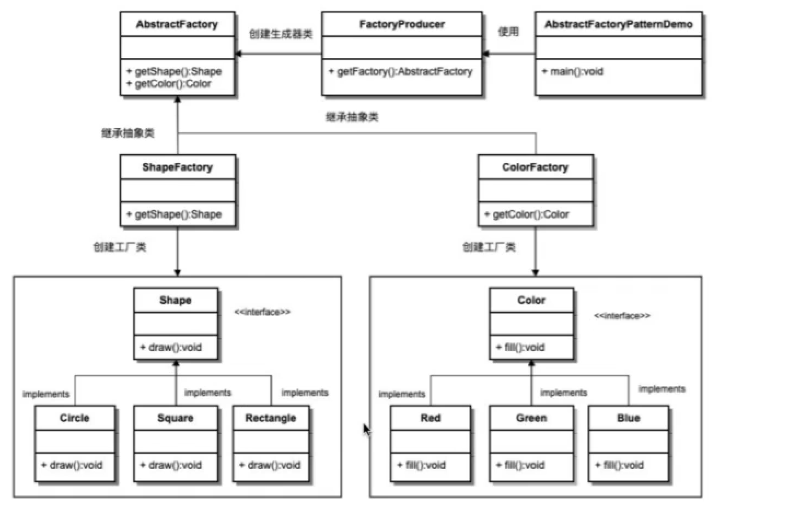

```java
/**
 * @Description 基于抽象工厂模式的单图形和颜色系统
 *
 * 允许客户端通过工厂来创建一系列相关或依赖的对象，而无需指定它们的具体类,通过工厂生产器，客户端代码与具体工厂解耦，增加了系统的灵活性和可扩展性。
 * 想添加新的形状或颜色，只需添加新的实现类并更新工厂类，无需修改客户端代码。
 *
 * 引入了大量的类和接口，对于简单的问题可能造成过度设计。
 * 抽象工厂模式适用于当一个系统需要独立于其组成部分的具体类时，或者当一个系统需要由多个产品系列中的一个来配置时。这种模式有助于构建高度可维护和可扩展的软件架构。
 **/

package com.rabbiter.hello;
/**
 * @Description 图形接口
 **/
interface Shape{
    /**
     * @Description 图形绘制抽象方法
     **/
    void draw();
}

/**
 * @Description 颜色接口
 **/
interface Color{
    /**
     * @Description 填充颜色抽象方法
     **/
    void fill();
}

/**
 * @Description 圆形
 **/
class Circle implements Shape{

    @Override
    public void draw() {
        System.out.println("绘制圆形");
    }
}

/**
 * @Description 长方形
 **/
class Rectangle implements Shape{
    @Override
    public void draw() {
        System.out.println("绘制长方形");
    }
}

/**
 * @Description 正方形
 **/
class Square implements Shape{
    @Override
    public void draw() {
        System.out.println("绘制正方形");
    }
}

/**
 * @Description 图形工厂类
 **/
class ShapeFactory extends AbstractFactory{
    @Override
    Color getColor(String colorName) {
        throw new UnsupportedOperationException("ShapeFactory cannot produce Color");
    }
    @Override
    Shape getShape(String shapeName){
        if(shapeName == null){
            return null;
        }else if(shapeName.equalsIgnoreCase("circle")){
            return new Circle();
        }else if(shapeName.equalsIgnoreCase("rectangle")){
            return new Rectangle();
        }else if(shapeName.equalsIgnoreCase("square")){
            return new Square();
        }else{
            return null;
        }
    }
}

/**
 * @Description 颜色工厂类
 **/
class ColorFactory extends AbstractFactory{

    @Override
    Color getColor(String colorName) {
        if (colorName==null){
            return  null;
        }else if(colorName.equalsIgnoreCase("red")){
            return new Red();
        }else if(colorName.equalsIgnoreCase("green")){
            return new Green();
        }else if(colorName.equalsIgnoreCase("blue")){
            return new Blue();
        }
        return null;
    }

    @Override
    Shape getShape(String shapeName) {
        throw new UnsupportedOperationException("ColorFactory cannot produce Shape");
    }
}


/**
 * @Description 填充红色
 **/
class Red implements Color{
    @Override
    public void fill() {
        System.out.println("填充红色");
    }
}
/**
 * @Description 填充绿色
 **/
class Green implements Color{
    @Override
    public void fill() {
        System.out.println("填充绿色");
    }
}
/**
 * @Description 填充蓝色
 **/
class Blue implements Color{
    @Override
    public void fill() {
        System.out.println("填充蓝色");
    }
}

/**
 * @Description 抽象工厂类
 **/
abstract class AbstractFactory{
    /**
     * @Description 获取颜色
     **/
    abstract Color getColor(String colorName);
    /**
     * @Description 获取形状
     **/
    abstract Shape getShape(String shapeName);
}

/**
 * @Description 工厂生成器类:根据工厂名称返回对应的工厂实例
 **/
class FactoryProducer{
    static AbstractFactory getFactory(String factoryName){
        if(factoryName==null){
            return null;
        }else if(factoryName.equalsIgnoreCase("shape")){
            return new ShapeFactory();
        }else if(factoryName.equalsIgnoreCase("color")){
            return new ColorFactory();
        }
        return null;
    }
}

/**
 * @Description 客户端代码
 **/
class AbstractFactoryPattern{
    public static void main(String[] args) {
        /*
        ShapeFactory shapeFactory = new ShapeFactory();
        Shape circle = shapeFactory.getShape("circle");//向上转型
        circle.draw();
        Rectangle rectangle = (Rectangle)shapeFactory.getShape("rectangle");//向下转型
        rectangle.draw();
         */
        //图形工厂绘制图形
        AbstractFactory shapeFactory = FactoryProducer.getFactory("shape");//通过工厂生产器获取工厂实例
        Shape circle = shapeFactory.getShape("circle");
        if (circle != null ){
            circle.draw();//绘制圆形
        }
        //颜色工厂填充颜色
        AbstractFactory colorFactory = FactoryProducer.getFactory("color");
        Color red = colorFactory.getColor("red");
        if (red !=null) {
            red.fill();//填充红色
        }
    }
}


```

```java
/**
 * 添加新的形状只需添加新的实现类三角形，无需修改客户端代码
 */
class Triangle implements Shape {
    @Override
    public void draw() {
        System.out.println("绘制三角形");
    }
}

// 更新 ShapeFactory
class ShapeFactory extends AbstractFactory {
    @Override
    Color getColor(String colorName) {
        throw new UnsupportedOperationException("ShapeFactory cannot produce Color");
    }

    @Override
    Shape getShape(String shapeName) {
        if (shapeName == null) {
            return null;
        }
        switch (shapeName.toLowerCase()) {
            case "circle":
                return new Circle();
            case "rectangle":
                return new Rectangle();
            case "square":
                return new Square();
            case "triangle": // 新增三角形
                return new Triangle();
            default:
                return null;
        }
    }
}

// 客户端代码中测试新的形状
public class AbstractFactoryPattern {
    public static void main(String[] args) {
        // 图形工厂绘制图形
        AbstractFactory shapeFactory = FactoryProducer.getFactory("shape");
        Shape triangle = shapeFactory.getShape("triangle");
        if (triangle != null) {
            triangle.draw(); // 绘制三角形
        }
        
        // ...其余代码保持不变...
    }
}
```

## 单例模式

------


# 招聘网可视化分析系统

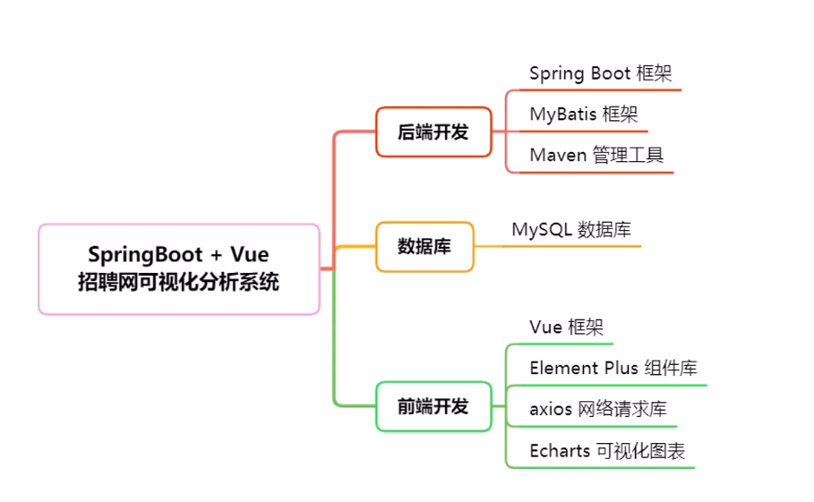

## springboot

> * 快速构建：相当于半成品的基础架构，等待填充业务逻辑完善细节
> * 约定优于配置：如连接数据库、日志处理等提供默认约定

## @SpringBootApplication

> * @SpringBootApplication 启动类注解 包装了@SpringBootConfiguration@EnableAutoConfiguration、@ComponentSan。是一个组合注解。
> * @SpringBootConfiguration 封装了@Configuration,定义了一系列的配置信息。
> * @EnableAutoConfiguration 开启自动配置。
> * @ComponentScan 扫描启动类及其子集将符合条件的组件自动发现和装配。

 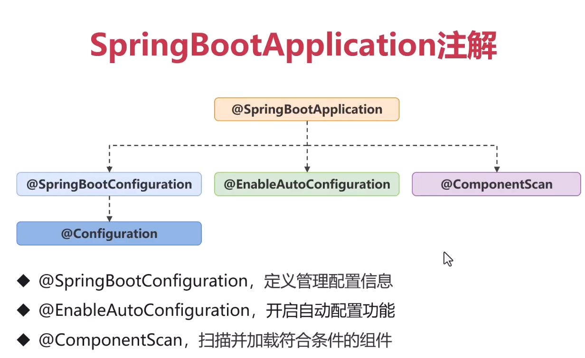

### @SpringBootConfiguration

> 定义管理配置信息
>
> 封装了@Configuration

##### @Configuration

* 作用: 标识该类是一个配置类，Spring 容器会将其作为一个 Bean 定义的来源。
* 场景: 通常用于定义 Spring 应用上下文中的 Bean。

### @EnableAutoConfiguration

> 开启自动配置功能

### @ComponentScan

> 扫描并加载符合条件的组件
>
> 将启动类同级及子集扫描出来自动发现和装配组件

## 统一响应

> * 枚举类：列出响应状态码
> * 响应结果类：封装响应结果

枚举响应状态码：

```java
package com.luotao.job.utils.enums;

import lombok.Getter;

/**
 * @Classname ResultCodeEnum
 * @Description 枚举类：统一响应状态码
 * @Version 1.css.0.0
 * @Date 2024/12/24 16:56
 * @Author LuoTao
 */
@Getter // 自动生成getter方法
public enum ResultCodeEnum {
    SUCCESS(200, "请求成功"),
    PARAM_ERROR(400, "参数错误"),
    NOT_FOUND(404, "接口不存在"),
    SERVER_ERROR(500, "服务器错误"),
    DB_ERROR(505, "数据库错误"),
    UNKNOWN_ERROR(600, "未知错误"),
    UNIQUE_KEY_ERROR(506, "唯一键冲突")
    ;
    /**
     响应状态码
     **/
    private Integer code;
    /**
     状态码描述
     **/
    private String msg;

    ResultCodeEnum(Integer code, String msg) {
        this.code = code;
        this.msg = msg;
    }
}

```

封装响应结果：

```java
package com.luotao.job.utils;
import com.luotao.job.utils.enums.ResultCodeEnum;
import lombok.Data;


/**
 * @Classname ResponseResult
 * @Description 封装响应结果
 * @Version 1.css.0.0
 * @Date 2024/12/26 16:43
 * @Author LuoTao
 */
@Data
public class ResponseResult {
    private Integer code;
    private String msg;
    private Object data;
    /**
     * @Description 自定义返回
     * @Author LuoTao
     * @Date 2024/12/26 16:52
     * @param code 自定义状态码
     * @param msg 自定义提示信息
     * @param data 自定义返回数据
     **/
    public ResponseResult(Integer code,String msg,Object data){
        this.code=code;
        this.msg=msg;
        this.data=data;
    }

    /**
     * @Description 自定义返回-不返回对象
     **/
    public ResponseResult(Integer code,String msg){
        this.code=code;
        this.msg=msg;
        this.data=null;
    }

    /**
    * @Description: 请求成功-不返回对象，使用默认的成功消息
    * @Author: LuoTao
    * @Date: 2024-12-26 16:58:39
    **/
    public ResponseResult(){
        this.code = ResultCodeEnum.SUCCESS.getCode();
        this.msg=ResultCodeEnum.SUCCESS.getMsg();
        this.data=null;
    }

    /**
     * @Description 请求成功返回对象，使用默认的成功消息
     * @Author LuoTao
     * @Date 2024/12/26 17:11
     **/
    public ResponseResult(Object data) {
            this.code=ResultCodeEnum.SUCCESS.getCode();
            this.msg=ResultCodeEnum.SUCCESS.getMsg();
            this.data = data;
    }
}

```


## @RestController

1. 组合功能
@RestController 是 @Controller 和 @ResponseBody 的组合注解。
@Controller：标记一个类为控制器类，Spring 容器会扫描并注册该类为一个 Bean。
@ResponseBody：标记在方法上时，表示该方法的返回值将直接写入 HTTP 响应体中，而不是解析为视图。
2. 自动处理响应体
使用 @RestController 注解后，控制器中的所有方法默认都会使用 @ResponseBody 注解，这意味着这些方法的返回值会被转换为 JSON、XML 等格式，并直接写入 HTTP 响应体中，而不需要再手动添加 @ResponseBody 注解。

```java
package com.luotao.job.controller;

import org.springframework.stereotype.Controller;
import org.springframework.web.bind.annotation.*;

/**
 * @Classname DemoController
 * @Description 处理客户端的HTTP请求，协调业务处理，根据请求返回数据
 * @Version 1.0.0
 * @Date 2024/12/23 16:24
 * @Author LuoTao
 */
//@Controller
@RestController // @RestController 是 @ResponseBody、@Controller 的组合注解
public class DemoController {
    @GetMapping("get/userinfo")
    //@ResponseBody//将返回值作为响应体返回客户端
    public String getUserinfo(@RequestParam(value = "username",required = true) String nickname){
        return "昵称" + nickname;
    }

    @PostMapping("/login")
    //@ResponseBody
    public String login(){
        return "login success";
    }
}

```

## validation校验注解

> 放在实体类的字段或方法参数上，以验证用户输入或其他数据源提供的信息。
>
> 1.引入`validation`依赖；2.实体类添加注解；3.控制器方法签名添加`@Valid`注解

| 校验功能     | 注解         | 描述                       |
| ------------ | ------------ | -------------------------- |
| 空、非空校验 | @Null        | 验证对象是否为Null         |
|              | @NotNull     | 验证是否不为Null           |
|              | @NotBlank    | 验证字符串不为空           |
|              | @NotEmpty    | 元素不为Null、不为Empty    |
| 布尔校验     | @AssertTrue  | 验证布尔对象是否为True     |
|              | @AssertFalse | 验证是否为False            |
| 长度校验     | @Size        | 对象长度必须在给定范围之内 |
|              | @Length      | 元素值长度在给定范围之内   |
| 邮箱校验     | @Email       | 验证是否为电子邮箱         |

```xml
<!--        validation参数校验-->
        <dependency>
            <groupId>org.springframework.boot</groupId>
            <artifactId>spring-boot-starter-validation</artifactId>
        </dependency>
```

```java
@Data // 自动生成getter、setter及toString方法
@NoArgsConstructor // 自动生成无参构造
@AllArgsConstructor // 自动生成全参构造
public class JobCategory {
    private int id;
    @NotBlank(message = "分类名称不能为空")
    @Length(min = 2,max = 20,message = "分类名称长度为2-20位")
    private String categoryName;
    private String categoryDesc;
}

```

```java
    @PostMapping("/add/category")
    public ResponseResult addJobCategory(@Validated JobCategory jobCategory) {
        return jobCategoryService.addJobCategory(jobCategory);
    }
```


## 读取配置文件

```yaml
# 应用服务 WEB 访问端口
server:
  port: 8080

# 数据库
spring:
  datasource:
    driver-class-name: com.mysql.cj.jdbc.Driver
    url: jdbc:mysql://localhost:3306/job?serverTimezone=Asia/Shanghai
    username: root
    password: root
```

用@value注解：

```java
    /**
     * @Description Value注解可以读取配置文件
     * http://127.0.0.1:8080/get/yaml
     **/
    @GetMapping("/get/yaml")
    public void getPropertiesValue(@Value("${server.port}") String port){
        System.out.println("================");
        System.out.println("port is " + port);
        System.out.println("================");
    }
```

用@ConfigurationProperties注解：

```java
package com.luotao.job.controller;

import org.springframework.beans.factory.annotation.Value;
import org.springframework.boot.context.properties.ConfigurationProperties;
import org.springframework.stereotype.Controller;
import org.springframework.web.bind.annotation.*;

/**
 * @Description 处理客户端的HTTP请求，协调业务处理，根据请求返回数据
 */
@RestController // @RestController 是 @ResponseBody、@Controller 的组合注解
@ConfigurationProperties(prefix = "spring.datasource")//读取配置文件的属性注解,属性名需一致并通过setter注入
public class DemoController {
    private String username;
    private String password;
    public void setUsername(String username){
        this.username=username;
    }
    public void setPassword(String password){
        this.password = password;
    }


    /**
     * @Description Value注解可以读取配置文件
     * http://127.0.0.1:8080/get/yaml
     **/
    @GetMapping("/get/yaml")
    public void getPropertiesValue(@Value("${server.port}") String port){
        System.out.println("================");
        System.out.println("port is " + port);
        System.out.println(username + ":" + password);
        System.out.println("================");
    }
}

```


## 统一响应

> 1.枚举类：统一响应状态码
>
> 2.封装响应结果

```java
package com.luotao.job.utils.enums;

import lombok.Getter;

/**
 * @Classname ResultCodeEnum
 * @Description 枚举类：统一响应状态码
 * @Version 1.0.0
 * @Date 2024/12/24 16:56
 * @Author LuoTao
 */
@Getter // 自动生成getter方法
public enum ResultCodeEnum {
    SUCCESS(200, "请求成功"),
    PARAM_ERROR(400, "参数错误"),
    NOT_FOUND(404, "接口不存在"),
    SERVER_ERROR(500, "服务器错误"),
    DB_ERROR(505, "数据库错误"),
    UNKNOWN_ERROR(600, "未知错误"),
    UNIQUE_KEY_ERROR(506, "唯一键冲突")
    ;
    /**
     响应状态码
     **/
    private Integer code;
    /**
     状态码描述
     **/
    private String msg;

    ResultCodeEnum(Integer code, String msg) {
        this.code = code;
        this.msg = msg;
    }
}

```

```
package com.luotao.job.utils.enums;
import lombok.Data;


/**
 * @Classname ResponseResult
 * @Description 封装响应结果
 * @Version 1.0.0
 * @Date 2024/12/26 16:43
 * @Author LuoTao
 */
@Data
public class ResponseResult {
    private Integer code;
    private String msg;
    private Object data;
    /**
     * @Description 自定义返回
     * @Author LuoTao
     * @Date 2024/12/26 16:52
     * @param code 自定义状态码
     * @param msg 自定义提示信息
     * @param data 自定义返回数据
     **/
    public ResponseResult(Integer code,String msg,Object data){
        this.code=code;
        this.msg=msg;
        this.data=data;
    }

    /**
     * @Description 自定义返回-不返回对象
     **/
    public ResponseResult(Integer code,String msg){
        this.code=code;
        this.msg=msg;
        this.data=null;
    }

    /**
    * @Description: 请求成功-不返回对象
    * @Author: LuoTao
    * @Date: 2024-12-26 16:58:39
    **/
    public ResponseResult(){
        this.code = ResultCodeEnum.SUCCESS.getCode();
        this.msg=ResultCodeEnum.SUCCESS.getMsg();
        this.data=null;
    }

    /**
     * @Description 请求成功返回对象，使用默认的成功消息
     * @Author LuoTao
     * @Date 2024/12/26 17:11
     **/
    public ResponseResult(Object data) {
            this.code=ResultCodeEnum.SUCCESS.getCode();
            this.msg=ResultCodeEnum.SUCCESS.getMsg();
            this.data = data;
    }
}

```

## 全局异常处理

### @RestControllerAdvice

### @ExceptionHandler(BindException.class)

```java
package com.luotao.job.utils.enums.exception;


import com.luotao.job.utils.enums.ResponseResult;
import com.luotao.job.utils.enums.ResultCodeEnum;
import org.springframework.dao.DuplicateKeyException;
import org.springframework.validation.BindException;
import org.springframework.validation.BindingResult;
import org.springframework.validation.FieldError;
import org.springframework.web.bind.annotation.ExceptionHandler;
import org.springframework.web.bind.annotation.RestControllerAdvice;

/**
 * @Classname GlobalExceptionHandler
 * @Description 全局异常处理
 * @Version 1.0.0
 * @Date 2024/12/27 15:49
 * @Author LuoTao
 */
@RestControllerAdvice
public class GlobalExceptionHandler {
    /**
     * @Description 参数校验异常处理
     **/
    @ExceptionHandler(BindException.class)
    public ResponseResult bindException(BindException e) {
        /**
         * @Description 从BindingResult对象中获取错误信息
         **/
        BindingResult bindingResult = e.getBindingResult();
        StringBuilder stringBuilder = new StringBuilder("校验失败：");
        for (FieldError fieldError : bindingResult.getFieldErrors()) {
            stringBuilder
                    .append(fieldError.getField())
                    .append(":")
                    .append(fieldError.getDefaultMessage())
                    .append(",");
        }
        String msg = stringBuilder.toString();
        return new ResponseResult(ResultCodeEnum.PARAM_ERROR.getCode(),msg);
    }

    /**
     * @Description 唯一键异常处理
     **/
    @ExceptionHandler(DuplicateKeyException.class)
    public ResponseResult duplicateKeyException(Exception e) {
        return new ResponseResult(ResultCodeEnum.UNIQUE_KEY_ERROR.getCode(),e.getCause().getMessage());
    }

    /**
     * @Description 未知异常处理
     **/
    @ExceptionHandler(Exception.class)
    public ResponseResult unknownException(Exception e) {
        return new ResponseResult(ResultCodeEnum.UNKNOWN_ERROR.getCode(),e.getMessage());
    }
}s

```

## 日志对象Logger

> 1.`properties`配置日志输出目录
>
> 2.`xml`配置文件
>
> 3.在全局统一异常处理类中应用：
>
> 1.两种方式创建`log`日志对象 ：在类上加`@Slf4j `注解或者手动创建`Logger`对象
>
> 2.记录日志：用`log.error`将错误代码和错误消息记录到日志中

```java
package com.luotao.job.utils.enums.exception;


import com.luotao.job.utils.enums.ResponseResult;
import com.luotao.job.utils.enums.ResultCodeEnum;
import lombok.extern.slf4j.Slf4j;
import org.slf4j.Logger;
import org.slf4j.LoggerFactory;
import org.springframework.dao.DuplicateKeyException;
import org.springframework.validation.BindException;
import org.springframework.validation.BindingResult;
import org.springframework.validation.FieldError;
import org.springframework.web.bind.annotation.ExceptionHandler;
import org.springframework.web.bind.annotation.RestControllerAdvice;

/**
 * @Classname GlobalExceptionHandler
 * @Description 全局异常处理
 * @Version 1.0.0
 * @Date 2024/12/27 15:49
 * @Author LuoTao
 */
@Slf4j //注解创建日志对象
@RestControllerAdvice
public class GlobalExceptionHandler {

    // public static final Logger log = LoggerFactory.getLogger(GlobalExceptionHandler.class);// 手动创建日志对象
    /**
     * @Description 参数校验异常处理
     **/
    @ExceptionHandler(BindException.class)
    public ResponseResult bindException(BindException e) {
        /**
         * @Description 从BindingResult对象中获取错误信息
         **/
        BindingResult bindingResult = e.getBindingResult();
        StringBuilder stringBuilder = new StringBuilder("校验失败：");
        for (FieldError fieldError : bindingResult.getFieldErrors()) {
            stringBuilder
                    .append(fieldError.getField())
                    .append(":")
                    .append(fieldError.getDefaultMessage())
                    .append(",");
        }
        String msg = stringBuilder.toString();
        log.error(ResultCodeEnum.PARAM_ERROR.getCode() + msg);//记录日志：将错误代码和错误消息记录到日志中
        return new ResponseResult(ResultCodeEnum.PARAM_ERROR.getCode(),msg);
    }

    /**
     * @Description 唯一键异常处理
     **/
    @ExceptionHandler(DuplicateKeyException.class)
    public ResponseResult duplicateKeyException(Exception e) {
        log.error(ResultCodeEnum.UNIQUE_KEY_ERROR.getCode() + e.getCause().getMessage());
        return new ResponseResult(ResultCodeEnum.UNIQUE_KEY_ERROR.getCode(),e.getCause().getMessage());
    }

    /**
     * @Description 未知异常处理
     **/
    @ExceptionHandler(Exception.class)
    public ResponseResult unknownException(Exception e) {
        log.error(ResultCodeEnum.UNKNOWN_ERROR.getCode() + e.getMessage());
        return new ResponseResult(ResultCodeEnum.UNKNOWN_ERROR.getCode(),e.getMessage());
    }
}

```

```properties
# 日志输出目录
logging:
  file:
    path: ./logs
```

```xml
<?xml version="1.0" encoding="utf-8"?>
<!--logback-spring.xml
    1.日志级别及含义：
    FATAL-严重问题,通常是导致程序退出的错误
    ERROR-记录程序错误或异常情况
    WARN-警告信息，低于WARN的日志不输出
    INFO-记录程序运行状态或异常情况
    DEBUG-输出详细的调试信息
    TRACE-级别最低
    OFF-特殊级别，关闭所有的日志记录
-->

<!-- configuration:根节点
    debug:为ture时，打印出logback内部日志信息，实时查看logback运行状态
    scan:为true时，配置文档如果改变，将会重新加载
    scanPeriod:监测配置文档是否有修改的时间间隔，当scan为true时生效
-->

<configuration debug="false" scan="true" scanPeriod="30 seconds">
    <!--   logger上下文名称-->
    <contextName>logback</contextName>

    <!--    属性配置-->
    <!--    name:属性名,value:属性值,使用${}引用属性-->
    <property name="log.path" value="${LOG_PATH}"/>
    <!--  彩色日志依赖的渲染类  -->
    <conversionRule conversionWord="clr" converterClass="org.springframework.boot.logging.logback.ColorConverter"/>
    <conversionRule conversionWord="wex"
                    converterClass="org.springframework.boot.logging.logback.WhitespaceThrowableProxyConverter"/>
    <conversionRule conversionWord="wEx"
                    converterClass="org.springframework.boot.logging.logback.ExtendedWhitespaceThrowableProxyConverter"/>

    <!--    彩色日志格式-->
    <property name="CONSOLE_LOG_PATTERN"
              value="%clr(%d{yyyy-MM-dd HH:mm:ss.SSS}){faint} %clr(%5p) %clr(${PID:- }){magenta} %clr(---){faint} %clr([%15.15t]){faint} %clr(%-40.40logger{39}){cyan} %clr(:){faint} %m%n%wex"/>

    <!--    输出到控制台-->
    <appender name="CONSOLE" class="ch.qos.logback.core.ConsoleAppender">
        <!--        控制台输出>=此级别的日志信息-->
        <filter class="ch.qos.logback.classic.filter.ThresholdFilter">
            <level>debug</level>
        </filter>
        <encoder>
            <!--   日志输出格式         -->
            <pattern>${CONSOLE_LOG_PATTERN}</pattern>
            <charset>UTF-8</charset>
        </encoder>
    </appender>

    <!--    输出到文档-->
    <!--    ERROR级别日志，时间滚动输出-->
    <appender name="ERROR" class="ch.qos.logback.core.rolling.RollingFileAppender">
        <!--        正在记录的日志文档路径及文档名-->
        <file>${log.path}/error.log</file>
        <!--        日志文档输出格式-->
        <encoder>
            <pattern>%d{yyyy-MM-dd HH:mm:ss.SSS} [%thread] %-5level %logger{50}:%line - %msg%n</pattern>
            <charset>UTF-8</charset>
        </encoder>
        <!--   日志记录器的滚动策略，按日期、文件大小记录     -->
        <rollingPolicy class="ch.qos.logback.core.rolling.TimeBasedRollingPolicy">
            <!--        日志记录文件名，日志记录文件名后缀为.log-->
            <fileNamePattern>${log.path}/error.%d{yyyy-MM-dd}.%i.log</fileNamePattern>
            <timeBasedFileNamingAndTriggeringPolicy class="ch.qos.logback.core.rolling.SizeAndTimeBasedFNATP">
                <maxFileSize>10MB</maxFileSize>
            </timeBasedFileNamingAndTriggeringPolicy>
            <!--            日志文档保留天数-->
            <maxHistory>15</maxHistory>
        </rollingPolicy>
        <!--        此日志文档只记录ERROR级别日志-->
        <filter class="ch.qos.logback.classic.filter.LevelFilter">
            <level>ERROR</level>
            <onMatch>ACCEPT</onMatch>
            <onMismatch>DENY</onMismatch>
        </filter>
    </appender>

    <!--    WARN级别日志，时间滚动输出-->
    <appender name="WARN" class="ch.qos.logback.core.rolling.RollingFileAppender">
        <!--        正在记录的日志文档路径及文档名-->
        <file>${log.path}/warn.log</file>
        <!--        日志文档输出格式-->
        <encoder>
            <pattern>%d{yyyy-MM-dd HH:mm:ss.SSS} [%thread] %-5level %logger{50}:%line - %msg%n</pattern>
            <charset>UTF-8</charset>
        </encoder>
        <!--   日志记录器的滚动策略，按日期、文件大小记录     -->
        <rollingPolicy class="ch.qos.logback.core.rolling.TimeBasedRollingPolicy">
            <fileNamePattern>${log.path}/warn.%d{yyyy-MM-dd}.%i.log</fileNamePattern>
            <timeBasedFileNamingAndTriggeringPolicy class="ch.qos.logback.core.rolling.SizeAndTimeBasedFNATP">
                <maxFileSize>10MB</maxFileSize>
            </timeBasedFileNamingAndTriggeringPolicy>
            <!--            日志文档保留天数-->
            <maxHistory>15</maxHistory>
        </rollingPolicy>
        <!--        此日志文档只记录  WARN 级别日志-->
        <filter class="ch.qos.logback.classic.filter.LevelFilter">
            <level>WARN</level>
            <onMatch>ACCEPT</onMatch>
            <onMismatch>DENY</onMismatch>
        </filter>
    </appender>
    <!--    DEBUG级别日志，时间滚动输出-->
    <appender name="DEBUG" class="ch.qos.logback.core.rolling.RollingFileAppender">
        <!--        正在记录的日志文档路径及文档名-->
        <file>${log.path}/debug.log</file>
        <!--        日志文档输出格式-->
        <encoder>
            <pattern>%d{yyyy-MM-dd HH:mm:ss.SSS} [%thread] %-5level %logger{50}:%line - %msg%n</pattern>
            <charset>UTF-8</charset>
        </encoder>
        <!--        日志记录器的滚动策略，按日期、文件大小记录-->
        <rollingPolicy class="ch.qos.logback.core.rolling.TimeBasedRollingPolicy">
            <!--            日志归档-->
            <fileNamePattern>${log.path}/debug.%d{yyyy-MM-dd}.%i.log</fileNamePattern>
            <timeBasedFileNamingAndTriggeringPolicy class="ch.qos.logback.core.rolling.SizeAndTimeBasedFNATP">
                <maxFileSize>10MB</maxFileSize>
            </timeBasedFileNamingAndTriggeringPolicy>
            <!--            日志文档保留天数-->
            <maxHistory>15</maxHistory>
        </rollingPolicy>
        <!--        此日志文档只记录 DEBUG 级别日志-->
        <filter class="ch.qos.logback.classic.filter.LevelFilter">
            <level>DEBUG</level>
            <onMatch>ACCEPT</onMatch>
            <onMismatch>DENY</onMismatch>
        </filter>
    </appender>

    <!--    INFO 级别日志，时间滚动输出-->
    <appender name="INFO" class="ch.qos.logback.core.rolling.RollingFileAppender">
        <!--        正在记录的日志文档路径及文档名-->
        <file>${log.path}/info.log</file>
        <!--        日志文档输出格式-->
        <encoder>
            <pattern>%d{yyyy-MM-dd HH:mm:ss.SSS} [%thread] %-5level %logger{50}:%line - %msg%n</pattern>
            <charset>UTF-8</charset>
        </encoder>
        <!--        日志记录器的滚动策略，按日期、文件大小记录-->
        <rollingPolicy class="ch.qos.logback.core.rolling.TimeBasedRollingPolicy">
            <!--            日志归档-->
            <fileNamePattern>${log.path}/info.%d{yyyy-MM-dd}.%i.log</fileNamePattern>
            <timeBasedFileNamingAndTriggeringPolicy class="ch.qos.logback.core.rolling.SizeAndTimeBasedFNATP">
                <maxFileSize>10MB</maxFileSize>
            </timeBasedFileNamingAndTriggeringPolicy>
            <!--            日志文档保留天数-->
            <maxHistory>15</maxHistory>
        </rollingPolicy>
        <!--        此日志文档只记录 INFO 级别日志-->
        <filter class="ch.qos.logback.classic.filter.LevelFilter">
            <level>INFO</level>
            <onMatch>ACCEPT</onMatch>
            <onMismatch>DENY</onMismatch>
        </filter>
    </appender>

    <!--
        root, 必选节点，指定基础日志输出级别
        appender-ref 指定日志输出到哪个appender
    -->
    <root level="INFO">
        <appender-ref ref="CONSOLE"/>
        <appender-ref ref="DEBUG"/>
        <appender-ref ref="INFO"/>
        <appender-ref ref="ERROR"/>
        <appender-ref ref="WARN"/>
    </root>

    <!--    指定某个包下的日志级别,默认使用 root 标签配置,打印 MyBatis 的日志级别为 DEBUG-->
    <logger name="com.luotao.job.mapper" level="DEBUG"/>

</configuration>
```


## 设计模式-mvc

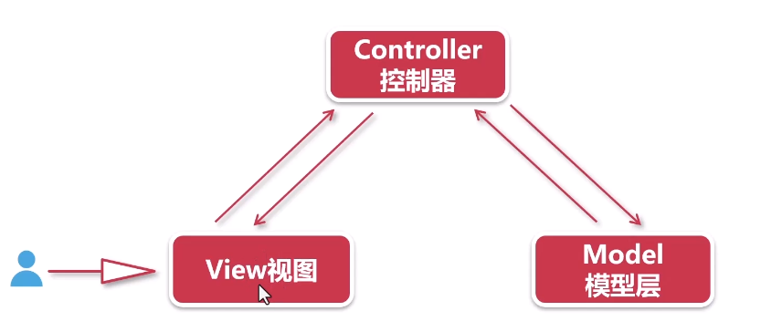

> * 设计模式，将程序的业务逻辑、数据和用户界面分离
>
> * 实现代码分离模块化
> * 用户通过view发送请求给服务器，controller对请求解析并找到model,model对请求处理完毕后将结果返回给controller，controller找到view，view将结果渲染呈现
> * model封装业务相关数据及数据的处理方法。
> * view对数据渲染
> * controller接受用户输入，决定调用哪个模型处理，然后选择视图来展示处理结果。负责协调view和model的交互。

### model

> 封装业务相关数据以及数据的处理方法，如数据的存储、读取及验证

### view

> 数据展示

### controller

> * 需求——》服务员（controller）——》厨师长（service）
> * 控制业务流程，协调`model`和`view`的交互。接受前端请求调用service层并接受返回的数据，最后返回给前端

#### @RequestMapping

@RequestMapping 用于映射 HTTP 请求到处理请求的控制器方法上。用来指定 URL 映射、HTTP 方法类型（如 GET、POST 等）、请求参数、请求头等。

#### @PathVariabl

@PathVariable 注解是 Spring MVC 中用于处理 URL 路径变量的重要工具，它可以方便地从请求路径中提取动态部分，并将其作为参数传递给控制器方法，从而实现更灵活和强大的路由功能。

## service

> * 需求——》服务员（controller）——》厨师长（service）
> * 由具体实现类实现具体的业务逻辑

```java
package com.luotao.job.service;
import com.luotao.job.domain.JobCategory;
import com.luotao.job.utils.ResponseResult;

public interface JobCategoryService {
    /**
        获取所有岗位类别
    **/
    ResponseResult getAllJobCategory();

    /**
     * 新增岗位类别
     **/
    ResponseResult addJobCategory(JobCategory jobCategory);

    /**
     * 删除岗位类别
     **/
    ResponseResult deleteJobCategory(Integer id);
    /**
     * 更新岗位类别
     **/
    ResponseResult updateJobCategory(JobCategory jobCategory);

}

```


### service实现类

```java
package com.luotao.job.service;

import com.luotao.job.domain.JobCategory;
import com.luotao.job.mapper.JobCategoryMapper;
import com.luotao.job.utils.ResponseResult;
import com.luotao.job.utils.enums.ResultCodeEnum;
import org.springframework.beans.factory.annotation.Autowired;
import org.springframework.stereotype.Service;

import javax.annotation.Resource;
import javax.swing.*;
import java.util.HashMap;

/**
 * @Classname JobCategoryServiceImpl
 * @Description TODO
 * @Version 1.css.0.0
 * @Date 2024/12/24 16:56
 * @Author LuoTao
 */
@Service
public class JobCategoryServiceImpl implements JobCategoryService {
    /*让 Spring 容器自动为 jobCategoryMapper 成员变量注入一个实现了 JobCategoryMapper 接口的实例对象。
    javax.swing.Spring 会根据配置（例如 MyBatis 的配置）动态生成JobCategoryMapper 实现类的代理对象。这个代理对象会被注入到 jobCategoryMapper 中
     */
    @Resource// 注入
    private JobCategoryMapper jobCategoryMapper;
    /**
     * 获取所有岗位类别
     **/
    @Override
    public ResponseResult getAllJobCategory() {
        return new ResponseResult(jobCategoryMapper.allJobCategory());
    }

    /**
     * 新增岗位类别
     *
     * @param jobCategory
     */
    @Override
    public ResponseResult addJobCategory(JobCategory jobCategory) {
        HashMap<String, Integer> idMap = new HashMap<>();
        int increamentID = jobCategoryMapper.insertJobCategory(jobCategory);
//        System.out.println(increamentID);
        if (increamentID >0 ){
            idMap.put("id", jobCategory.getId());
            return new ResponseResult(idMap);
        }
        return new ResponseResult(ResultCodeEnum.SERVER_ERROR);
    }

    /**
     * 删除岗位类别
     *
     * @param id
     */
    @Override
    public ResponseResult deleteJobCategory(Integer id) {
        if (jobCategoryMapper.deleteByPrimaryKey(id) > 0) {
            return new ResponseResult();
        }
        return new ResponseResult(ResultCodeEnum.DB_ERROR);
    }

    /**
     * 更新岗位类别
     *
     * @param jobCategory
     */
    @Override
    public ResponseResult updateJobCategory(JobCategory jobCategory) {
        if (jobCategoryMapper.updateByPrimaryKey(jobCategory)>0){
            return new ResponseResult();
        }
        return new ResponseResult(ResultCodeEnum.DB_ERROR);
    }

}

```


## mapper

> * 副手，完成厨师长的任务
> * 1.编写mapper接口;2.配置`xml`文件;3.properties配置xml路径；4.启动类上标识扫描注解
> * Mapper作为连接应用层和数据库层的关键组件，充当数据库操作的接口,简化数据库交互过程
> * 定义sql语句：mapper中的方法签名和xml的SQL语句一一对应
> * 参数映射：java对象或基本类型可以映射为SQL语句中的占位符使得可以通过代码传递对象或参数
> * 结果映射：mpper可将查询结果映射为java对象，简单的标量值还是复杂的数据结构都可以通过配置实现

## @Bean

* 作用: 标识方法会返回一个对象，该对象会被注册到 Spring 容器中作为一个 Bean

### @MapperScan

自动发现并注册所有的 Mapper 接口，并将其注册为 Spring 的 Bean。

```java
@MapperScan("com.luotao.job.mapper")// 启动类上标识扫描接口所在包
```

```properties
# application.yaml 中配置mpper位置
mybatis:
  mapper-locations: classpath:/mapper/**/*.xml
```

### mapper.xml

```xml
<?xml version="1.0" encoding="UTF-8"?>
<!DOCTYPE mapper
        PUBLIC "-//mybatis.org//DTD Config 3.0//EN"
        "http://mybatis.org/dtd/mybatis-3-mapper.dtd">
<mapper namespace="com.luotao.job.mapper.JobCategoryMapper">
<!--
* 副手，完成厨师长的任务
* Mapper作为连接应用层和数据库层的关键组件，充当数据库操作的接口,简化数据库交互过程
* 定义sql语句：mapper中的方法签名和xml的SQL语句一一对应
* 参数映射：java对象或基本类型可以映射为SQL语句中的占位符使得可以通过代码传递对象或参数
* 结果映射：mpper可将查询结果映射为java对象，简单的标量值还是复杂的数据结构都可以通过配置实现

-->
    <select id="allJobCategory" resultType="com.luotao.job.domain.JobCategory">
        select * from `job_category`
    </select>
    <!--keyProperty="id" 表示插入操作完成后，新生成的主键将被映射到传入的 JobCategory 对象的 id 属性上。-->
    <insert id="insertJobCategory" parameterType="com.luotao.job.domain.JobCategory" useGeneratedKeys="true" keyProperty="id">
        insert into `job_category`(category_name,category_desc) values (#{category_name},#{category_desc})
    </insert>

    <delete id="deleteByPrimaryKey" parameterType="java.lang.Integer" >
        delete from `job_category` where id=#{id}
    </delete>

    <update id="updateByPrimaryKey" parameterType="com.luotao.job.domain.JobCategory" useGeneratedKeys="true" keyProperty="id">
        update `job_category` set category_name=#{category_name},category_desc=#{category_desc}  where id=#{id}
    </update>

</mapper>
```

### mapper接口

```java
package com.luotao.job.mapper;

import com.luotao.job.domain.JobCategory;

import java.util.List;

/**
 * @Classname JobCategoryMapper
 */

public interface JobCategoryMapper {
    /**
     查询数据
    **/
    List<JobCategory> allJobCategory();

    /**
        添加数据
    **/
    int insertJobCategory(JobCategory jobCategory);

    /**
     * 删除数据
     **/
    int deleteByPrimaryKey(Integer id);

    /**
     修改数据
     **/
    int updateByPrimaryKey(JobCategory jobCategory);

}

```


## domain

> * 原材料
> * 定义数据实体，与数据库表的关系。一张表对应一个实体类，类属性值与字段一一对应

```java
package com.luotao.job.domain;

import lombok.AllArgsConstructor;
import lombok.Data;
import lombok.NoArgsConstructor;

/**
 * @Classname JobCategory
-- 岗位分类表
drop table if exists job_category;
create table job_category(
id int not null auto_increment comment 'ID',
category_name varchar(80) not null comment '分类名称',
category_desc varchar(200) default null comment '分类描述',
primary key (id),
unique key category_name_unique(category_name)
) engine =innodb default charset =utf8mb4 comment ='岗位分类表';
 */
@Data // 自动生成getter、setter及toString方法
@NoArgsConstructor // 自动生成无参构造
@AllArgsConstructor // 自动生成全参构造
public class JobCategory {
    private int id;
    /**
    * @Description: 分类名称
    **/
    private String category_name;
    /**
     * @Description: 分类描述
     **/
    private String category_desc;
}

```


## 三层架构

> 软件架构

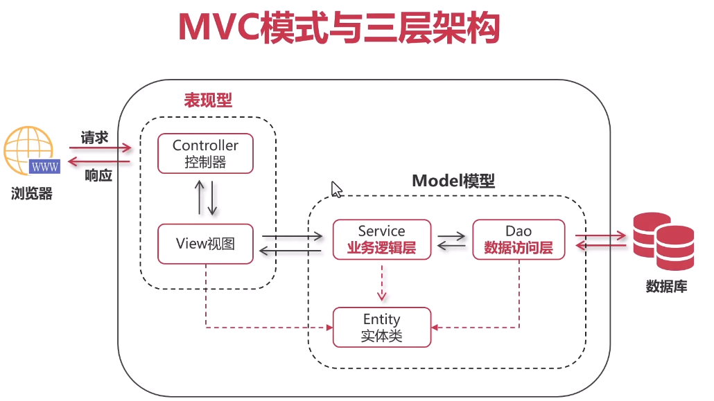


## 岗位分类表数据库设计

```sql
create schema job collate utf8_general_ci;
```

```sql
-- 岗位分类表
drop table if exists job_category;
create table job_category(
    id int not null auto_increment comment 'ID',
    category_name varchar(80) not null comment '分类名称',
    category_desc varchar(200) default null comment '分类描述',
    primary key (id),
    unique key category_name_unique(category_name)
) engine =innodb default charset =utf8mb4 comment ='岗位分类表';
```

```sql
INSERT INTO job_category (category_name, category_desc)
VALUES ('技术类', '与技术开发和编程相关的工作'),
       ('管理类', '涉及项目管理和团队领导的工作'),
       ('销售类', '负责产品销售和市场推广的工作'),
       ('财务类', '处理财务和会计相关的工作'),
       ('人力资源类', '负责招聘、培训和员工管理的工作');

```

## mybatis

> 封装JDBC

```xml
        <!--mybatis-->
        <dependency>
            <groupId>org.mybatis.spring.boot</groupId>
            <artifactId>mybatis-spring-boot-starter</artifactId>
            <version>2.2.2</version>
        </dependency>
        <!--数据库驱动-->
        <dependency>
            <groupId>mysql</groupId>
            <artifactId>mysql-connector-java</artifactId>
            <version>8.0.33</version>
        </dependency>
```

## appllication.yaml

```yaml
# 应用服务 WEB 访问端口
server:
  port: 8080

# 数据库
spring:
  datasource:
    driver-class-name: com.mysql.cj.jdbc.Driver
    url: jdbc:mysql://localhost:3306/job?serverTimezone=Asia/Shanghai
    username: root
    password: root
```

## lombok

> @Data // 自动生成getter、setter及toString方法
> @NoArgsConstructor // 自动生成无参构造
> @AllArgsConstructor // 自动生成全参构造

```xml
        <!--lombok-->
        <dependency>
            <groupId>org.projectlombok</groupId>
            <artifactId>lombok</artifactId>
            <version>1.18.30</version>
        </dependency>
```

```java
@Data // 自动生成getter、setter及toString等方法
@NoArgsConstructor // 自动生成无参构造
@AllArgsConstructor // 自动生成全参构造
public class JobCategory {
    private int id;
    private String category_name;
    private String category_desc;
}

```

# 岗位详情后端实现

## 数据库设计

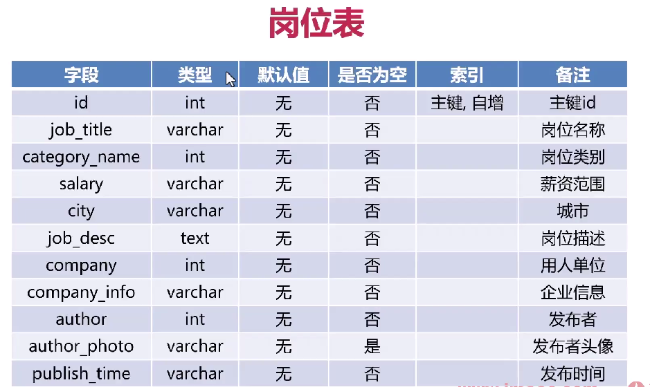

```sql
-- 删除已存在的表
DROP TABLE IF EXISTS `jobs`;

-- 创建 jobs 表
CREATE TABLE `jobs`
(
    `id`            int          NOT NULL AUTO_INCREMENT COMMENT 'ID',
    `job_title`     varchar(80)  NOT NULL COMMENT '岗位名称',
    `category_name` varchar(200) NOT NULL COMMENT '岗位类别名称',
    `salary`        varchar(80) DEFAULT NULL COMMENT '薪资范围',
    `city`          varchar(80)  NOT NULL COMMENT '城市',
    `job_desc`      text         NOT NULL COMMENT '岗位描述',
    `company`       varchar(200) NOT NULL COMMENT '用人单位',
    `company_info`  varchar(200) NOT NULL COMMENT '企业类型,经营类型,规模',
    `author`        varchar(200) NOT NULL COMMENT '发布者',
    `author_photo`  varchar(200) NOT NULL COMMENT '发布者头像',
    `publish_time`  varchar(200) NOT NULL COMMENT '发布时间',
    PRIMARY KEY (`id`) USING BTREE
) ENGINE = InnoDB
  DEFAULT CHARSET = utf8mb4 COMMENT ='岗位表'
  ROW_FORMAT = DYNAMIC;

```

```sql
INSERT INTO `jobs` (`job_title`, `category_name`, `salary`, `city`, `job_desc`, `company`,
                    `company_info`, `author`, `author_photo`, `publish_time`)
VALUES ('软件工程师', '技术类', '10000-15000', '北京', '负责软件开发和维护工作', 'ABC科技有限公司',
        '高新技术企业,互联网行业,中型企业', '张三', 'https://example.com/avatar.jpg', '2023-10-01'),
       ('产品经理', '管理类', '12000-18000', '上海', '负责产品规划和市场调研', 'XYZ科技有限公司',
        '高新技术企业,互联网行业,大型企业', '李四', 'https://example.com/avatar2.jpg', '2023-10-02'),
       ('销售经理', '销售类', '8000-12000', '广州', '负责产品销售和客户关系维护', 'DEF贸易有限公司',
        '商贸企业,批发零售业,小型企业', '王五', 'https://example.com/avatar3.jpg', '2023-10-03'),
       ('财务分析师', '财务类', '9000-13000', '深圳', '负责财务分析和报表制作', 'GHI财务咨询公司',
        '咨询服务企业,金融行业,中型企业', '赵六', 'https://example.com/avatar4.jpg', '2023-10-04'),
       ('人力资源专员', '人力资源类', '7000-10000', '杭州', '负责招聘和员工培训', 'JKL人力资源公司',
        '人力资源服务企业,服务业,小型企业', '孙七', 'https://example.com/avatar5.jpg', '2023-10-05');

```

## mybatisX


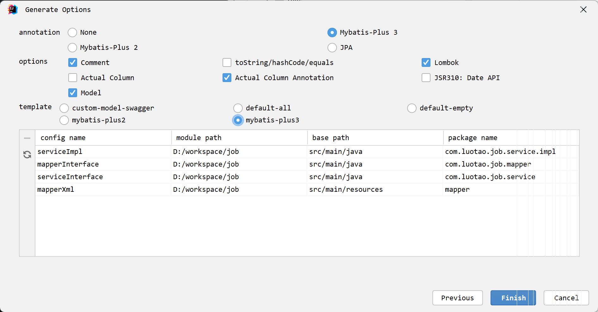

引入依赖并注释掉原来的mybatis：

```xml
        <!--        mybatisplus-->
        <dependency>
            <groupId>com.baomidou</groupId>
            <artifactId>mybatis-plus-boot-starter</artifactId>
            <version>3.5.5</version>
        </dependency>
```

将mybatis配置改成mybatisplus配置：

```yaml
# 添加 MyBatis-Plus 配置
mybatis-plus:
  # 指定Mapper XML文件的位置
  mapper-locations: classpath:/mapper/**/*.xml

  configuration:
    # 开启驼峰命名转换，例如：数据库字段名 user_name 自动映射到实体类属性 userName
    map-underscore-to-camel-case: true
    
  global-config:
    db-config:
      # 主键生成策略为自增
      id-type: auto
```


```java
package com.luotao.job.controller;

import com.luotao.job.domain.Jobs;
import com.luotao.job.service.JobsService;
import com.luotao.job.utils.ResponseResult;
import org.springframework.web.bind.annotation.GetMapping;
import org.springframework.web.bind.annotation.PathVariable;
import org.springframework.web.bind.annotation.RequestMapping;
import org.springframework.web.bind.annotation.RestController;

import javax.annotation.Resource;

/**
 * @Classname JobController
 * @Description TODO
 * @Version 1.0.0
 * @Date 2025/3/25 17:47
 * @Author LuoTao
 */
@RestController
@RequestMapping("/job")
public class JobController {
    @Resource
    private JobsService jobsService;

    @GetMapping("/v1/{id}")
    public ResponseResult getById(@PathVariable Integer id){
        Jobs byId = jobsService.getById(id);
        if (byId != null){
            return new ResponseResult(byId);
        }else{
            return new ResponseResult(401, "不存在对应id的数据");
        }
    }
}

```

### 添加分页插件

```java
package com.luotao.job.config;

import com.baomidou.mybatisplus.annotation.DbType;
import com.baomidou.mybatisplus.extension.plugins.MybatisPlusInterceptor;
import com.baomidou.mybatisplus.extension.plugins.inner.PaginationInnerInterceptor;
import org.mybatis.spring.annotation.MapperScan;
import org.springframework.context.annotation.Bean;
import org.springframework.context.annotation.Configuration;

/**
 * @Classname MybatisPlusConfig
 * @Description TODO
 * @Version 1.0.0
 * @Date 2025/3/26 17:32
 * @Author LuoTao
 */
@Configuration
@MapperScan("com.luotao.job.mapper")
public class MybatisPlusConfig {

    /**
    * @Description: 添加分页插件。
     * 创建MybatisPlusInterceptor实例。
     * 添加PaginationInnerInterceptor作为内部拦截器，并指定数据库类型为MariaDB。
     * 返回配置好的拦截器实例。
    **/
    @Bean
    public MybatisPlusInterceptor mybatisPlusInterceptor(){
        MybatisPlusInterceptor interceptor = new MybatisPlusInterceptor();
        interceptor.addInnerInterceptor(new PaginationInnerInterceptor((DbType.MARIADB)));
        return interceptor;
    }
}


```

service接口及其实现类：

```java
    /**
     * @Description 分页查询
     * @Author LuoTao
     * @Date 2025/3/26 17:49
     * @return 分页对象结果集
     * @param pageNum 当前页码
     * @param pageSize 每页的数据条数
     **/
    IPage<Jobs> getJobsByPage(int pageNum, int pageSize);
```

```java
package com.luotao.job.service.impl;

import com.baomidou.mybatisplus.core.conditions.query.QueryWrapper;
import com.baomidou.mybatisplus.core.metadata.IPage;
import com.baomidou.mybatisplus.extension.plugins.pagination.Page;
import com.baomidou.mybatisplus.extension.service.impl.ServiceImpl;
import com.luotao.job.domain.Jobs;
import com.luotao.job.service.JobsService;
import com.luotao.job.mapper.JobsMapper;
import org.springframework.stereotype.Service;

import javax.annotation.Resource;

/**
* @author T
* @description 针对表【jobs(岗位表)】的数据库操作Service实现
* @createDate 2025-03-25 17:30:32
*/
@Service
public class JobsServiceImpl extends ServiceImpl<JobsMapper, Jobs>
    implements JobsService{
    @Resource
    private JobsMapper jobsMapper;

    /**
     * @Description 定义了getJobsByPage方法，用于根据页码和每页大小查询岗位信息。
     * 使用QueryWrapper构造查询条件，选择特定字段并按publish_time降序排序。
     * 调用jobsMapper.selectPage执行分页查询并返回结果。
     * @return 分页对象结果集
     * @param pageNum 当前页码
     * @param pageSize 每页的数据条数
     **/
    @Override
    public IPage<Jobs> getJobsByPage(int pageNum, int pageSize) {
        Page<Jobs> page = new Page<>(pageNum, pageSize);// 创建分页对象
        QueryWrapper<Jobs> jobsQueryWrapper = new QueryWrapper<>();// 创建查询条件包装器构造查询条件
        jobsQueryWrapper.select("id",
                "job_title",
                "category_name",
                "salary",
                "city",
                "company",
                "publish_time"
        );
        jobsQueryWrapper.orderByDesc("publish_time");
        Page<Jobs> jobsPage = jobsMapper.selectPage(page, jobsQueryWrapper); // 执行分页查询
        return jobsPage;
    }
}


```

编写路由：

```java
    // 分页查询
    @GetMapping("/v1/page/{page}")
    public ResponseResult getByPage(@PathVariable Integer page){
        Integer pageSize=20;
        IPage<Jobs> jobsByPage = jobsService.getJobsByPage(page, pageSize);
        log.info("总行数:{}",jobsByPage.getTotal());
        log.info("总页数:{}",jobsByPage.getPages());
        log.info("当前页:{}",jobsByPage.getCurrent());
        log.info("当前页行数:{}",jobsByPage.getRecords());
        return new ResponseResult(jobsByPage);
    }
```

##  VO（Value Object）

值对象，通常用于封装数据，表示一个不可变的对象，其值是唯一的标识。主要用于在不同层之间传递数据（如Controller层到Service层，或者Service层到前端）。不直接映射数据库表。

## 按类别统计岗位数量

1. 编写SQL：

```sql
# 按类别统计数量
select js.category_name,jc.category_desc,count(js.id) as quantity
from jobs js
         left join
     job_category jc on js.category_name = jc.category_name
group by
    js.category_name
order by
    quantity desc

```

2. 编写vo类结果映射：

```java
package com.luotao.job.vo;

import lombok.Data;

/**
 * @Classname JobsByCategoryVo
 * @Description 从数据库中查询每个类别的岗位数量，并将结果映射到 JobsByCategoryVo 对象中。
 * 封装岗位类别及其数量的信息，便于在不同层之间传递数据或作为接口返回结果。它是一个典型的值对象，专注于数据传输和展示，而不包含复杂的业务逻辑。
 * @Version 1.0.0
 * @Date 2025/3/26 18:44
 * @Author LuoTao
 */
@Data // 自动getsetter
public class JobsByCategoryVo {
    private String categoryName;
    private String categoryDesc;
    private Integer quantity;//岗位数量
}

```

3. 编写mapper接口的方法和SQL 映射文件：

   > MyBatis 通过 XML 文件或注解将 Mapper 接口的方法与 SQL 语句关联起来。
   >
   > MyBatis 通过 SqlSession 执行 SQL 语句。以下是执行流程：
   > 解析 SQL 语句，替换占位符。
   > 通过 JDBC 执行 SQL。
   > 将查询结果映射为 Java 对象并返回。

```java
public interface JobsMapper extends BaseMapper<Jobs> {
    // 按类别统计岗位数量
    List<JobsByCategoryVo> countByCategoryName();
}
```

```java
    <select id="countByCategoryName" resultType="com.luotao.job.vo.JobsByCategoryVo">
        select js.category_name, jc.category_desc, count(js.id) as quantity
        from jobs js
                 left join
             job_category jc on js.category_name = jc.category_name
        group by js.category_name
        order by quantity desc

    </select>
```

4. 补充service接口方法并实现：

```java
    // 按类别统计岗位数量
    List<JobsByCategoryVo> countByCategoryName();
```

```java
    @Override
    public List<JobsByCategoryVo> countByCategoryName() {
        List<JobsByCategoryVo> jobsByCategoryVos = jobsMapper.countByCategoryName();
        return jobsByCategoryVos;
    }
```

5. 编写路由：

```java
    // 分类统计岗位
    @GetMapping("/v1/category/statistics")
    public ResponseResult getByCategory(){
        List<JobsByCategoryVo> jobsByCategoryVos = jobsService.countByCategoryName();
        return new ResponseResult(jobsByCategoryVos);
    }

```

## 按城市统计岗位数量

1.  编写SQL：

```sql
# 按城市统计数量
select js.city, jc.category_desc, count(js.id) as quantity
from jobs js
         left join
     job_category jc on js.category_name = jc.category_name
group by city
order by quantity desc
```

2. 编写vo类结果映射：

```java
package com.luotao.job.vo;

import lombok.Data;

/**
 * @Classname JobsByCityVo
 * @Description 按城市统计岗位，从数据库中查询每个城市的岗位数量，并将结果映射到 Vo 对象中。
 * @Version 1.0.0
 * @Date 2025/3/26 19:15
 * @Author LuoTao
 */
@Data
public class JobsByCityVo {
    private String city;
    private Integer quantity;
}

```


3. 编写mapper接口及xml实现数据查询：

```java
 // 按城市统计岗位数量
    List<JobsByCityVo> countByCity();
```

```xml
    <select id="countByCity" resultType="com.luotao.job.vo.JobsByCityVo">
        select js.city, jc.category_desc, count(js.id) as quantity
        from jobs js
                 left join
             job_category jc on js.category_name = jc.category_name
        group by city
        order by quantity
    </select>
```


4. 补充service接口方法并实现：

   ```java
       // 按城市统计岗位数量
       List<JobsByCityVo> countByCity();
   ```

   ```java
       @Override
       public List<JobsByCityVo> countByCity() {
           List<JobsByCityVo> jobsByCityVos = jobsMapper.countByCity();
           return jobsByCityVos;
       }
   ```

5. 编写路由：

   ```java
       // 按城市统计岗位
       @GetMapping("/v1/city/statistics")
       public ResponseResult getByCity(){
           List<JobsByCityVo> JobsByCityVos = jobsService.countByCity();
           return new ResponseResult(JobsByCityVos);
       }
   ```


## 按省份统计岗位数量

```sql
-- 城市-省级 city
drop table if exists `city`;
CREATE TABLE `city` (
                        `id` int NOT NULL AUTO_INCREMENT,
                        `city` varchar(50) NOT NULL COMMENT '城市名称',
                        `province` varchar(50) NOT NULL COMMENT '省级名称',
                        PRIMARY KEY (`id`) USING BTREE
) ENGINE=InnoDB DEFAULT CHARSET=utf8mb4 ROW_FORMAT=DYNAMIC;
```

1. 编写SQL：

   ```sql
   /*
    按省份统计岗位: jobs.city 去和  city.city和city.province 模糊匹配
    CONCAT('%', c.city, '%') 的作用是将 % 和 c.city 拼接成一个模糊匹配的模式。例如：
   如果 c.city 的值是 '北京'，那么 CONCAT('%', c.city, '%') 的结果是 '%北京%'。
   这个结果可以用于 LIKE 操作符，表示匹配包含 '北京' 的字符串。
   */
   SELECT
       c.province,
       COUNT(js.id) AS quantity
   FROM
       jobs js
           LEFT JOIN
       city c
       ON
           (js.city LIKE CONCAT('%', c.city, '%') OR js.city LIKE CONCAT('%', c.province, '%'))
   WHERE
       c.province IS NOT NULL
     AND c.province != ''
   GROUP BY
       c.province
   ORDER BY
       quantity DESC;
   
   ```

   

2. 编写vo类结果映射：

   ```java
   @Data
   public class JobsByProvinceVo {
       private String province;
       private Integer quantity;
   }
   ```

   

3. 编写mapper接口的方法和SQL 映射文件：

   ```java
   // 按省份统计岗位数量
       List<JobsByProvinceVo> countByProvince();
   ```

   ```xml
    <select id="countByProvince" resultType="com.luotao.job.vo.JobsByProvinceVo">
           SELECT
               c.province,
               COUNT(js.id) AS quantity
           FROM
               jobs js
                   LEFT JOIN
               city c
               ON
                   (js.city LIKE CONCAT('%', c.city, '%') OR js.city LIKE CONCAT('%', c.province, '%'))
           WHERE
               c.province IS NOT NULL
             AND c.province != ''
           GROUP BY
               c.province
           ORDER BY
               quantity DESC;
       </select>
   ```

   

4. 补充service接口方法并实现：

   ```java
       // 按省份统计岗位数量
       List<JobsByProvinceVo> countByProvince();
   ```

   ```java
       @Override
       public List<JobsByProvinceVo> countByProvince() {
           List<JobsByProvinceVo> jobsByProvinceVos = jobsMapper.countByProvince();
           return jobsByProvinceVos;
       }
   ```

   

5. 编写路由：

   ```java
       // 按省份统计岗位
       @GetMapping("/v1/province/statistics")
       @ApiOperation("按省份统计岗位")
       public ResponseResult getByProvince(){
           List<JobsByProvinceVo> jobsByProvinceVos = jobsService.countByProvince();
           return new ResponseResult(jobsByProvinceVos);
       }
   ```

   

## Swagger生成在线API文档

引入依赖：

```xml
        <!--        Swagger
        <dependency>
            <groupId>io.springfox</groupId>
            <artifactId>springfox-boot-starter</artifactId>
            <version>3.0.0</version>
        </dependency>
		-->
        <!--        Knife4j-Swaggerui增强-->
        <dependency>
            <groupId>com.github.xiaoymin</groupId>
            <artifactId>knife4j-spring-boot-starter</artifactId>
            <version>3.0.3</version>
        </dependency>
```

编写Swagger配置类：

```java
package com.luotao.job.config;

import org.springframework.context.annotation.Bean;
import org.springframework.context.annotation.Configuration;
import org.springframework.web.bind.annotation.RestController;
import springfox.documentation.builders.ApiInfoBuilder;
import springfox.documentation.builders.PathSelectors;
import springfox.documentation.builders.RequestHandlerSelectors;
import springfox.documentation.service.ApiInfo;
import springfox.documentation.spi.DocumentationType;
import springfox.documentation.spring.web.plugins.Docket;

/**
 * Swagger配置类，用于配置Swagger生成 RESTful API 文档
 * 该配置类指定了哪些接口将被生成文档，以及文档的基本信息
 */
@Configuration
public class SwaggerConfig {
    /**
     * 创建 RESTful API 文档的配置
     * 使用 Docket 对象来配置 Swagger，包括文档类型、API 信息选择器等
     *
     * @return Docket 实例，用于构建和配置 Swagger 文档
     */
    @Bean
    public Docket createRestApi(){
        // 创建并配置Docket对象，使用OpenAPI 3.0规范
        return new Docket(DocumentationType.OAS_30)
                // 设置API文档的基本信息，如标题、描述、版本等
                .apiInfo(apiInfo())
                .select()
                // 选择带有@RestController注解的类中的API进行文档化
                .apis(RequestHandlerSelectors.withClassAnnotation(RestController.class))
                // 对所有路径的API进行文档化
                .paths(PathSelectors.any())
                .build();
    }

    /**
     * 构建 API 文档的详细信息
     * 包括标题、描述、许可证信息、版本号等
     *
     * @return ApiInfo 实例，含了API文档的元数据信息
     */
    private ApiInfo apiInfo() {
        return new ApiInfoBuilder()
                .title("可视化分析系统")  // 设置API文档的标题
                .description("后端接口文档")     // 设置API文档的描述
                .license("luotao")               // 设置API文档的许可证信息
                .licenseUrl("https://luotaofun.github.io/") // 设置许可证的URL
                .version("1.0")                  // 设置API的版本
                .build();                        // 构建并返回ApiInfo对象
    }
}

```

启动类上添加注解@EnableOpenApi激活 API 文档功能：

```java

@SpringBootApplication
@MapperScan("com.luotao.job.mapper")// 扫描接口所在包
@EnableOpenApi // 激活 API 文档功能
public class JobApplication {

    public static void main(String[] args) {
        SpringApplication.run(JobApplication.class, args);
    }

}

```

yaml配置文件中添加Spring MVC 的路径匹配策略：

```yaml
spring:
  mvc:
    # Spring MVC 的路径匹配策略
    pathmatch:
      matching-strategy: ant_path_matcher
```

```java
@Api(tags = "岗位管理相关接口")//标记在一个类上，用于描述该控制器（Controller）的整体功能。
public class JobController {
    @ApiOperation("根据id获取岗位数据")//标记在一个方法上，用于描述该方法的具体功能。
	// 方法
}
```

[Swaggerui]: http://localhost:8080/swagger-ui/index.html
[Knife4j]: http://localhost:8080/doc.html


# vue3

```
// ::v-deep  可以穿透并修改子组件的样式

```

```bash
 # 用于更改 PowerShell 脚本的执行策略:允许运行本地创建的脚本
 Set-ExecutionPolicy RemoteSigned
```

```vue
vue create job-web
```

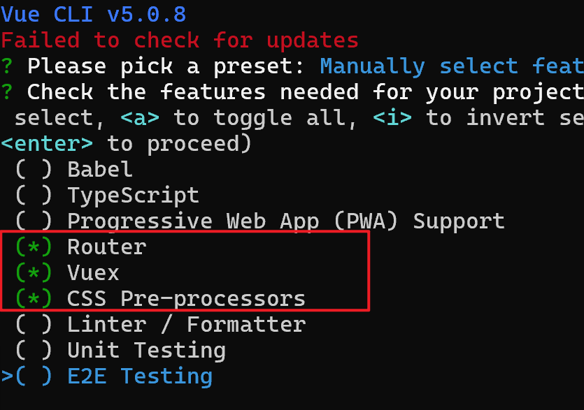

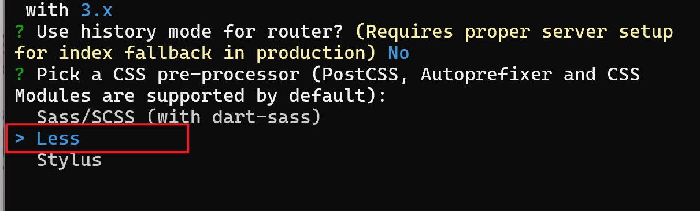

## vue-生命周期

> 实例从创建到销毁的过程


```vue
<template>
    <div>
        <h1>生命周期</h1>
        <p><button @click="changeCount">点击修改count值-- {{ count }}</button></p>
        <p><button @click="destroy">点击销毁</button></p>
    </div>
</template>

<script>
        import { getCurrentInstance,
            reactive, 
            toRefs,
            onBeforeMount,
            onMounted,
            onBeforeUpdate,
            onUpdated,
            onBeforeUnmount,
            onUnmounted

         } from 'vue'
        
        export default {
            setup () {
                console.log("开始创建组件--setup")
                const instance = getCurrentInstance(); //获取当前组件实例
                console.log("当前组件实例--instance" , instance);
                const state = reactive({ //定义响应式数据对象
                    count: 0,
                })

                function changeCount() { //触发组件更新
                    state.count++;
                }

                function destroy() { //触发销毁组件
                    instance.appContext.app.unmount();
                }
            
                onBeforeMount(() => { 
                    console.log("组件挂载前--onBeforeMount")
                })
                onMounted(() => { 
                    console.log("组件挂载后--onMounted")
                    console.log(instance)
                })
                onBeforeUpdate(() => { 
                    console.log("组件更新前--onBeforeUpdate")
                })
                onUpdated(() => { 
                    console.log("组件更新后--onUpdated")
                })
                onBeforeUnmount(() => { 
                    console.log("组件卸载前--onBeforeUnmount")
                })
                onUnmounted(() => { 
                    console.log("组件卸载后--onUnmounted")
                })

                return {
                    ...toRefs(state),// 将响应式对象转为普通对象(每一个属性都是响应式)
                    changeCount,
                    destroy
                }
            }
        }
    
</script>

<style lang="scss" scoped>

</style>
```

**setup语法糖写法**

```vue
<template>
    <div>
        <h1>生命周期</h1>
        <p><button @click="changeCount">点击修改count值-- {{ count }}</button></p>
        <p><button @click="destroy">点击销毁</button></p>
    </div>
</template>

<script setup>
        import { getCurrentInstance,
            reactive, 
            toRefs,
            onBeforeMount,
            onMounted,
            onBeforeUpdate,
            onUpdated,
            onBeforeUnmount,
            onUnmounted

         } from 'vue'
        

        console.log("开始创建组件--setup")
        const instance = getCurrentInstance(); //获取当前组件实例
        console.log("当前组件实例--instance" , instance);
        const state = reactive({ //定义响应式数据对象
            count: 0,
        })

        function changeCount() { //触发组件更新
            state.count++;
        }

        function destroy() { //触发销毁组件
            instance.appContext.app.unmount();
        }
    
        onBeforeMount(() => { 
            console.log("组件挂载前--onBeforeMount")
        })
        onMounted(() => { 
            console.log("组件挂载后--onMounted")
        })
        onBeforeUpdate(() => { 
            console.log("组件更新前--onBeforeUpdate")
        })
        onUpdated(() => { 
            console.log("组件更新后--onUpdated")
        })
        onBeforeUnmount(() => { 
            console.log("组件卸载前--onBeforeUnmount")
        })
        onUnmounted(() => { 
            console.log("组件卸载后--onUnmounted")
        })


        const {count}={   ...toRefs(state)}// 将响应式对象转为普通对象(每一个属性都是响应式)


    
</script>

<style lang="scss" scoped>

</style>
```

## 组件间的交互

**父组件**

```vue
<template>
  <div class="home">
    <!-- v-bind  传递给子组件-->
    <myheader 
    v-bind:msg="parentMsg" 
    @event="func"
    @event2="func2"
    ></myheader>
    <!-- <lifeCycle></lifeCycle> -->
  </div>
</template>

<script setup>
import MyHeader from '@/components/MyHeader.vue';
import LifeCycle from '@/components/LifeCycle.vue';
const parentMsg = '我是父组件----->给子组件带句话';

const func =() => {
  alert('我是父组件中的函数');
}
const func2 =(childMsg) => {
  alert(childMsg);
}
</script>

```

**子组件**

```vue
<template>
    <div>
        <h1>luotaofun</h1>
        
        <p>展示父组件传递的数据:{{prop.msg }}</p>
        <button @click="emit('event')">触发父组件事件event</button>
        <button @click="emit('event2',childMsg)">触发父组件事件event2,从父组件中获取子组件信息</button>
    </div>
</template>

<script setup>
    // defineProps 接受父组件传递的数据
    const prop = defineProps({
        msg: {
            type: String,
            required: true
        }
    })

    const childMsg = '我是子组件';
    //defineEmits 注册事件,返回触发器
    const emit = defineEmits("event","event2");
</script>

<style lang="scss" scoped>

</style>
```

## 首页

引入`element-plus`组件库：

```bash
npm install element-plus --save
```

```vue
import { createApp } from 'vue'
import App from './App.vue'
import router from './router'
import store from './store'
// 引入element-plus组件库
import ElementPlus from 'element-plus'
import 'element-plus/dist/index.css'

// 定义特性标志解决控制台警告：在生产环境中，为了获得更好的树摇优化，Vue 需要特定的特性标志，以减小生成的生产包的大小。
window.__VUE_PROD_DEVTOOLS__ = false;
window.__VUE_PROD_HYDRATION_MISMATCH_DETAILS__ = false;

createApp(App) 
.use(store) // vuex状态管理
.use(router)
.use(ElementPlus)
.mount('#app') // 绑定到id为app的元素上

```


### 根组件引入Container布局容器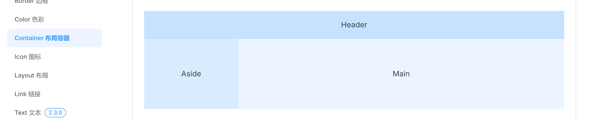

```vue
<template>
  <div class="common-layout">
    <el-container>
      <!-- 头部 -->
      <el-header>
          <Header></Header>
      </el-header>
      <el-container>
        <!-- 左侧边栏 -->
        <el-aside width="200px">
          <LeftMenu></LeftMenu>
        </el-aside>
        <!-- 主体内容 -->
        <el-main>
          <!-- 路由视图 -->
          <router-view/>
        </el-main>
      </el-container>
    </el-container>
  </div>
</template>

<script setup>
  import Header from '@/components/Header.vue'
  import LeftMenu from '@/components/LeftMenu.vue'

    // debounce: 限制一个函数的执行频率，确保在一定时间间隔内只执行一次
  // fn: 要执行的函数
  // delay: 延迟时间
  // 函数内部使用setTimeout来实现延迟执行，每次调用时会清除之前的定时器，然后设置一个新的定时器来延迟执行目标函数
  const debounce = (fn, delay) => {
    let timer = null;
    return function () {
      let context = this;
      let args = arguments;
      clearTimeout(timer);
      timer = setTimeout(function () {
        fn.apply(context, args);
      }, delay);
    }
  }

  // 将原始的ResizeObserver保存为_ResizeObserver
  const _ResizeObserver = window.ResizeObserver;

  // 定义新的ResizeObserver类，重写构造函数
  // 在新的构造函数中，传入的回调函数被debounce函数处理，确保回调函数在16毫秒的间隔时间内执行一次
  window.ResizeObserver = class ResizeObserver extends _ResizeObserver {
    constructor(callback) {
      callback = debounce(callback, 16);
      super(callback);
    }
  }
</script>

<style lang="less">
  .el-header {
      background-color: #545c64;
  }
  .el-aside {
      font-weight: bold;
  }
</style>
```

### 创建头部组件和左侧导航组件

`Header.vue`

```vue
<template>
    <div>
        <el-row>
          <el-col :span="3">
            <div class="grid-content ep-bg-purple" />
            
          </el-col>
          <el-col :span="21">
            <div class="grid-content ep-bg-purple-light" />
            物流进销存系统
          </el-col>
        </el-row>
    </div>
    
        
</template>

<script setup>
</script>

<style lang="less" scoped>
    .logo{
        width: 60px;
        height: 60px;
    }
    .el-row{
        font-weight: bold;
        font-size: larger;
        line-height: 60px;
        color:#fff;
        text-align: left;
    }
</style>
```

`LeftMenu.vue`

引入垂直菜单,建立三个菜单项

```vue
<template>
    <div>
        <el-menu
        default-active="2"
        class="el-menu-vertical-demo"
      >
        <el-menu-item index="2">
            <el-icon><icon-menu /></el-icon>
            <span>数据列表</span>
            </el-menu-item>
            <el-menu-item index="3" >
            <el-icon><document /></el-icon>
            <span>分类统计</span>
            </el-menu-item>
            <el-menu-item index="4">
            <el-icon><setting /></el-icon>
            <span>数据分析</span>
            </el-menu-item>
        </el-menu>
    </div>
</template>

<script setup>
</script>

<style lang="less" scoped>

</style>
```

### 路由配置

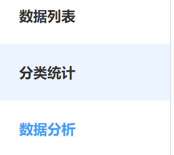

创建数据列表,分类统计,数据分析三个组件

`DataList.vue, Statistics.vue, Analyse.vue`要有对应路由,点击后才能渲染出对应组件视图

先定义组件的路由对象

```js
import { createRouter, createWebHashHistory } from 'vue-router'
import DataList from '@/views/DataList.vue'
import Statistics from '@/views/Statistics.vue'
import Analysis from '@/views/Analysis.vue'

const routes = [
  {
    path: '/',
    name: 'Analysis',
    component: Analysis,
    meta:{
      title: '数据分析'
    }
  },
  {
    path: '/dataList',
    name: 'DataList',
    component: DataList,
    meta: {
      title: '数据列表'
    }
  },
  {
    path: '/statistics',
    name: 'Statistics',
    component: Statistics,
    meta:{
      title: '数据统计'
    }
  },

]

const router = createRouter({
  history: createWebHashHistory(),
  routes
})

// 遍历路由以设置title
router.beforeEach((to, from, next) => {
  document.title = to.meta.title
  next()
})

export default router

```

### 左侧菜单启用router,配置跳转path

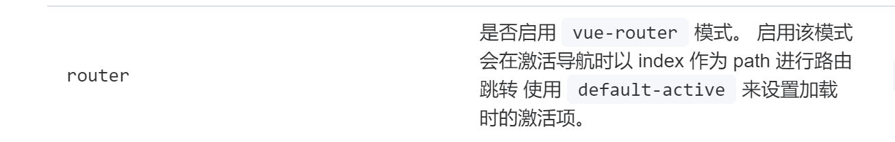

`LeftMenu.vue`

```vue
<template>
    <div>
        <el-menu
        default-active="/"
        router
        class="el-menu-vertical-demo"
        @open="handleOpen"
        @close="handleClose"
        >
            <el-menu-item index="/">
                <el-icon><DataAnalysis /></el-icon>
                <span>岗位数据分析</span>
            </el-menu-item>

            <el-menu-item index="/dataList">
                <el-icon><Grid /></el-icon>
                <span>岗位数据列表</span>
            </el-menu-item>
            
            <el-menu-item index="/statistics">
                <el-icon><Histogram /></el-icon>
                <span>岗位分类统计</span>
            </el-menu-item>
        </el-menu>
    </div>
</template>

<script setup>
    import { Grid, Histogram, DataAnalysis } from '@element-plus/icons-vue'
</script>

<style lang="less" scoped>

</style>
```

## 数据列表

引入带斑马纹表格和分页控件

`DataList.vue`

```vue
<template>
    <div>
        <el-table :data="tableData" stripe style="width: 100%">
            <el-table-column fix prop="jobTitle" label="岗位名称" width="180" />
            <el-table-column prop="salary" label="薪资" width="180" />
            <el-table-column prop="company" label="企业全称" />
            <el-table-column prop="city" label="工作地点" />
            <el-table-column prop="publishTime" label="发布时间" />
            <el-table-column prop="companyInfo" label="所属行业" />
        </el-table>
    </div>

    <!-- 分页控件 -->
    <el-pagination 
    class="pagination"
    background 
    layout="prev, pager, next" 
    :total="1000" />
</template>

<script  setup>
    const tableData = [
        {
            jobTitle: 'JAVA工程师',
            salary: '1.2K',
            company: '腾讯',
            city:   '深圳',
            publishTime: '2022-01-01',
            companyInfo: '计算机软件'
        }
    ]
</script>

<style lang="less" scoped>
    .pagination {
        margin-top: 30px;
        margin-left: 68%;
    }
</style>
```

## 封装Axios网络请求

1. 安装依赖

   ```bash
   npm install axios -S
   ```

   

2. utils包下新建`axiosConfig.js`

   ```js
   import axios from 'axios';
   // 声明函数并将其导出，以便在其他模块中使用。config 参数是一个对象，包含请求的配置信息。
   export function request(config){
       // 创建Axios实例
       const instance = axios.create({
           baseURL:"", // 请求的基础 URL
           timeout:8000,// 请求超时时间
       })
       return instance(config); //使用刚刚创建的 Axios 实例发送请求。Axios 实例会根据这些配置发送请求，并返回一个 Promise，该 Promise 解析为响应数据。
   }
   ```

3. 封装业务请求`apis.js`

   ```js
   // 业务请求
   import{request} from './axiosConfig';
   // `vue.config.js`中配置了代理解决跨域。前端请求时url带该前缀时走代理请求到target指定的后端服务器上，并且请求路径中的该前缀被去掉，还原成后端接口原来的路径。
   const prefix ='/api'
   // 请求分页查询岗位数据的接口,参数page是想要获取第几页，即当前选中页码
   export function getJobListData(page){
       return request({
           url:prefix + '/job/v1/page/' + page,
           method:'get'
       })
   }
   
   ```

   

4. 发起请求fetch后端数据

   ```vue
   <script setup>
       import {getJobListData} from '@/utils/apis'
       import {ref,onMounted} from 'vue'
       const currentPage = ref(1);
       const fetchData=(currentPage)=>{
           getJobListData(currentPage.value).then(res=>{
               console.log(res.data);
           })
       }
       // 组件已挂载时调用
       onMounted(()=>{
           fetchData(currentPage)
       })
   </script>
   ```

   

5. 域名不同需要解决跨域,可以配置一个代理让前端发起的业务请求通过代理请求到后端的服务器上。根目录下创建`vue.config.js`

   代理配置的工作方式是：前端请求先到达前端开发服务器，然后由开发服务器转发到后端服务器。这个过程对前端代码是透明的，您的代码仍然发送请求到 /api/blog/tags，但实际上这个请求会被代理到 http://localhost:8000/blog/tags。

   ```js
   // module相当于当前的js
   module.exports = {
       // 配置代理信息。前端请求时url带该前缀时走代理请求到target指定的后端服务器上，并且请求路径中的该前缀被去掉，还原成后端接口原来的路径。
       devServer:{
           proxy:{
               '/api':{
                   target:'http://127.0.0.1:8000/',
                   pathRewrite:{
                       '^/api':''
                   },
                   changeOrigin: true,
                   logLevel: 'debug'
               }
           }
       }
   }
   ```

   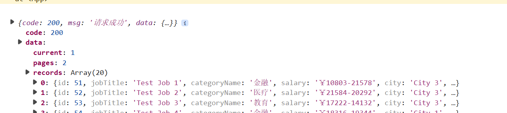

## 岗位数据列表前后端联调

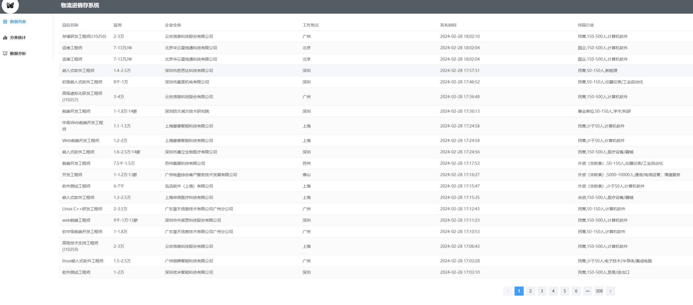

1. 通过调用之前封装业务请求`apis.js`的getJobListData函数获取当前页的数据，并将数据存储到tableData中。
2. 处理分页控件。  用current-change 事件来处理当前页变动时候触发的事件，即先获取当前新选中的页码然后再次请求。

```js
<template>
    <div>
        <el-table :data="tableData" stripe style="width: 100%">
            <el-table-column fix prop="jobTitle" label="岗位名称" width="180" />
            <el-table-column prop="salary" label="薪资" width="180" />
            <el-table-column prop="company" label="企业全称" />
            <el-table-column prop="city" label="工作地点" />
            <el-table-column prop="publishTime" label="发布时间" />
            <el-table-column prop="companyInfo" label="所属行业" />
        </el-table>
    </div>
    <!-- 分页控件。用current-change 事件来处理当前页变动时候触发的事件 -->
    <el-pagination 
    class="pagination"
    background 
    layout="prev, pager, next" 
    :total="total" 
    @current-change="handleCurrentChange"
    />
</template>

<script setup>
import { getJobListData } from '@/utils/apis'
import { reactive } from 'vue';
import { ref, onMounted } from 'vue'
const currentPage = ref(1); // 当前选中的页码
const tableData = reactive([])
const total = ref(0) // 总记录数
const size = ref(0) // 当前页记录数

// 通过调用getJobListData接口获取当前页的数据，并将数据存储到tableData中。
const fetchData = (currentPage) => {
    getJobListData(currentPage.value).then(res => {
        // 拿数据之前要先将tableData清空，否则数据会累加
        tableData.length = 0
        // console.log(res.data);
        for (let i in res.data.data.records) {
            // console.log(res.data.data.records[i]);
            tableData.push(res.data.data.records[i]) // 将当前页的每条记录push
        }
        total.value=res.data.data.total
        size.value=res.data.data.size
        console.log('总记录数：' + total.value,'当前页记录数:' + size.value)
    })
}
const handleCurrentChange=(newPage)=>{
    console.log('改变后选中的页码为：' + newPage)
    currentPage.value=newPage
    fetchData(currentPage) // 选中的页码改变后再次fetchData发请求
}

// 组件已挂载时调用
onMounted(() => {
    fetchData(currentPage)
})
</script>

<style lang="less" scoped>
.pagination {
    margin-top: 30px;
    margin-left: 68%;
}
</style>
```

## 岗位类别统计联调

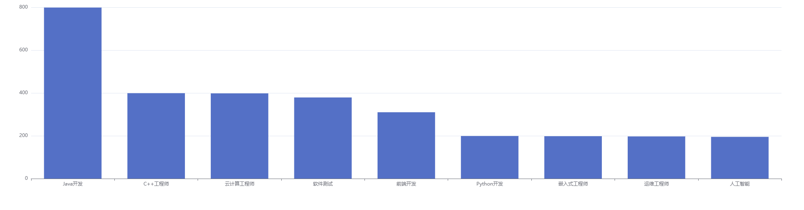

[快速上手 - 使用手册 - Apache ECharts](https://echarts.apache.org/handbook/zh/get-started/)

1. 引入依赖Echarts

   ```bash
   npm install echarts --save
   ```

2. 在apis.js`中封装按类别统计的业务请求函数getJobByCategory

   ```js
   // 封装按类别统计的业务请求
   export function getJobByCategory(){
       return request({
           url:prefix + '/job/v1/category/statistics',
           method:'get'
       })
   }
   ```

3. 在onMounted钩子函数中通过调用之前封装业务请求`apis.js`的getJobByCategory函数获取categoryName和quantity分别作为x轴和y轴的数据。

   ```js
   <template>
       <div id="chart" class="chart">
   
       </div>
   </template>
   
   <script setup>
   import * as echarts from 'echarts'
   import { getJobByCategory } from '@/utils/apis'
   import { reactive } from 'vue';
   import { ref, onMounted } from 'vue'
   
   // 用categoryData保存后端接口响应数据
   const categoryData = reactive({
       category: [],// 岗位名称
       count: [] //岗位数量
   })
   // 组件已挂载时调用
   onMounted(() => {
       // 通过调用 getJobByCategory获取categoryDesc和quantity，并将数据存储到 categoryData 中。
       getJobByCategory().then(res => {
           // console.log(res.data);
           for (let i in res.data.data) {
               categoryData.category.push(res.data.data[i]
               ['categoryDesc'])
               categoryData.count.push(res.data.data[i]
               ['quantity'])
           }
           // 基于准备好的DOM，初始化echarts实例
           var myChart = echarts.init(document.getElementById('chart'))
           var option = {
               title: {
                   // text: 'ECharts 入门示例'
               },
               tooltip: {},
               xAxis: {
                   data: categoryData.category
               },
               yAxis: {},
               series: [
                   {
                       name: '岗位数量',
                       type: 'bar',
                       data: categoryData.count
                   }
               ]
           }
           // 绘制图表
           myChart.setOption(option);
       })
   
   })
   </script>
   
   <style lang="less" scoped>
   .chart {
       width: 100%;
       height: 550px;
   }
   </style>
   ```

## 岗位分析页面布局

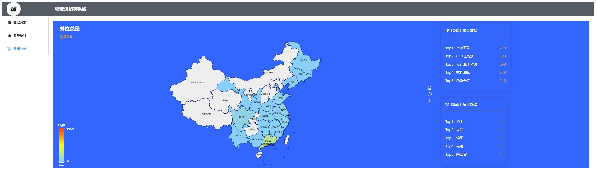

1. 从[阿里云DataV可视化](https://datav.aliyun.com/portal/school/atlas/area_selector?spm=a2crr.23498931.0.0.4ad815dd31QeAc)获取地图数据json

2. 将地图echarts封装成函数，然后在onMounted钩子函数中调用.

   ```vue
   <template>
       <div class="analysis">
           <div class="content">
               <el-row>
                   <!-- 第一列 -->
                   <el-col :span="17">
                       <div class="grid-content ep-bg-purple" />
                       <!-- 地图 -->
                       <div id="map" class="map"></div>
                   </el-col>
                   <!-- 第二列 -->
                   <el-col :span="7">
                       <div class="grid-content ep-bg-purple-light" />
                       <el-row>
                           <!-- 第一个卡片 -->
                           <el-card style="max-width: 480px">
                               <template #header>
                                   <div class="card-header">
                                       <span>按『类别』统计数据</span>
                                   </div>
                               </template>
                               <p v-for="o in 5" :key="o" class="text item">
                                   {{ 'Top' + o }}
                               </p>
                           </el-card>
                       </el-row>
   
                       <el-row>
                           <!-- 第二个卡片 -->
                           <el-card style="max-width: 480px">
                               <template #header>
                                   <div class="card-header">
                                       <span>按『城市』统计数据</span>
                                   </div>
                               </template>
                               <p v-for="o in 5" :key="o" class="text item">
                                   {{ 'Top' + o }}
                               </p>
                           </el-card>
                       </el-row>
                   </el-col>
               </el-row>
           </div>
           <!-- 统计组件 -->
           <div class="statistic">
               <el-statistic title="岗位总量" :value="8888" />
           </div>
       </div>
   </template>
   
   <script setup>
   // 引入中国地图json数据
   import chinamap from '@/map/chinamap'
   import * as echarts from 'echarts'
   import { onMounted } from 'vue';
   const mapEcharts = () => {
       let chartDom = document.getElementById('map')
   	if (chartDom) {
           // 初始化echarts实例
           let mapChart = echarts.init(chartDom);
   
           // 注册地图
           echarts.registerMap('chinamap', chinamap);
   
           // 设置配置项
           let options = {
               roam: true, // 鼠标缩放地图
   
               // 提示框
               tooltip: {
                   trigger: 'item',
                   formatter: '{b}<br/>{c}'
               },
   
               // 工具栏：数据视图、还原、保存为图片
               toolbox: {
                   show: true,
                   orient: 'vertical',
                   left: 'right',
                   top: 'center',
                   iconStyle: {
                       color: 'none',
                       borderColor: '#fff',
                       borderWidth: 1,
                       borderType: 'solid'
                   },
                   feature: {
                       dataView: { readOnly: false },
                       restore: {},
                       saveAsImage: {}
                   }
               },
               // 视觉映射组件
               visualMap: {
                   min: 0,
                   max: 5000,
                   text: ['High', 'Low'],
                   left: 'left',
                   realtime: false,
                   calculable: true,
                   textStyle: {
                       fontWeight: 'bold', // 字体加粗
                       color: '#fff', // 字体颜色
                   },
                   inRange: {
                       color: ['lightskyblue', 'yellow', 'orangered']
                   }
               },
               // 地理区域数据可视化，配合visualMap，展示不同区域的数据
               series: [
                   {
                       type: 'map',
                       map: 'chinamap',
                       zoom: 1.4, // 默认缩放级别
                       center: [104.114129, 37.550339], // 缩放中心点，北京的经纬度
   
                       // 地图文字设置
                       label: {
                           show: true,
                           fontSize: 8,
                       },
   
                       itemStyle: {
                           borderColor: '#091A7A',
                           borderWidth: 1,
                       },
   
                       emphasis: {
                           itemStyle: {
                               areaColor: '#0258f0', // 高亮时的颜色
                           }
                       },
   
                       // 区域数据
                       data: [
                           { name: '北京市', value: 120 },
                           { name: '天津市', value: 120 },
                           { name: '河北省', value: 220 },
                           { name: '山西省', value: 520 },
                           { name: '内蒙古自治区', value: 220 },
                           { name: '辽宁省', value: 210 },
                           { name: '吉林省', value: 120 },
                           { name: '黑龙江省', value: 120 },
                           { name: '上海市', value: 120 },
                           { name: '江苏省', value: 520 },
                           { name: '浙江省', value: 220 },
                       ],
                   }
               ]
           }
   
           // 绘制地图
           mapChart.setOption(options);
       }
   }
   // 挂载后渲染echarts
   onMounted(() => {
       mapEcharts()
   })
   </script>
   
   <style lang="less" scoped>
   .map {
       height: 630px;
       margin-left: 15px;
   }
   
   .analysis {
       background-color: #3366FF;
       position: relative;
       height: 630px;
   }
   
   .content {
       position: absolute;
       width: 100%;
   }
   
   .statistic {
       position: absolute;
       z-index: 3;
       margin-top: 25px;
       margin-left: 25px;
   }
   // ::v-deep  可以穿透并修改子组件的样式
   ::v-deep .el-statistic__head {
       font-size: 22px;
       color: #fff;
       font-weight: bolder;
       margin-bottom: 10px;
   }
   
   ::v-deep .el-statistic__number {
       color: #DBA230;
       font-weight: bolder;
   }
   
   .el-card {
       background-color: transparent;
       margin-top: 12px;
       margin-bottom: 12px;
       margin-left: 30px;
       border-color: rgb(62, 94, 221);
       border-width: 2px;
       font-size: 15px;
       color: #fff;
   }
   
   .card-header {
       font-weight: bolder;
   }
   
   .r1 {
       margin-right: 12px;
   }
   
   .r2 {
       width: 185px;
       display: inline-block;
   }
   
   .r3 {
       color: #DBA230;
   }
   </style>
   ```


## 岗位分析页面联调

1. 在apis.js`中封装对应函数

   ```js
   // 封装按城市统计的业务请求
   export function getJobByCity(){
       return request({
           url:prefix + '/job/v1/city/statistics',
           method:'get'
       })
   }
   // 封装按省份统计的业务请求
   export function getJobByProvince(){
       return request({
           url:prefix + '/job/v1/province/statistics',
           method:'get'
       })
   }
   ```

### 联调按【省份】请求后端接口的`JobsByProvinceVo`填充到echarts配置项的data数据区

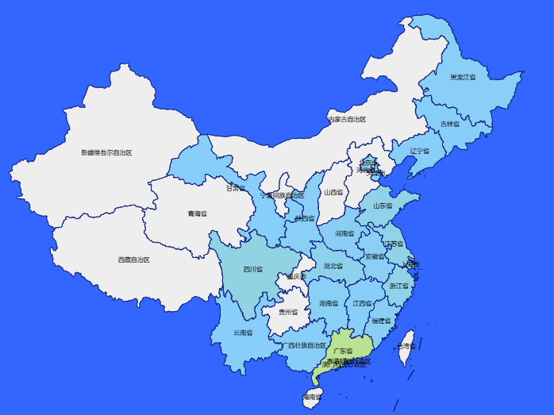

```js
<script setup>
import {
    getJobByProvince,
} from '@/utils/apis'
import { reactive,ref } from 'vue';

let dataList = ref([]); //保存后端响应JobsByProvinceVo
// 将JobsByProvinceVo转换为echarts规定的数据格式，即{ name: '北京市', value: 120 }
let dataTemp = reactive({}) 
// 挂载后
onMounted(() => {
    getJobByProvince().then(res=>{
        // console.log(res.data.data);
        for (let i in res.data.data){
            // 写法一：使用 Object.assign 进行的是浅拷贝，这意味着如果源对象包含嵌套对象，嵌套对象不会被复制，而是引用同一个对象。
            // dataTemp = Object.assign({},{
            //     name: res.data.data[i]['province'],
            //     value: res.data.data[i]['quantity']
            // })
            // 写法二：使用 reactive 包装新的对象
             dataTemp = reactive({
                name: res.data.data[i]['province'],
                value: res.data.data[i]['quantity']
            });
            dataList.value.push(dataTemp)
        }
        mapEcharts()//渲染echarts
    })
    console.log(dataList.value);
    
})
</script>
```

### 联调按【类别】请求后端接口`JobsByCategoryVo`，保存到categoryData

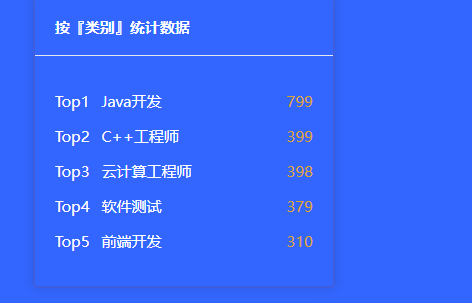

```js
<script setup>
import {
    getJobByCategory,
    getJobByCity,
} from '@/utils/apis'
import { reactive,ref } from 'vue';

let categoryData = ref([])// 保存后端JobsByCategoryVo的top5
// 按类别拿岗位数量
const fetchData=()=>{
    getJobByCategory().then(res=>{
        // console.log(res.data.data)
        for(let i in res.data.data.slice(0,5)){
            categoryData.value.push(res.data.data[i]);
        }
        
    })
}

// 挂载后
onMounted(()=>{
    fetchData()
})
</script>
```

1. 将categoryData渲染到页面

   ```html
   <el-row>
                           <!-- 第一个卡片 -->
                           <el-card style="max-width: 480px">
                               <template #header>
                                   <div class="card-header">
                                       <span>按『类别』统计数据</span>
                                   </div>
                               </template>
                               <p v-for="(item,index) in categoryData" :key="index" class="text item">
                                   <span class="r1">{{ 'Top' + (index+1) }}</span>
                                   <span class="r2">{{ item.categoryDesc }}</span>
                                   <span class="r3">{{ item.quantity }}</span>
                               </p>
                           </el-card>
                       </el-row>
   ```

   

### 联调按【城市】请求后端接口`JobsByCityVo`，保存到`cityData`

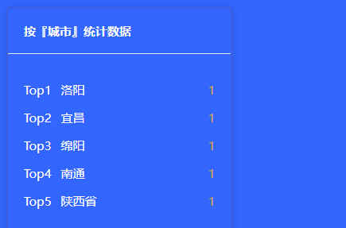

```js
<script setup>
import {
    getJobByCity,
} from '@/utils/apis'
import { reactive,ref } from 'vue';

let cityData=ref([]) //保存后端JobsByCityVo的top5
const fetchData = () => {
    
    // 按城市拿岗位数据
    getJobByCity().then(res => {
        // console.log(res.data.data)
        for (let i in res.data.data.slice(0, 5)) {
            cityData.value.push(res.data.data[i]);
        }
    })
}

</script>
```

1. 将cityData渲染到页面

   ```html
   <!-- 第二个卡片 -->
                           <el-card style="max-width: 480px">
                               <template #header>
                                   <div class="card-header">
                                       <span>按『城市』统计数据</span>
                                   </div>
                               </template>
                               <p v-for="(item, index) in cityData" :key="index" class="text item">
                                   <span class="r1">{{ 'Top' + (index + 1) }}</span>
                                   <span class="r2">{{ item.city }}</span>
                                   <span class="r3">{{ item.quantity }}</span>
                               </p>
                           </el-card>
   ```

### 联调【分页查询】请求后端接口`JobsByCityVo`获取第一页数据，拿到总记录数`total`并将其渲染到页面


```js
<script setup>
import {
    getJobByCity,
} from '@/utils/apis'
import { reactive,ref } from 'vue';

let total = ref(0) //总记录数
const fetchData = () => {
    //获取第一页数据拿到总记录数total
    getJobListData(1).then(res=>{
        //console.log(res.data.data)
        total.value=res.data.data.total
    })
}

</script>
```

```html
        <!-- 统计组件 -->
        <div class="statistic">
            <el-statistic title="岗位总量" :value="total" />
        </div>
```

# 报错：ResizeObserver loop completed with undelivered notifications.

由于 `ResizeObserver` 在处理元素大小变化时遇到了性能问题或无限循环。

- Element Plus 在某些组件中使用 `ResizeObserver` 来监听元素大小变化，以实现响应式布局或动态调整。
- 如果这些组件频繁触发大小变化，可能会导致 `ResizeObserver` 无法及时处理所有通知，从而引发错误。

**解决方案**：
使用 debounce 防抖函数限制回调函数的执行频率。
通过重写 ResizeObserver，将防抖逻辑集成到其构造函数中。
确保在监听 DOM 元素尺寸变化时，回调函数只在必要时执行，从而提升页面性能。

```vue
<script setup>
// debounce 防抖函数: 限制一个函数的执行频率，确保在一定时间间隔内只执行一次
const debounce = (fn, delay) => {
  let timer = null;
  return function () {
    let context = this;
    let args = arguments;
    clearTimeout(timer);
    timer = setTimeout(function () {
      fn.apply(context, args);
    }, delay);
  }
}

// 将原始的ResizeObserver保存为_ResizeObserver
const _ResizeObserver = window.ResizeObserver;

// 定义新的ResizeObserver类，重写构造函数，将防抖逻辑集成到其构造函数中
// 在新的构造函数中，传入的回调函数被debounce函数处理，确保回调函数在16毫秒的间隔时间内执行一次
window.ResizeObserver = class ResizeObserver extends _ResizeObserver {
  constructor(callback) {
    callback = debounce(callback, 16);
    super(callback);
  }
}
</script>

```

## 打包项目

注意要开放服务器mysql3306端口和后端api8000端口。

pom文件中`<skip>true</skip> `的存在是为了在开发环境中加快构建速度，但在项目上线时必须注释掉或禁用它。
注释掉` <skip>true</skip> `的目的是确保 spring-boot-maven-plugin 的 repackage 目标能够正常执行，生成一个可执行的 JAR/WAR 文件。

将jar包和配置文件`application.prod.yaml`上传到job目录

```bash
mkdir job
cd job
ls
```


